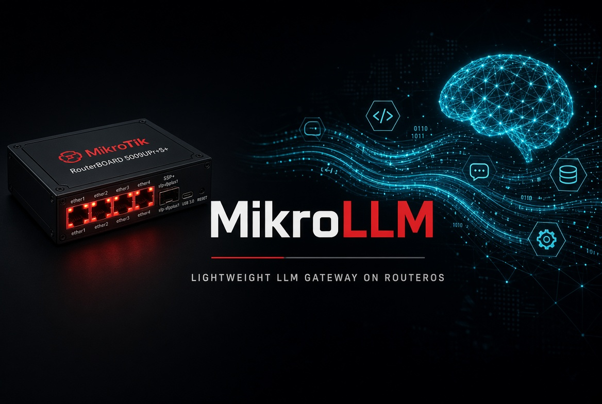

<p align="center">
  
</p>

# MikroLLM

[English](README.md) · **Русский**

Лёгкий шлюз к [Ollama](https://ollama.com) (локальный и Cloud), [OpenRouter](https://openrouter.ai), [vLLM](https://docs.vllm.ai) и [LM Studio](https://lmstudio.ai) в духе LiteLLM: OpenAI-совместимый API, виртуальные ключи `sk-…`, HTML-админка, playground-чат, pull/load моделей там, где API это умеет.

Пишется на Go, без Python и без CGO. Бинарь ~12 МБ, в работе обычно 8–20 МБ RAM. Удобно ставить:

- в **контейнер RouterOS 7** на MikroTik (hAP ax³ и другие ARM64);
- на **обычный сервер** (Linux amd64/arm64, Docker или systemd);
- локально для разработки.

Документация: [docs/ru/](docs/ru/README.md) (русский). По умолчанию английский: [docs/](docs/README.md).

## Что умеет

- Несколько бэкендов: **Ollama**, **Ollama Cloud**, **OpenRouter**, **vLLM**, **LM Studio**; health-check каждые 10 с. Каждый можно выключить в админке или через MCP, не удаляя.
- Alias для клиентов, балансировка `least_conn` / `round_robin` / `failover`, запасная модель при конце кредитов.
- Очереди: шаги (локальные → бесплатное облако → платное), визуализация на дашборде, ожидание на диске без Kafka/Redis. Клиент может слать alias, имя очереди или `имя-alias`.
- Виртуальные ключи с ограничением моделей и RPM.
- Админка: серверы, модели (фильтр по провайдеру и цене), ключи, очереди, лог с фильтрами, чат, **биллинг** (час/день/неделя/месяц/год), **безопасность** (системный промпт, injection, PII).
- **MCP** на `POST /mcp`: агент настраивает провайдеры, модели, очереди и ключи, читает логи и статус. [docs/mcp.md](docs/ru/mcp.md)
- Скачивание модели (`pull`) с полосой прогресса на Ollama и LM Studio; F5 не обрывает задачу.
- Загрузка / выгрузка весов в RAM (Ollama `keep_alive`, LM Studio `/api/v1/models/load|unload`).
- vLLM: модель задаётся на сервере (`vllm serve <HuggingFace-id>`) — [инструкция](docs/ru/providers.md#vllm).
- OpenRouter и Ollama Cloud — напрямую по HTTPS, без промежуточного GPU-сервера; нужен API-ключ. Цены $/1M в каталоге: OpenRouter из `/models`, Ollama Cloud с [ollama.com/pricing](https://ollama.com/pricing).
- Prompt cache OpenRouter: `auto` ставит Claude `cache_control`; логи показывают `cached_tokens` и оценку $. [docs/providers.md](docs/ru/providers.md#prompt-cache).
- Playground: выбрать alias или имя модели и писать в чат без ключа (нужна сессия админки).
- **Сеть hub**: на Статусе включить **Участник hub сети** — шлюз сам регистрируется на зашитом адресе (`https://hub.mikrollm.ru`, иначе `MIKROLLM_HUB_URL`) и отдаёт помеченные alias через исходящий long-poll. Не P2P. **Сервис** хаба — отдельный репозиторий. [docs/ru/hub.md](docs/ru/hub.md)

## Быстрый старт (локально)

**Одна строка** (Linux или macOS): ставит Ollama при необходимости, MikroLLM, пользовательский сервис и подключает локальные модели Ollama. [docs/ru/install-desktop.md](docs/ru/install-desktop.md)

```bash
curl -fsSL https://raw.githubusercontent.com/javded-itres/mikrollm/main/scripts/install.sh | sh
```

Админка: http://127.0.0.1:4000/admin — пароль печатает скрипт (`~/.mikrollm/admin.pass`).

Из исходников нужны Go 1.23+ и хотя бы один Ollama на `localhost:11434` или в LAN:

```bash
git clone https://github.com/javded-itres/mikrollm.git
cd mikrollm
go test ./...
make run
```

`make run` слушает `:4000`, пароль админки `admin`, каталог данных `./data`.

Откройте http://127.0.0.1:4000/admin → **Статус** → добавьте Ollama / vLLM / LM Studio → **Модели** → подключите нужные → **Ключи** → выпустите `sk-…`.

```bash
curl http://127.0.0.1:4000/v1/chat/completions \
  -H "Authorization: Bearer sk-…" \
  -H "Content-Type: application/json" \
  -d '{"model":"llama3.2","messages":[{"role":"user","content":"привет"}],"stream":false}'
```

Пустой каталог данных при первом запуске **сеет** два бэкенда `mac-82` / `mac-80` на `192.168.88.80/82`. Если у вас другие адреса — удалите их в админке и добавьте свои. На уже существующей базе seed не выполняется.

## Куда ставить

| Сценарий | Документ |
|---|---|
| Ноутбук / десктоп, одна команда | [docs/ru/install-desktop.md](docs/ru/install-desktop.md) |
| Разработка на машине с Go | [docs/install-local.md](docs/ru/install-local.md) |
| Linux-сервер, Docker или systemd | [docs/install-docker.md](docs/ru/install-docker.md) |
| Контейнер MikroTik RouterOS 7 | [docs/install-mikrotik.md](docs/ru/install-mikrotik.md) |
| HTTPS | [docs/tls.md](docs/ru/tls.md) |
| Админка: модели, RAM, ключи, чат | [docs/admin.md](docs/ru/admin.md) |
| Ollama / Cloud / OpenRouter / vLLM / LM Studio | [docs/providers.md](docs/ru/providers.md) |
| HTTP API | [docs/api.md](docs/ru/api.md) |
| MCP для агента | [docs/mcp.md](docs/ru/mcp.md) |
| Устройство кода | [docs/architecture.md](docs/ru/architecture.md) |
| Сеть hub (исходящий клиент) | [docs/ru/hub.md](docs/ru/hub.md) |

## Требования

- Хотя бы один бэкенд: локальный Ollama / vLLM / LM Studio **или** облако OpenRouter / Ollama Cloud (HTTPS + API-ключ). Сеть должна быть доступна из процесса MikroLLM.
- Для образа RouterOS: Docker Buildx, Python 3, USB-диск на роутере желателен.
- Порт **4000/tcp** (меняется флагом `-listen` / `MIKROLLM_LISTEN`). HTTPS — [docs/tls.md](docs/ru/tls.md).

## Конфигурация

| Флаг | Переменная | По умолчанию |
|---|---|---|
| `-seed` | `MIKROLLM_SEED` | пусто = LAN `mac-80`/`mac-82`; `local` = `http://127.0.0.1:11434` и подключить модели Ollama |
| `-listen` | `MIKROLLM_LISTEN` | `:4000` |
| `-data` | `MIKROLLM_DATA` | `./data` |
| `-admin-password` | `ADMIN_PASSWORD` | пусто: пароль генерируется и пишется в лог при **первом** старте |
| `-admin-password-reset` | `ADMIN_PASSWORD_RESET=1` | не сбрасывать |
| `-mcp-token` | `MIKROLLM_MCP_TOKEN` | Bearer для `/mcp`; если пусто — генерируется при первом старте |
| `-mcp-token-reset` | `MIKROLLM_MCP_TOKEN_RESET=1` | выпустить новый MCP-токен |
| `-tls-cert` | `MIKROLLM_TLS_CERT` | PEM сертификата; вместе с `-tls-key` включает HTTPS на `-listen` |
| `-tls-key` | `MIKROLLM_TLS_KEY` | PEM ключа |
| `-tls-auto` | `MIKROLLM_TLS_AUTO=1` | self-signed в `<data>/tls`, если своих файлов нет |
| `-tls-hosts` | `MIKROLLM_TLS_HOSTS` | SAN для `-tls-auto` (IP и имена через запятую) |
| `-acme-hosts` | `MIKROLLM_ACME_HOSTS` | FQDN Let's Encrypt; сам выпуск и продление (нужен порт 80) |
| `-acme-email` | `MIKROLLM_ACME_EMAIL` | почта аккаунта LE |
| `-acme-http` | `MIKROLLM_ACME_HTTP` | HTTP-01, по умолчанию `:80`; `off` выключает |
| `-acme-staging` | `MIKROLLM_ACME_STAGING=1` | staging CA |
|  | `MIKROLLM_QUEUE_MAX_BYTES` | `16777216` — потолок тела очереди на диске, старше ждущие сбрасываются |
|  | `MIKROLLM_QUEUE_MAX_JOBS` | `200` — максимум ждущих+идущих |
|  | `MIKROLLM_QUEUE_MAX_WAIT` | `3m` — сколько HTTP-соединение может ждать слот |
|  | `MIKROLLM_HUB_URL` | в коде `https://hub.mikrollm.ru` — исходящий hub для **Участник hub сети** |

Пароль хранится в SQLite (`data/mikrollm.db`) как bcrypt. Сброс — только с `ADMIN_PASSWORD_RESET=1`.

## Сборка

```bash
make test
make build-arm64          # dist/mikrollm (linux/arm64)
make tar-ros              # dist/mikrollm-ros-legacy.tar для RouterOS
```

Релизы GitHub содержат готовые бинарники и tar для MikroTik.

## Лицензия

[MIT](LICENSE)
