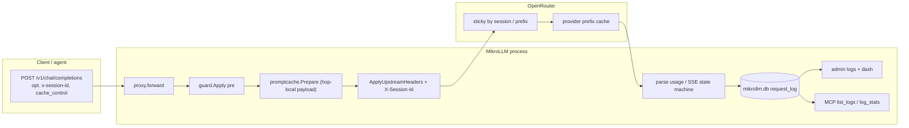

# Cloud prompt cache in MikroLLM (provider prefix cache only)

**English** · [Русский](ru/design-prompt-cache.md)

| Field | Value |
|---|---|
| **Author** | TBD |
| **Date** | 2026-09-19 |
| **Status** | Draft (rev. 3) |
| **Module** | `github.com/javded-itres/mikrollm` (Go 1.23, `CGO=0`) |
| **Target stand** | RouterOS 7.22, hAP ax³, container `mikrollm`, veth LLM `192.168.254.5`, `memory-high=64M`, USB `/data` |
| **Related (not this plan)** | [`docs/design-request-cache.md`](docs/design-request-cache.md) — exact-match response cache (`cache.db` / LRU / Redis). **Non-goal.** |

---

## Overview

Cloud providers via **OpenRouter** already discount **prefix reuse** of the prompt: the same system + the same long context, a new question at the tail. This is not an exact-match of the entire JSON request. MikroLLM today **does not enable, forward, or display** this: `guard.injectSystem` flattens multipart and drops `cache_control` / `prompt_cache_breakpoint`; the client's `x-session-id` never reaches upstream (a new `http.Request` is built from scratch); `request_log` does not store tokens; playground uses `stream: true`, and the gateway does not parse `usage` from the last SSE event.

The proposal is a **thin in-process layer on top of the cloud prefix cache**. No local response cache, no Redis, no `cache.db`, no embeddings, no tokenizer on the router. Three increments: (A) do not break and do forward fields/session header; (B) if the client sent nothing — **Anthropic only** top-level `cache_control`; (C) parse `usage` and show `cached_tokens` / a rough $ savings estimate. RAM budget — parsing a small `usage` object plus an SSE tail ≤ 64 KiB per in-flight request. `cmd="-data /data -listen :4000"` does not change.

The product case that exact-match cache **does not** cover: an agent with a stable long prefix and a new question every time — **on OpenRouter**:

| Path | What gateway v1 does | Expected savings |
|---|---|---|
| `anthropic/claude-*` | Layer B: top-level `"cache_control":{"type":"ephemeral"}` if the client did not send it | read ~0.10× after write 1.25× on the first turn |
| `z-ai/glm-*` and other **automatic** (OpenAI, DeepSeek, Gemini 2.5+ implicit, Grok, Moonshot) | Layer A: do not break prefix + `session_id`; Layer B **does not** inject | the provider caches on its own if the tokenized prefix is stable |
| Qwen-explicit / `deepseek/deepseek-v3.2` / Gemini-explicit | Layer A pass-through; client sends per-block `cache_control` (example in `docs/providers.md` **in PR 2**) | without client blocks the cache **does not** turn on; the gateway in v1 **does not** guess the breakpoint |

**Do not** sell $ prefix cache on the line in [`docs/load-test.md`](docs/load-test.md) §2 (`glm-5.3-flash` on **Ollama Cloud**, ISP). There billed prompt cache is a **no-op** (K10, Non-Goals). From that report take **RAM only**: bodies ~0.59 MB (~128k) / ~4–5 MB (~1M), idle ~26 MB, peak 256k×8 and 1M×1 ≈ 73–77 MB (nemotron 1M up to 84 MB) — cannot buffer the prompt a second time and cannot run Redis.

Default `prompt_cache=auto` is a **billing change** on live Claude (first turn 1.25× write), not a no-op deploy. PR 1 (preserve) ships separately; PR 2, which enables inject, **in the same PR** provides an admin/MCP `off` switch.

---

## Background & Motivation

### What the clouds do (OpenRouter, docs as of 2026-09-19)

Sources: [Prompt Caching](https://openrouter.ai/docs/features/prompt-caching), [Usage Accounting](https://openrouter.ai/docs/cookbook/administration/usage-accounting).

**Automatic** prefix cache (no extra JSON needed if the **tokenized** prefix is stable):

| Provider | Threshold / TTL | Read | Write |
|---|---|---|---|
| OpenAI | ≥ ~1024 tok | 0.25× or 0.50× | free up to GPT-5.6; GPT-5.6+ 1.25× even on automatic |
| Grok (xAI) | automatic | 0.25× | 0 |
| Moonshot | automatic | 0.25× | 0 |
| Groq (Kimi K2) | automatic | 0.50× | 0 |
| DeepSeek | automatic | 0.10× | 1.0× (same as input) |
| Z.AI | automatic | ~0.20× | 0 (limited-time free storage) |
| Gemini 2.5+ | implicit; Flash ≥1024, Pro ≥4096; TTL ~3–5 min | 0.25× | 0 on implicit |

**Explicit** `cache_control` (without it the cache **does not** turn on):

- **Anthropic Claude**: up to 4 breakpoints; min 1024–4096 tok depending on the model; TTL 5 min or `"ttl":"1h"` (write 1.25× / **2×**). Two modes: per-block and **top-level** `"cache_control": {"type":"ephemeral"}` — the breakpoint itself is placed at the end of the cacheable tail (multi-turn). **This is the only auto-inject in v1.**
- **Alibaba Qwen** (explicit list: `qwen/qwen3-max`, `qwen/qwen-plus`, `qwen/qwen3.6-plus`, `qwen/qwen3-coder-plus`, `qwen/qwen3-coder-flash`, **`deepseek/deepseek-v3.2`**; snapshot-id like `qwen/qwen3.5-plus-02-15` — **no**): **per-block only**, TTL 5 min, write 1.25×, read 0.10×. Claude's top-level field **does not** enable their cache. v1: pass-through + example for the client; **do not** stamp last-part.
- **Gemini via OpenRouter (explicit)**: per-block, the **last** breakpoint is taken; `systemInstruction` is immutable. Gemini 2.5+ implicit works **without** the field — auto-inject is not needed. Older/explicit path: pass-through.

OpenAI GPT-5.6+: `prompt_cache_breakpoint` on text parts + optional `prompt_cache_options`. OpenRouter translates `cache_control` ↔ `prompt_cache_breakpoint` (TTL is **not** carried over).

**Sticky routing** OpenRouter (account + model + conversation, idle **10 min**): conversation key = hash(first **system or developer** + first non-system), or `session_id` (body or `x-session-id`, ≤256 characters), or `prompt_cache_key`. With `session_id`, sticky turns on **before** the first cache hit. Manual `provider.order` turns sticky off.

Usage chat completions:

```json
"usage": {
  "prompt_tokens": 10339,
  "completion_tokens": 60,
  "cost": 0.042,
  "prompt_tokens_details": { "cached_tokens": 10318, "cache_write_tokens": 0 }
}
```

Anthropic-native additionally: `cache_read_input_tokens` / `cache_creation_input_tokens`. Parse both families.

Two different OpenRouter money fields (do not confuse):

- **`cache_discount`** (response root **or** `usage.cache_discount`) — savings from cache; can be **negative** on cache write. This is the candidate for `saved_usd`.
- **`usage.cost`** — **full billed charge of the hop**, not savings. Always put it in `usage_cost` if the key is present. **Never** write it to `saved_usd` and never substitute it for the multiplier.

Both persist on the hop (do not resolve alias→price post-factum).

**OpenRouter stream (Usage Accounting, 2026-09-19):** `usage: { include: true }` and `stream_options: { include_usage: true }` **deprecated, no effect**. Full `usage` is already **always** in the last SSE message (a separate event after `finish_reason`, then `data: [DONE]`). Keepalive: `: OPENROUTER PROCESSING`. Layer C **must** parse this chunk even if `Prepare` never sets `include_usage`. Optional inject of `include_usage` is defense-in-depth **only** on `KindOpenRouter` (a third-party OpenAI-compat proxy), not a parser condition.

**Ollama Cloud** (`https://ollama.com`, kind `ollama-cloud`): there is no documented billed prompt cache at Claude's level. Local Ollama already keeps a KV prefix on its own — that is **not** this feature. **vLLM / LM Studio / local Ollama**: no billed prompt cache → the layer is **no-op**.

### Current MikroLLM behavior (verified in the repository)

Chat chain: `internal/proxy/proxy.go` `forward` → optionally `queue.Engine.Handle` → `Proxy.Forward`.

```
POST /v1/chat/completions | POST /api/chat
        │
        ▼
proxy.forward                 // auth, ReadAll 32MiB, model, TouchKey
        │
        ├─ queues.Lookup ──► queue.Engine.Handle / run
        │                         Forward(wt.ctx, w, k, path, body, AssignedModel)
        └──────────────────► Proxy.Forward
                               guard.Apply(body, policies, GuardPre)   // always Unmarshal+Marshal
                               rewriteModel(filtered, upstream)        // hop-local today
                               http.NewRequest + domain.ApplyUpstreamHeaders
                               copySafeHeaders + WriteHeader, then copy 32 KiB + Flush
                               (memWriter + guard post, if !stream && HasPost)
                               st.Log(prefix, model, backend, status, latency, bytesOut)
```

Each `Forward`:

1. **`guard.Apply`** (`internal/guard/guard.go` 67–96) always `json.Unmarshal` → `map[string]any` → **`json.Marshal`** at the end, even if policies are empty. Plus an **inner** `json.Marshal` in the `applyPolicy` loop on every `changed`. **Object** keys are sorted by `encoding/json`. **Arrays are not reordered:** the order of `messages` and `content[]` is preserved. Extra top-level keys (`session_id`, `cache_control`, `provider`, `prompt_cache_key`, …) in `map[string]any` **survive**. Numbers become `float64` (`8` → `8`). The cache-killer is **not** key sorting, but `contentText` flatten in `injectSystem`.
2. **`injectSystem`**: if the **first** message is `role=system`, **replaces `content` with a string** `prompt + "\n\n" + contentText(...)`. This **flattens multipart** and **drops `cache_control` / `prompt_cache_breakpoint` on parts**. If there is no first system — prepend `{role, content: prompt}` (string), even if the client started with `developer` (OpenRouter sticky looks at system **or** developer). Keep the existing prepend-when-no-system behavior; do not patch `developer` as system in v1.
3. **`rewriteModel`**: remarshal only if the `model` string differs from `upstream`; other top-level keys are kept; if it matched — **the same bytes**. Result is hop-local: `filtered` is not overwritten.
4. **`domain.ApplyUpstreamHeaders`** (`internal/domain/token.go`): Bearer + `User-Agent: MikroLLM/0.0.1`; for OpenRouter also `HTTP-Referer`, `X-Title`, `X-OpenRouter-Title`. **No `x-session-id`.**
5. Client headers are **not** copied because `http.NewRequestWithContext` is built **from scratch** — that is the protection against leaking client Cookie/Authorization, **not** `copySafeHeaders` (`copySafeHeaders` is the **response** side: strips `Set-Cookie`/`Location`/CORS from upstream). The client's `X-Session-Id` **is lost**. `Forward` / `queue.Engine.Handle` do not take the original `http.Request`, only `context.Context` + body. Currently only `domain.WithQueueAlias` is put on ctx (`internal/domain/guardctx.go`). `Engine.run` already passes `wt.ctx` to `Forward` (`engine.go:300`); it is enough to wrap ctx in `forward` **before** `Handle`.
6. **`store.Log`** (`internal/store/store.go`): `INSERT INTO request_log (ts, key_prefix, model, backend, status, latency_ms, bytes_out)`. Trim last-500. **No token, upstream, or $ columns.** `Forward` writes the hop **alias** into `model` (`proxy.go:520`), not the catalog `upstream_name`. Admin `/admin/logs` and MCP `list_logs` / `log_stats` do not show cache.
7. OpenRouter catalog (`health.decodeOpenAICatalog`): `pricing.prompt` / `pricing.completion` → `CatalogEntry.PromptUSD` / `CompletionUSD` per 1M. **No cache-read prices.** Provider: `domain.ProviderOf(id, KindOpenRouter)` by prefix before `/` (`anthropic` → `Anthropic`, …). `catalogMeta` is an **exact** name match. Alias without `/` (`claude-sonnet-4`) on cold health gives `ProviderOf` → `"OpenRouter"` — auto **does not** inject (safe).
8. Stream: the gateway copies bytes 32 KiB + `Flush` **immediately after** `WriteHeader`. Does not set `stream_options.include_usage`. On OpenRouter this is **not** the cause of blindness (usage is already in the last SSE); blindness is that we **do not parse** the tail and do not distinguish `: comment` / `[DONE]` from the usage-chunk.
9. Fallback (`X-MikroLLM-Fallback`, hop>0) and queue overflow **change model**. The previous model's prefix cache **does not** carry over. `filtered` (post-guard) is shared across all hops — therefore inject `cache_control` **must not** be written back into `filtered`.
10. `least_conn` among several OpenRouter backends is rare; sticky on the OpenRouter side is per API key. The gateway must still forward `session_id`.

`walk` / `rewriteContent` on mask copy part-map keys, so `cache_control` on a block **survives** text masking. Changed text = miss at the provider — correct.

Container idle RSS ~**26 MB** ([`docs/load-test.md`](docs/load-test.md)). Peak 256k×8 / 1M×1 ≈ **73–77 MB** (1M nemotron ~84 MB) already above `memory-high=64M`. A second **prompt** buffer or Redis is not allowed. The **completion** buffer ≤ 1 MiB on non-stream without post-guard is a separate ceiling, not to be confused with the request body.

### Pains

1. "The same long prefix, new question" on **OpenRouter Claude** does not enable explicit cache until the client (and playground) sends `cache_control`. On **Qwen-explicit / `deepseek-v3.2`** the same — and v1 **does not** fix this with inject, only does not break client blocks.
2. The `system_prompt` policy breaks already placed breakpoints (`contentText`).
3. Agents do not see `cached_tokens` in logs, MCP, or the non-stream response header.
4. Playground (`internal/web/static/app.js`, `stream: true` → `/admin/chat` → `ServeChat` → `forward`) does not return a cache-tokens header (K13); without a parser of the last SSE `usage`, layer C is blind. `include_usage` is no longer required on OpenRouter.

---

## Goals & Non-Goals

### Goals

1. Do not break the cloud prefix cache: preserve and forward body fields and `x-session-id` to OpenRouter.
2. Fix `injectSystem`: do not flatten multipart, do not drop `cache_control` / `prompt_cache_breakpoint`.
3. If the client did not send cache-hints — **Anthropic top-level only** `"cache_control":{"type":"ephemeral"}` (`prompt_cache=auto` mode). Qwen / Alibaba / `deepseek/deepseek-v3.2` / Gemini-explicit — **pass-through + a documented per-block example in PR 2**, not auto-inject and not last-part stamp in v1.
4. Observe savings: parse `usage` (non-stream JSON and the **last SSE/NDJSON object that has `usage`**), write tokens + `saved_usd` (discount or estimate) + `usage_cost` (billed fact, not savings) to `request_log`, show in admin/MCP, emit `X-MikroLLM-Cache-Tokens` on non-stream.
5. Optionally on `KindOpenRouter` set `stream_options.include_usage=true` if the key is absent (do not overwrite explicit `false`). **Do not** treat this as a parser condition: OpenRouter usage in the stream is already there.
6. No-op on `ollama` / `vllm` / `lmstudio` / `ollama-cloud`.
7. CGO=0, no new modules in `go.mod` (currently only `golang.org/x/crypto` + `modernc.org/sqlite`). Zero RAM growth beyond parsing usage + 64 KiB tail/request + 1 MiB non-stream buffer (not HasPost).
8. Queue and fallback: the same `Forward`; `Prepare` is **hop-local**; usage is written for the **successful** hop.

### Non-Goals

- Exact-match response cache, L1 LRU, `<data>/cache.db`, Redis, `//go:build redis`, semantic cache — that is [`docs/design-request-cache.md`](docs/design-request-cache.md). This document **does not** change and **does not** implement that plan.
- KV prefix cache of local Ollama / vLLM (lives upstream; the gateway does not duplicate it and does not "turn it on").
- Billed prompt cache of Ollama Cloud — no public semantics; do not emulate; **do not** cite the glm-5.3-flash load-test as $ savings of this feature.
- Changing OpenRouter account-level sticky (not available from our side).
- Tokenizer on the device / estimating prompt token count.
- Reconciliation with OpenRouter invoices (`usage.cost` = billed fact; `saved_usd` = `cache_discount` or estimate, not an invoice).
- Cache of embeddings / image / audio / Batch API.
- Synthesizing `session_id` in v1 (see Key Decisions).
- Rewriting string-content into multipart and **stamping last text part** for Qwen/Gemini in v1 (optional PR 5).
- Default `"ttl":"1h"` (write 2×).
- New CLI flags required to start. `cmd="-data /data -listen :4000"` remains sufficient.
- Calling OpenRouter `GET /api/v1/generation` from the router (extra HTTPS, health timeouts ~8 s).

---

## Key Decisions

| # | Decision | Why |
|---|---|---|
| K1 | **Separate feature** from exact-match cache. Neither `cache.db`, nor Redis, nor a body hash key. | Different semantics (prefix vs full replay). On ax³ there is no RAM/USB for a second layer. The user explicitly asked only for cloud prompt cache. |
| K2 | **Body pass-through always**, regardless of `prompt_cache`. Field list: `cache_control` (top-level and per-block), `session_id`, `prompt_cache_key`, `prompt_cache_options`, `prompt_cache_breakpoint`, `provider` object. | A client/agent that already knows Claude/Qwen cache must not lose a breakpoint because of the gateway. `provider.order` turns sticky off — that is the client's choice, do not strip the field. Extra keys already survive `map[string]any`; the work is **not to destroy** them in `injectSystem`. |
| K3 | **`injectSystem` never flattens `[]any`.** Prepend a separate text part **before** cached blocks **or** a new system message. String stays string (do not convert to multipart — tokenization). Default branch (rare object-content): stringify via `contentText`, do not drop the message. Patch the first `role=system`; do not treat `developer` as system. Preserve message-level `cache_control` keys. | Current `contentText` on an array is a proven cache killer. Masking that **changes** cacheable text remains a miss — that is correct. |
| K4 | **`guard.Apply`:** (1) `len(Dedup(policies))==0` or no policy `Applies` to the phase → **do not decode**, return `body`; (2) only `system_prompt` → decode + inject + **one** Marshal; (3) remaining policies → decode, apply, **one** Marshal at the end; **remove** the inner `json.Marshal` in the `applyPolicy` loop; (4) if after policies `!changed` → original bytes. | The empty path on ax³ (no policies) must not build a map of 5 MB. Key sorting does not break prefix tokens, but Marshal/Unmarshal eat CPU/RAM. `Result.Changed` already exists and proxy does not use it. |
| K5 | **`x-session-id` via `context`**, not by extending the `Forward` signature. `domain.WithSessionID` / `SessionIDFrom` next to `WithQueueAlias` (ctx key `2`). Set it on OpenRouter `req.Header` in `Forward` **only** if `KindOpenRouter`. | `Forward` and the queue already take `ctx`; `run` already passes `wt.ctx`. There is no original `http.Request` in `run`. Do not copy other client headers: protection is a **new Request**, not `copySafeHeaders`. |
| K6 | **v1 `session_id`: pass-through only.** Do not generate. Clients/agents should send their own stable id (≤256). Playground does not send the header — OpenRouter's default hash (first system/developer + first non-system) is still sticky if `app.js` keeps the first user message. | Synthesis duplicates OpenRouter's default. A random id per request **breaks** sticky. |
| K7 | **Auto-inject Anthropic top-level only** `"cache_control": {"type":"ephemeral"}` (no `ttl`). No multipart rewrite. Qwen / Alibaba / `deepseek/deepseek-v3.2` / Gemini-explicit — **not** auto. | One key, multi-turn, 5 min, write 1.25×. `"ttl":"1h"` = 2× write. Per-block stamp on a 128k body shifts the prefix and hits Claude's 4-breakpoint limit. Document + client example in **PR 2**. Optional last-part stamp — **PR 5**, not v1. |
| K8 | **`NeedsAnthropicTopLevel(provider, sendAs, origModel)`:** true if `Provider` (after `ProviderLabel`) == `"Anthropic"` **or** prefix `anthropic/` on `sendAs` **or** on original `raw["model"]`. If all three miss (alias without `/`, cold catalog) — **do not** inject. | `catalogMeta` is exact match. Cold health + `upstream_name=claude-sonnet-4` → `"OpenRouter"`; a safe skip is better than a false inject. |
| K9 | **`prompt_cache` setting.** Global `admin_meta.prompt_cache` DEFAULT `'auto'`. On alias: `models.prompt_cache` DEFAULT `'inherit'`. **`Resolve(global, alias)`:** `""` and `"inherit"` on alias → global; empty global → `auto`. **`SaveModel`:** empty or invalid `PromptCache` **persist `'inherit'`** (like `LBPolicy==""` → `least_conn`). | Otherwise `setModelFallback` / `ConnectOllamaModel` / MCP without the field would wipe the mode to `""`, and the old Resolve(`""`→`auto`) would bypass global and force inject. |
| K10 | Modes (only hop `KindOpenRouter`; otherwise no-op): **`off`** — do not inject, pass-through; **`auto`** — top-level `cache_control` only if K8 and no hints; **`on`** — top-level on any OpenRouter request without hints. Never inject if hints are already present. Default `auto` = **behavior change / 1.25× write** on Claude, not a "safe off". | `on` is a manual lever. Do not rewrite messages. Do not set on Ollama Cloud. |
| K11 | **Cache-hints** (inject forbidden): top-level `cache_control` or `prompt_cache_options`; any nested `cache_control` / `prompt_cache_breakpoint` in the decoded map, **including `tools`**. `session_id` / `prompt_cache_key` are **not** a hint. | Do not overwrite client Claude/Qwen. Do not add a 5th Anthropic breakpoint on top of four block ones. Sticky can be combined with our top-level field. |
| K12 | **`include_usage` is optional**, only `KindOpenRouter`, if `stream` and the key is absent. Do not overwrite explicit `false`. Layer C **does not** depend on this field: parse the last usage chunk anyway. | OpenRouter: deprecated no-effect; usage is already in the last SSE. Inject — in case a third-party OpenAI-compat sits behind the same kind. |
| K13 | **Do not invent `usage`.** Forward the upstream object as-is (`walk` does not touch it). Do not add our own fields to the response JSON. Header `X-MikroLLM-Cache-Tokens` — **non-stream only** (before `WriteHeader`). Stream: usage in last-chunk + `request_log`. No trailers. `X-MikroLLM-Cache-Write-Tokens` — only if write > 0. | HTTP cannot append a header after flush. Stream buffering is forbidden. |
| K14 | **`Prepare` hop-local.** `filtered` forever = post-guard body. Each hop: `payload, _ := promptcache.Prepare(PrepInput{Body: filtered, SendAs: upstream, Kind: b.KindNorm(), ...})`. `payload` lives until `Do` of this hop and is **not** written into `filtered`. Inside Prepare: one Unmarshal → model + optional inject + optional include_usage → one Marshal if changed. Non-OR: cheap path like current `rewriteModel` (Unmarshal only if `model` ≠ `SendAs`). | Otherwise Claude `auto` on hop 0 would leave `cache_control` in hop 1's body (OpenAI/Ollama/Qwen) — that is `on` behavior under `auto` and a 400 risk. Today `rewriteModel(filtered, upstream)` is already hop-local. |
| K15 | **Log: ALTER `request_log`**, not a new table. Tokens + hop identity + $ at write time (see Data Model). Trim 500. Parse usage only from a **successful** body (2xx); 4xx/5xx/guard/502 → zeros. Fallback: each hop row as today; non-zero tokens only on 2xx hop. | `catalogMeta(alias)` post-factum does not find `anthropic/claude-…`. The price must be recorded while the hop knows `upstream` and `requested`. |
| K16 | **Package `internal/promptcache`** (std only): mode, hints, inject, parse usage, SSE state machine, multipliers. `proxy` calls; `store` does not import. | Keep `proxy.go` short. Tests without HTTP. |
| K17 | **`usage.cost` is total billed, never `saved_usd`.** (1) If `cache_discount` is present (root **or** `usage.cache_discount`) → `saved_usd = cache_discount` (negative write is ok). (2) Else if `cached_tokens` **or** `cache_write_tokens` > 0 **and** hop catalog `prompt_usd` is known → estimate with multiplier (OpenAI **0.50×**, underestimates vs 0.25×). (3) `usage.cost` always persist as `usage_cost` if the key is present; **does not** participate in `EstimateSaved`. No discount, no cached/write, unknown provider or no `prompt_usd` → `saved_usd=0`, still write tokens. Do not call `/api/v1/generation`. Dash: sum of `saved_usd` = savings; `usage_cost` separately as fact. | Otherwise the presence of `cost` on every OR-chunk would zero out the "$ estimate", and substituting cost→saved would lie the other way. |
| K18 | **Do not forward `x-session-id` to non-OpenRouter.** | On Ollama/vLLM the header is meaningless. Body `session_id` will still go as an extra JSON key. |
| K19 | **All model SQL in PR 2** (ALTER + all SELECT/INSERT/UPDATE `ListModels`/`GetModel`/`GetModelByAlias`/`SaveModel`/`ConnectOllamaModel`). MCP: `prompt_cache` property in schema (`additionalProperties: false`); `hasArg("prompt_cache")` otherwise keep old. Admin POST via `u.protect` (CSRF), `setModelFallback` pattern. Methods `PromptCacheMode`/`SetPromptCacheMode` **on `ports.Store`**. | Otherwise a round-trip would wipe the column; MCP could neither read global nor send the field. |

---

## Proposed Design

### Components



No new processes. Same SQLite `mikrollm.db`, `MaxOpenConns=1`.

### Forward flow (after changes)

```mermaid
sequenceDiagram
  participant Cl as Client
  participant Fw as proxy.forward
  participant Q as queue.Engine
  participant F as Proxy.Forward
  participant G as guard.Apply
  participant PC as promptcache.Prepare
  participant Up as OpenRouter
  participant Log as store.Log

  Cl->>Fw: body + X-Session-Id
  Fw->>Fw: ctx = WithSessionID(r.Context(), header)
  alt queue alias
    Fw->>Q: Handle(ctx, …, original body)
    Q->>F: Forward(wt.ctx, …, AssignedModel)
  else
    Fw->>F: Forward(ctx, …)
  end
  F->>G: Apply(body, policies, GuardPre)
  Note over G: no policies → no decode<br/>injectSystem does not flatten
  G-->>F: filtered = pre.Body (forever)
  loop hop 0..3
    F->>F: pick backend / upstream
    F->>PC: Prepare(Body: filtered, SendAs, Kind, Provider, Mode)
    Note over PC: payload hop-local;<br/>filtered is not changed
    F->>Up: POST payload + headers
    alt 2xx
      F->>F: 3-way: stream / HasPost / 1MiB
      F->>Log: usage of this hop
    else error + fallback
      F->>Log: zeros
      Note over F: next hop Prepare(filtered) again
    end
  end
```

Insertion points:

- `proxy.forward` (~line 350): `ctx := domain.WithSessionID(r.Context(), r.Header.Get("X-Session-Id"))`; into `queues.Handle` and direct `Forward` — this `ctx` (currently the queue gets a bare `r.Context()`). `Engine.run` already does `Forward(wt.ctx, …)`.
- `Proxy.Forward`: `filtered = pre.Body` **once**; on each hop `payload, _ := promptcache.Prepare(PrepInput{Body: filtered, SendAs: upstream, Kind: b.KindNorm(), Provider: p.providerOf(...), OrigModel: requested, Mode: mode})`. **Do not** `filtered = payload`.
- Before `p.client.Do`: if `b.KindNorm()==KindOpenRouter` and `SessionIDFrom(ctx)!=""` → `req.Header.Set("X-Session-Id", sid)`.
- Response: 3-way branch (below). Never `WriteHeader`/`Flush` to the client `w` before EOF on non-stream without HasPost.

### Layer A — do not break / forward

#### `injectSystem`

Currently (`internal/guard/guard.go` 217–230): flatten via `contentText`.

New:

```go
func injectSystem(raw map[string]any, prompt string) {
    msgs, _ := raw["messages"].([]any)
    if len(msgs) > 0 {
        if m, ok := msgs[0].(map[string]any); ok {
            if role, _ := m["role"].(string); strings.EqualFold(role, "system") {
                switch c := m["content"].(type) {
                case string:
                    m["content"] = prompt + "\n\n" + c // string stays string
                case []any:
                    part := map[string]any{"type": "text", "text": prompt}
                    m["content"] = append([]any{part}, c...) // share block maps, do not mutate
                default:
                    // rare object-content: stringify, do not drop the message
                    m["content"] = prompt + "\n\n" + contentText(c)
                }
                msgs[0] = m
                raw["messages"] = msgs
                return
            }
        }
    }
    // no first system (incl. developer only) — prepend system, as today
    sys := map[string]any{"role": "system", "content": prompt}
    raw["messages"] = append([]any{sys}, msgs...)
}
```

Rules:

- Do not call `contentText` on `[]any`.
- Do not remove message keys (`name`, message-level `cache_control`).
- Do not convert string → multipart in v1.
- Prepend **before** cached blocks: the policy lands in the prefix. Stable policy → shared cache; change → miss (correct).
- `rewriteContent` on mask copies the part-map — `cache_control` lives. Mask of cacheable text = miss.
- `developer` as first message: **do not** patch its content; prepend a new `system` (as today when system is absent). OpenRouter sticky hashes first system/developer — appearance of our system **changes** the sticky key if the client does not send `session_id`. Document this; do not fix by synthesizing an id in v1.

#### `guard.Apply`

```go
func Apply(body []byte, policies []domain.Policy, phase string) Result {
    policies = Dedup(policies)
    any := false
    for _, p := range policies {
        if Applies(p, phase) {
            any = true
            break
        }
    }
    if !any {
        return Result{Body: body} // no decode
    }
    raw, ok := decode(body)
    if !ok {
        return Result{Body: body}
    }
    changed := false
    if phase == domain.GuardPre {
        if prompt := joinSystem(policies); prompt != "" {
            injectSystem(raw, prompt)
            changed = true
        }
    }
    for _, p := range policies {
        if !Applies(p, phase) || p.Kind == domain.GuardSystemPrompt {
            continue
        }
        blocked, ch := applyPolicy(raw, p) // no longer Marshal inside
        if blocked != nil {
            return Result{Body: body, Block: blocked}
        }
        changed = changed || ch
    }
    if !changed {
        return Result{Body: body}
    }
    out, err := json.Marshal(raw)
    if err != nil {
        return Result{Body: body}
    }
    return Result{Body: out, Changed: true}
}
```

Document: providers hash **tokens** of `messages`, not JSON bytes. `encoding/json` **does not** reorder arrays (`messages`, `content[]`); it only reorders object keys. Forbidden to rebuild `messages` out of order, except prepend system.

#### Session header

`internal/domain/guardctx.go`:

```go
const sessionIDCtxKey guardCtxKey = 2

func WithSessionID(ctx context.Context, id string) context.Context { /* trim; cut at \r/\n; cap 256 */ }
func SessionIDFrom(ctx context.Context) string
```

`http.Header.Get("X-Session-Id")` case-insensitive. Empty string → do not touch ctx. Length >256: silently trim from the right (collisions allowed). Cut CRLF like `SanitizeToken`.

Body `session_id` OpenRouter takes **before** the header; we do not rewrite the body (K6). Header only → forward header. Body only → JSON pass-through. Both → OpenRouter prefers body.

Forward the header **only** `KindOpenRouter` (K18).

#### Layer A tests (PR 1, without `Prepare`)

1. Multipart system + `cache_control` on the second block, **without** `system_prompt` → block structure and `cache_control` intact; top-level `session_id`, `prompt_cache_key`, `provider` alive.
2. Same **with** `system_prompt` → structural equality `content` = `[policyPart, ...original]`; second block with `cache_control` not flattened.
3. String system + `system_prompt` → string concatenation, not an array.
4. Message-level `cache_control` + string content + `system_prompt` → key on the message lives, content stays string.
5. `x-session-id` on upstream **only** kind `openrouter`. Not on Ollama/vLLM.
6. Queue overflow: hop on OpenRouter overflow-alias still sees `X-Session-Id` (`forward` puts ctx before `Handle`; overflow calls `Forward` with the same ctx).
7. `Apply` without policies: `bytes.Equal` to original body (and **without** Unmarshal — can spy on the decoder in the test via invalid JSON? enough: valid JSON with unsorted keys remains byte-equal).
8. `rewriteModel` when changing `model` preserves extra keys (almost already have `TestRewriteModelReplacesQueueAlias` — add extra field). Do **not** mention `Prepare` here.

### Layer B — enable if the client did not send

Package `internal/promptcache` (appears in PR 2):

```go
const (
    ModeOff     = "off"
    ModeAuto    = "auto"
    ModeOn      = "on"
    ModeInherit = "inherit"
)

type PrepInput struct {
    Body      []byte
    SendAs    string // upstream model of this hop
    OrigModel string // raw/client/alias; for K8
    Kind      string
    Provider  string // CatalogEntry.Provider hop
    Mode      string // already Resolve()'d off|auto|on
}

func Prepare(in PrepInput) (out []byte, changed bool)
func HasCacheHints(raw map[string]any) bool
func NeedsAnthropicTopLevel(provider, sendAs, origModel string) bool
func Resolve(global, alias string) string
```

`Resolve`:

```go
func Resolve(global, alias string) string {
    a := strings.ToLower(strings.TrimSpace(alias))
    if a == "" || a == ModeInherit {
        g := strings.ToLower(strings.TrimSpace(global))
        if g == "" {
            return ModeAuto
        }
        return g
    }
    return a
}
```

`SaveModel` (store):

```go
if m.PromptCache == "" || !validPromptCache(m.PromptCache) {
    m.PromptCache = ModeInherit
}
```

`validPromptCache` for the alias column: `inherit|off|auto|on`. For global: `off|auto|on`. Garbage on **read** of alias → treat as inherit; on **write from admin/MCP** — HTTP/MCP error. `SaveModel` from internal round-trips (`setModelContext`) always has a valid field after GetModel.

`Prepare`:

1. If `Kind != KindOpenRouter` and (`SendAs==""` || model already equals) — return body (like `rewriteModel` early-return). If model needs changing — Unmarshal only for `model`.
2. Else Unmarshal → map; error → body.
3. Substitute `SendAs` into `model` if needed.
4. Optional `include_usage` (K12) — can be in PR 3; not required in PR 2.
5. Inject `cache_control` if OpenRouter and not `HasCacheHints`:
   - `Mode==auto` && `NeedsAnthropicTopLevel(provider, sendAs, origModel)` → `{"type":"ephemeral"}`;
   - `Mode==on` → the same without `ttl`;
   - else skip.
6. Marshal if changed; otherwise original bytes of **this** input (`filtered`, not previous payload).

`NeedsAnthropicTopLevel`: OR over three strings, case-insensitive prefix `anthropic/` and provider `"Anthropic"`. All miss → false.

`HasCacheHints`: recursion over decoded map (messages, tools, …). Not `bytes.Contains`.

Resolve mode **once** per request (by hop 0 alias / requested), not on each fallback alias? **No:** fallback is a different model, a different `GetModelByAlias(model)` on the current hop. Resolve mode **on the hop** by the current `model` after `pick`. Claude→OpenAI: hop 1 OpenAI alias with `inherit` → global `auto` → `NeedsAnthropicTopLevel` false → **no** inject on hop 1, even if hop 0 injected into its payload. This works **only** if payload is hop-local (K14).

PR 2 test (mandatory): Anthropic hop 402 → fallback OpenAI alias; captured OpenAI body **without** top-level `cache_control` under `auto`.

Qwen/Gemini-explicit: in PR 2 — a paragraph + JSON per-block example in [`docs/providers.md`](docs/providers.md) (do not wait for PR 4). The gateway does not place the blocks.

### Layer C — observe savings

#### Usage parsing

```go
type Usage struct {
    PromptTokens     int
    CompletionTokens int
    CachedTokens     int
    CacheWriteTokens int
    CacheDiscount    float64
    HasDiscount      bool // cache_discount key was present (even if 0 or <0)
    Cost             float64
    HasCost          bool // usage.cost key was present; this is billed total, not savings
}

func ParseJSON(event []byte) Usage // full chat JSON or full SSE data-payload
func ParseUsageMap(u map[string]any) Usage // inner usage object only (tokens + cost + usage.cache_discount)
```

`ParseJSON` looks at the **entire event** (completion body / SSE payload that the state machine saved because it had the `"usage"` key):

| Field | JSON path (full event) |
|---|---|
| Prompt | `usage.prompt_tokens`, otherwise `usage.input_tokens` |
| Completion | `usage.completion_tokens`, otherwise `usage.output_tokens` |
| Cached | `usage.prompt_tokens_details.cached_tokens`, otherwise `usage.cache_read_input_tokens` |
| Write | `usage.prompt_tokens_details.cache_write_tokens`, otherwise `usage.cache_creation_input_tokens` |
| `HasDiscount` / `CacheDiscount` | key **`cache_discount` at the root**; if absent — **`usage.cache_discount`**. Value may be <0. No key → `HasDiscount=false`, do not confuse with 0. |
| `HasCost` / `Cost` | **`usage.cost` only**. Do not read root `cost` (foreign fields). This is **total billed**, not savings. |

Ollama NDJSON `done`: `prompt_eval_count` / `eval_count`; cached/write/discount/cost = none.

`ParseUsageMap` **does not** see root `cache_discount`. Therefore SSE/`ParseJSON` always feed the **full event payload**, not a cut-out `usage`. If `ParseUsageMap` is called on the inner map — discount only from `usage.cache_discount`.

If both token families — **max** per field (not sum). Negative tokens → 0. Do **not** clip `cache_discount`. Do not clip `usage.cost`. Non-int numbers via `float64` trunc for tokens.

Unmarshal error / not-object → zeros. Do not log the body.

#### Stream: state machine (copy loop + ignore list)

Playground and agents: `stream: true`. OpenRouter sends keepalive `: OPENROUTER PROCESSING`, deltas, a **separate** usage event after `finish_reason`, then `data: [DONE]`. Do not copy the LiteLLM bug of "stop before the usage chunk".

```
lastUsage = nil
frag = empty  // ≤ 64 KiB
for {
    n, err = resp.Body.Read(buf32k)
    if n > 0 {
        Write+Flush to client   // ALWAYS, even on tail overflow
        feed(tailScanner, buf[:n])
    }
    if err != nil { break }
}
Log(ParseJSON(lastUsage))  // nil → zeros
```

`feed` (SSE, OpenRouter / OpenAI-compat):

1. Accumulate lines in `frag`. If `len(frag) > 64KiB` → **drop frag**, do not touch `lastUsage` (if a usage-chunk already existed — keep it; if not — remains 0). **Do not stop copy to the client.**
2. Empty line → event separator, ignore.
3. Line with prefix `:` → comment/keepalive, ignore.
4. `data: [DONE]` or payload `[DONE]` → ignore for usage.
5. Line `data:` + JSON: Unmarshal into `map[string]any`. If there is a `"usage"` key:
   - if `len(payload) ≤ 64KiB` → `lastUsage = payload` (**entire event**, not inner `usage` — otherwise root `cache_discount` is lost);
   - else → **do not** save this frame (`usage=0` if there was no other), copy continues.
6. Other `data:` (deltas without `usage`) → ignore for usage.
7. Non-JSON payload → ignore.

NDJSON (`/api/chat` native Ollama): same limits; candidate — object with `done==true` and/or `prompt_eval_count`; `cached_tokens=0`. Do not raise the cap "to a whole huge NDJSON". If usage happens to be on a giant content-frame — accept 0, do not buffer.

RAM: 64 KiB × inflight; c=8 → 512 KiB. Do not buffer the entire SSE.

No `X-MikroLLM-Cache-Tokens` on stream.

PR 3 tests: comment frames; `[DONE]`; usage-only extra chunk after `finish_reason`; 64 KiB overflow → HTTP 200 + full body to client + `cached_tokens=0`; client `stream_options.include_usage=false` is not rewritten; parser finds usage **without** inject `include_usage`.

#### Non-stream / stream: 3-way branch (one place in Forward)

Today `copySafeHeaders(outW.Header(), resp.Header)` is called **once** on the writer that actually emits (`w` or `memWriter`), then `WriteHeader`, then copy+Flush. `copySafeHeaders` (`proxy.go` 708–716) does **`Add`**, not `Set`: a second call on the same keys **duplicates** `Content-Type` / `Cache-Control`. There is no shared `outHeader` across branches. Invariant: upstream headers are copied **exactly once** onto the writer from which the client will see them.

The queue wraps `w` in `headTracker`: the first `Write` without `WriteHeader` forces 200 — therefore the buffer is **not** in `w`, but in `bytes.Buffer` / existing `memWriter`, until headers are decided.

Pseudocode of **one** place after a successful `Do` (2xx). **No** line `copySafeHeaders(outHeader, …)` before `switch`.

```
switch {
case guard.IsStream(filtered):
    copySafeHeaders(w.Header(), resp.Header)   // once, onto client w
    w.WriteHeader(code)                        // no X-MikroLLM-Cache-*
    copy 32KiB + Flush + tailScanner           // into w / headTracker
    usage = ParseJSON(lastUsage)               // full SSE event

case guard.HasPost(policies):
    // unbounded memWriter — do NOT cut at 1 MiB; as today
    cap := memWriter{h: http.Header{}}
    copySafeHeaders(cap.Header(), resp.Header) // once, ONLY onto cap
    cap.WriteHeader(code)
    copy all of upstream into cap (no Flush to the client)
    post := guard.Apply(cap.buf.Bytes(), policies, GuardPost)
    if post.Block != nil { ...; return }
    usage = ParseJSON(post.Body)               // walk does not strip usage
    // upstream not yet copied onto w — must not copy resp.Header onto w AND cap.h onto w
    copySafeHeaders(w.Header(), cap.h)         // once: upstream from cap
    setCacheHeaders(w.Header(), usage)         // Header.Set, not Add — does not duplicate
    w.WriteHeader(cap.code or 200)
    w.Write(post.Body)
    // headTracker.wrote == true only after this Write

default:
    // !stream && !HasPost: buffer ≤ 1 MiB; NO Write/Flush to w until EOF/overflow
    var buf bytes.Buffer
    overflow := false
    for {
        n, err := resp.Body.Read(tmp)
        if n > 0 {
            if !overflow && buf.Len()+n <= MaxUsageBuffer { // 1<<20
                buf.Write(tmp[:n])
            } else {
                if !overflow {
                    overflow = true
                    copySafeHeaders(w.Header(), resp.Header) // once
                    w.WriteHeader(code)                      // WITHOUT cache-headers
                    w.Write(buf.Bytes())
                    buf.Reset()
                }
                w.Write(tmp[:n]); Flush
            }
        }
        if err != nil { break }
    }
    if overflow {
        usage = zero   // usage is at the end of JSON — do not parse a prefix
    } else {
        usage = ParseJSON(buf.Bytes())
        copySafeHeaders(w.Header(), resp.Header) // once
        setCacheHeaders(w.Header(), usage)       // Set after copy
        w.WriteHeader(code)
        w.Write(buf.Bytes())
    }
}

p.st.Log(..., usageWithPrice(usage, upstream, catalog, provider))
```

`setCacheHeaders`: only `Header.Set("X-MikroLLM-Cache-Tokens", …)` and when write>0 `Set("X-MikroLLM-Cache-Write-Tokens", …)`. After `copySafeHeaders` (`Add`) this is safe: our keys are not in `resp`.

Hard rules:

- **Never** call `copySafeHeaders(w.Header(), resp.Header)` and then `copySafeHeaders(w.Header(), cap.h)` — `Add` will double `Content-Type`.
- HasPost: upstream headers live on `cap.h`; they reach `w` **only** from `cap.h`.
- Overflow 1 MiB: **do not** parse truncated JSON; `usage` is at the end. Copy headers once at overflow time, without cache-tokens.
- HasPost **without** the 1 MiB ceiling.
- On stream never delay the first byte for usage.
- `headTracker.wrote` is true only when the client actually received bytes.

PR 3 tests: overflow 1MiB+1 → 200, full body, no cache-header, tokens 0; HasPost + usage headers; `headTracker.wrote` after a real write; **exactly one `Content-Type`** at the client on stream, HasPost, and buffered JSON.

#### `include_usage` (PR 3, optional)

In `Prepare`, only `KindOpenRouter` + stream: if there is no `include_usage` key — set `true`. Leave client `false`. The parser does not require this field.

#### `store.Log` / ports

```go
// ports.LogRepo — 5 call sites in proxy.go, 2 in mcp/server_test.go, no others
Log(prefix, model, backend string, status int, latency time.Duration, bytesOut int64, u domain.TokenUsage)
```

`domain.TokenUsage` carries tokens + hop-time $ (zeros on guard/502/4xx).

#### $ estimate (computed in proxy at Log time, not post-factum)

`usage.cost` is **not** passed here and **not** read.

```go
func EstimateSaved(u Usage, promptUSDPer1M float64, provider string) (saved float64, ok bool) {
    if u.HasDiscount {
        return u.CacheDiscount, true // 0 and negatives are valid
    }
    if u.CachedTokens == 0 && u.CacheWriteTokens == 0 {
        return 0, false
    }
    if promptUSDPer1M <= 0 {
        return 0, false
    }
    readMult, known := ReadMultiplier(provider)
    if !known {
        return 0, false
    }
    saved = promptUSDPer1M/1e6*float64(u.CachedTokens)*(1-readMult)
    // write extra: Anthropic/Qwen 1.25× if CacheWriteTokens>0
    // do NOT use u.Cost / u.HasCost
    return saved, true
}

// persist on hop:
//   usage_cost = u.Cost if u.HasCost, otherwise 0
//   saved_usd  = EstimateSaved(...) if ok, otherwise 0
```

The **read** table (fallback if there is no `cache_discount`):

| Provider label / slug | read × |
|---|---|
| Anthropic / `anthropic` | 0.10 |
| DeepSeek / `deepseek` | 0.10 |
| Qwen / `qwen` | 0.10 |
| Google / `google` | 0.25 |
| xAI / `x-ai` / Grok | 0.25 |
| Moonshot / `moonshotai` | 0.25 |
| Groq / `groq` | 0.50 |
| OpenAI / `openai` | **0.50** (conservatively underestimates vs 0.25× models) |
| Z.ai / `z-ai` | 0.20 |
| otherwise | unknown → tokens only |

`promptUSDPer1M` = `catalogMeta(upstream, requested).PromptUSD` **on the hop**, while both names are known. Write into the log row.

Dash last-500:

- savings: **sum of `saved_usd`** (discount or estimate);
- OpenRouter fact: **sum of `usage_cost`** as a separate caption, if at least one row `HasCost` (in SQLite a non-zero `usage_cost` **or** the column is filled — 0 is valid, so better to count "has cost" if the hop wrote it; for UI simplicity: show the sum of `usage_cost` as "billed (OR)", the sum of `saved_usd` as "savings estimate"). **Do not** subtract one from the other.

UI: "estimate", not billing. `usage.cost` is never the caption under "saved".

### Data and settings

**`admin_meta.prompt_cache TEXT NOT NULL DEFAULT 'auto'`** — `Store.PromptCacheMode() / SetPromptCacheMode` on **`ports.Store`**.

**`models.prompt_cache TEXT NOT NULL DEFAULT 'inherit'`** — all model SQL in PR 2, in one commit.

Validation as K9. No `settings` table. No second SQLite.

### RAM / load

| Item | Estimate | Comment |
|---|---|---|
| `Usage` struct | tens of bytes | stack |
| SSE tail | ≤ 64 KiB × inflight | c=8 → 512 KiB; overflow is not accumulated |
| Non-stream buffer | ≤ 1 MiB, only `!stream && !HasPost` | playground streams |
| HasPost memWriter | unbounded, **as today** | this plan does not tighten it |
| Inject top-level | ~40 bytes of JSON | no copies of the 128k prefix |
| Log columns × 500 | tens of KiB | INTEGER+REAL |
| Idle RSS | ~26 MB unchanged | no Redis, no L1 |
| Bodies 0.59 / 5 MB | RAM evidence from load-test | not $ Ollama Cloud |

No policies → guard without decode. `Prepare` on local Ollama with matching `model` — without Unmarshal.

### Queue and fallback

- `forward` puts session on ctx **before** `Handle`. Overflow (`engine.go` ~148: `Forward(..., q.OverflowAlias)`) and `run` use the same ctx → `X-Session-Id` on OpenRouter overflow hop. Do not share another model's prefix cache.
- Fallback in `Forward`: each hop `Prepare(filtered, …)` anew. Claude `cache_control` **does not** leak onto the OpenAI hop. Failed hop: tokens=0. Successful: its own `cached_tokens` / `saved_usd`.
- `X-MikroLLM-Fallback` as today when `hop>0`.

### Admin / MCP

**PR 2 (the switch, mandatory together with inject):**

- `/admin/models`: select `prompt_cache` like `fallback`; `POST /admin/models/{id}/prompt-cache` via `u.protect` (CSRF, copy of `setModelFallback`: GetModel → field → SaveModel).
- Global select on `/admin/models` above the alias table: `POST /admin/prompt-cache` also `u.protect`.
- MCP `save_model` / `list_models`: field in **schema**. `hasArg("prompt_cache")` otherwise old. `get_status` additive `prompt_cache.global`.

**PR 4 (observation, after log columns):**

- `/admin/logs`: columns prompt / cached / write / $ estimate.
- `/admin` dash: stat "prompt cache" = sum of `cached_tokens` + sum of `saved_usd` (savings). Optionally next to it the sum of `usage_cost` as "billed", not as savings.
- MCP `list_logs` / `log_stats`: additive token + `$` fields; `cached_ratio`.

Non-stream headers:

```
X-MikroLLM-Cache-Tokens: 10318
X-MikroLLM-Cache-Write-Tokens: 1234    # only if > 0
```

Do not confuse with future exact-match `X-MikroLLM-Cache: hit|miss`.

---

## API / Interface Changes

### HTTP client → gateway (no breaking)

```http
POST /v1/chat/completions
X-Session-Id: agent-thread-42
```

```json
{
  "model": "claude",
  "session_id": "agent-thread-42",
  "prompt_cache_key": "…",
  "cache_control": { "type": "ephemeral" },
  "messages": [
    {
      "role": "system",
      "content": [
        { "type": "text", "text": "stable prefix…", "cache_control": { "type": "ephemeral" } }
      ]
    }
  ]
}
```

No new required fields. Response: upstream `usage` as-is + cache-headers on non-stream.

### `ports.LogRepo`

Was: `Log(..., bytesOut int64)`  
Became: `Log(..., bytesOut int64, u domain.TokenUsage)`

### `ports.Store` / `domain.Model`

Add to the `ports.Store` interface (MCP `Server.st` is `ports.Store`, no type assert):

```go
PromptCacheMode() string
SetPromptCacheMode(string) error
```

```go
type Model struct {
    // ...
    Fallback     string
    PromptCache  string // inherit|off|auto|on; SaveModel: "" → inherit
}

type TokenUsage struct {
    PromptTokens, CompletionTokens, CachedTokens, CacheWriteTokens int
    Upstream       string
    PromptUSD      float64 // catalog $/1M on hop; 0 if none
    CacheDiscount  float64
    HasDiscount    bool
    Cost           float64
    HasCost        bool
    SavedUSD       float64
    HasSaved       bool
}

type RequestLog struct {
    // existing fields ...
    PromptTokens, CompletionTokens, CachedTokens, CacheWriteTokens int
    Upstream      string
    PromptUSD     float64
    CacheDiscount float64
    UsageCost     float64
    SavedUSD      float64
}
```

Has* are not stored as a separate BOOL in SQLite: for `cache_discount` / `usage_cost` / `saved_usd` write REAL and consider "present" if the hop filled them (0 is valid for discount). Simpler: three REAL + do not introduce `flags`; dash sums `saved_usd` as-is (0 does not hurt the sum). If discount was 0 — the sum does not change, that is ok.

### MCP

`objSchema(..., additionalProperties: false)`:

- `save_model`: property `prompt_cache` (string).
- `list_models`: field in the result.
- `list_logs` / `log_stats`: additive, filter schema need not be extended.
- `get_status`: additive `prompt_cache`.

---

## Data Model Changes

```sql
-- store.migrate, ignore duplicate
-- PR 2:
ALTER TABLE models ADD COLUMN prompt_cache TEXT NOT NULL DEFAULT 'inherit';
ALTER TABLE admin_meta ADD COLUMN prompt_cache TEXT NOT NULL DEFAULT 'auto';

-- PR 3:
ALTER TABLE request_log ADD COLUMN prompt_tokens INTEGER NOT NULL DEFAULT 0;
ALTER TABLE request_log ADD COLUMN completion_tokens INTEGER NOT NULL DEFAULT 0;
ALTER TABLE request_log ADD COLUMN cached_tokens INTEGER NOT NULL DEFAULT 0;
ALTER TABLE request_log ADD COLUMN cache_write_tokens INTEGER NOT NULL DEFAULT 0;
ALTER TABLE request_log ADD COLUMN upstream TEXT NOT NULL DEFAULT '';
ALTER TABLE request_log ADD COLUMN prompt_usd REAL NOT NULL DEFAULT 0;
ALTER TABLE request_log ADD COLUMN cache_discount REAL NOT NULL DEFAULT 0;
ALTER TABLE request_log ADD COLUMN usage_cost REAL NOT NULL DEFAULT 0;
ALTER TABLE request_log ADD COLUMN saved_usd REAL NOT NULL DEFAULT 0;
```

Migration is compatible with USB `/data/mikrollm.db`. Old 500 rows — zeros. An old binary with explicit `SELECT id, ts, … bytes_out` works on the new schema. A new binary runs ALTER in `Open`. Rollback: restore the binary; columns do not get in the way. Switch without downgrade: `prompt_cache=off` (UI in PR 2).

No indexes needed on token/$ columns.

---

## Alternatives Considered

### 1. Exact-match response cache (L1 LRU + `cache.db` / Redis)

[`docs/design-request-cache.md`](docs/design-request-cache.md). Saves a full replay, **not** "the same prefix, new question". **Do not do.** Coexistence later: different headers (`X-MikroLLM-Cache` vs `X-MikroLLM-Cache-Tokens`).

### 2. Redis sidecar / second container

No free RAM on hAP ax³. Redis does not increase the provider's `cached_tokens`. Rejected.

### 3. Synthesizing `session_id`

Duplicates OpenRouter's default; random-per-request breaks sticky. v1 pass-through (K6). Not PR 5 of this plan (PR 5 = last-part stamp).

### 4. Per-block auto breakpoint / stamp last text part

Needed for Qwen, `deepseek/deepseek-v3.2`, Gemini-explicit. Risk: breakpoint shift, string→multipart changes tokenization, Anthropic limit 4. **Not v1.** Optional **PR 5** after documentation in PR 2. Goal 3 narrowed to Anthropic top-level.

### 5. Buffer the entire stream for a header

1M completion × c will hit 64M. Clients ignore trailers. Rejected: state machine + log.

### 6. Cache-read prices from OpenRouter `/models` or `GET /generation`

`decodeOpenAICatalog` knows only prompt/completion. `input_cache_read` has been unstable. `/api/v1/generation` is extra HTTPS from the router. **Preference:** `cache_discount` (root or `usage`) as `saved_usd`; otherwise the multiplier. `usage.cost` persist separately as fact, **not** as savings.

### 7. Default `prompt_cache=off`

Zero billing surprise, but Claude without the field still will not enable cache until the operator finds out. Keep `auto` as the product, **but** call it a behavior change and ship `off` in the same PR as inject.

---

## Security & Privacy Considerations

| Threat | Mitigation |
|---|---|
| Leak of client Cookie/Authorization to OpenRouter | New `http.Request` from scratch; only `X-Session-Id` goes upstream (and our Referer/Title/Bearer of the backend). `copySafeHeaders` is irrelevant here (response). |
| `session_id` as a correlator in logs | **Do not** write to `request_log`. |
| CRLF in the header | Trim; strip `\r\n` (like `SanitizeToken`). |
| CSRF on new POST | `u.protect` — like `POST /admin/models/{id}/fallback`. |
| Mask policy vs provider cache | Cache is the **provider's**. Next request with different text = miss. |
| `prompt_cache=on` → 400 | Opt-in. Do not retry stripping the field. |
| Default `auto` = 1.25× write Claude | Rollout: PR 1 first; PR 2 = inject **and** UI/MCP `off`. Short playground under min tokens: the field will still go out, there may be no cache. |
| $ estimate vs invoice | "estimate"; `cache_discount` → `saved_usd`; otherwise multiplier 0.50× OpenAI; `usage.cost` only as billed fact. |
| Guard post must not strip `usage` | `walk` does not visit `usage`. Test. |
| Prepare leak on fallback | K14 hop-local; test Claude→OpenAI without `cache_control`. |

Auth does not change: Bearer `sk-`, MCP token.

---

## Observability

| Signal | Where |
|---|---|
| `cached_tokens` / write / prompt / completion | `request_log`, `/admin/logs`, MCP `list_logs` |
| `saved_usd`, `cache_discount`, `usage_cost`, `upstream` | the same row, hop-time |
| Sums and `cached_ratio` | MCP `log_stats`, dash stat |
| `X-MikroLLM-Cache-Tokens` | non-stream |
| Upstream `usage` | body 1:1 |
| Parse errors / SSE overflow | silently 0; full body to the client |
| `log.Printf` | do not spam on hit |

No alerts. For the operator: dash 0 with live Claude → broken pass-through / `off` / short prompt / SSE parser ate usage as a comment (regression).

RAM — RouterOS `memory-current`, as in the load-test.

---

## Rollout Plan

This is **not** a no-op deploy on Claude.

1. **PR 1 to prod first** (preserve + session). No inject. Claude/Qwen client blocks start surviving `system_prompt`. Billing does not change.
2. **PR 2** — inject default `auto` **and in the same PR** admin/MCP `off` (global + per-alias), all model SQL, `ports.Store` methods, CSRF `protect`, Qwen example in `docs/providers.md`. Operators with live Claude traffic can set `off` without SQL and without downgrade. **Behavior change:** the first Claude turn after upgrade pays **1.25× write** (5 min TTL), if there are no hints and the prompt ≥ min tokens (1024–4096). Shorter than the minimum — the field still goes out, there will be no cache (OpenRouter: "will not be cached", usually not 400).
3. PR 3 — usage/log/stream parser. PR 4 — log tables/dash/$ (multipliers).
4. Deploy ax³: `make tar-ros`, `cmd` without new flags. ALTER in `Open()`.
5. Check: curl OpenRouter Claude with a long system twice → second `cached_tokens>0`; golden multipart+`system_prompt`; fallback Claude→OpenAI without `cache_control` in the body; SSE comments do not zero usage.
6. Rollback: old binary. SQLite columns do not interfere with explicit SELECT. On the new binary: global `off`.
7. CLI flag is not needed.

Layers A→B→C→D are separate PRs. Do not start PR 2 until SaveModel/Resolve/UI `off` are specified (this rev. 2). Do not start PR 3 without the SSE state machine (this rev. 2).

---

## Risks

| Risk | Severity | Mitigation |
|---|---|---|
| Default `auto`: Claude pays 1.25× write on the first turn after upgrade | **High** | Rollout: PR 1 separately; PR 2 = inject + UI `off`; call it a behavior change |
| Top-level `cache_control` on non-Claude with `on` → 400 | Medium | Default `auto`; `on` opt-in; do not retry |
| SSE comment / `[DONE]` overwrites usage → silent 0 | Medium | State machine: last JSON **with the `usage` key**; ignore list; tests |
| `Prepare` written into `filtered` → leak on fallback | High | K14; test Anthropic 402 → OpenAI without the field |
| `SaveModel` `""` wipes mode / Resolve `""`→auto bypassing global | High | Persist inherit; Resolve inherit/"" → global |
| `$` 0.25× OpenAI overstates savings | Medium | 0.50×; `cache_discount` first; `usage.cost` ≠ saved |
| `copySafeHeaders` `Add` will double `Content-Type` | High | 3-way: exactly one copy onto the emitting writer; Set MikroLLM after copy; test of a single Content-Type |
| `include_usage` rejected | Low | Optional; parser does not depend; OR only |
| Second Unmarshal of 5 MB | Medium | K4 skip decode without policies; Prepare early-return non-OR |
| Non-stream 1 MiB × c=8 | Low | playground streams; HasPost is not cut |
| HasPost unbounded | Info | pre-existing; not part of this plan |
| Fallback / overflow changes model | Low | Document + `X-MikroLLM-Fallback`; hop-local Prepare |
| `least_conn` two OR keys | Low | `session_id` is forwarded; sticky per key on their side |
| Alias without `/` + cold catalog | Low | K8 does not inject |
| Mask/PII in the prefix | Info | Expected miss |
| Short Claude < min tokens | Low | Field goes out, no cache, usually not 400 |

---

## Open Questions

1. Stamp last text part for Qwen / `deepseek-v3.2` / Gemini-explicit? **v1: no.** Documentation + client example in PR 2. Optional **PR 5** (Alt 4 risks). Goal 3 narrowed to Anthropic.
2. Synthesize `session_id` for playground? **v1: no.** `app.js` can later send a stable tab id (separate JS, not this plan). OpenRouter's default hash works while the first user message is stable.
3. Pull `input_cache_read` from the catalog when it stabilizes? **Not a blocker.** Prefer `cache_discount` on the chunk.
4. `X-MikroLLM-Cache-Write-Tokens` always or only >0? **Only >0.**
5. Global `prompt_cache` on the dashboard vs models? **Models (PR 2, the switch)** + dash stat of tokens/$ in PR 4.

---

## PR Plan

Each PR independently reviewable. Linear dependencies. Do not do anything from `docs/design-request-cache.md`.

### PR 1 — Preserve fields + fix `injectSystem` + session header

**Title:** `fix(guard): preserve cache_control; forward x-session-id to OpenRouter`

**Depends on:** nothing. **Can start immediately.** Billing does not change.

**Files:**

- `internal/guard/guard.go` — `injectSystem`; skip decode if there are no policies; one Marshal; remove Marshal from the `applyPolicy` loop
- `internal/guard/guard_test.go` — golden multipart ± `system_prompt`; message-level `cache_control` + string; extra top-level keys; `bytes.Equal` without policies; order of `content[]` = `[policy, ...original]`
- `internal/domain/guardctx.go` — `WithSessionID` / `SessionIDFrom` (trim, cap 256, strip CR/LF)
- `internal/proxy/proxy.go` — `WithSessionID` in `forward` **before** `Handle`/`Forward`; `X-Session-Id` on OpenRouter after `ApplyUpstreamHeaders`
- `internal/proxy/proxy_test.go` — `TestOpenRouterChatPathAndHeaders` + session; negative Ollama/vLLM; multipart system_prompt via ChatCompletions; **queue overflow still sends `X-Session-Id`** to OpenRouter
- tests `WithSessionID`

**Not in PR 1:** package `promptcache`, `Prepare`, settings UI, ALTER.

**Check:** `go test ./internal/guard ./internal/proxy ./internal/domain ./internal/queue`.

### PR 2 — Auto `cache_control` + settings (the switch in this same PR)

**Title:** `feat: OpenRouter prompt_cache auto/on/off (Anthropic top-level)`

**Depends on:** PR 1. **Do not start inject without UI/MCP `off` and SaveModel round-trip.**

**Files (all model SQL here, do not split):**

- `internal/promptcache/prepare.go` + `prepare_test.go` — `Prepare`, `HasCacheHints`, `NeedsAnthropicTopLevel` (provider + sendAs + origModel), `Resolve` (`""`/`inherit` → global)
- `internal/proxy/proxy.go` — hop-local `Prepare(filtered)` instead of `rewriteModel`; **do not** write into `filtered`
- `internal/domain/types.go` — `Model.PromptCache`
- `internal/store/store.go` — ALTER `models.prompt_cache`, `admin_meta.prompt_cache`; **all** SELECT/INSERT/UPDATE of models; `SaveModel`: `""`/invalid → `inherit`; `PromptCacheMode`/`SetPromptCacheMode`
- `internal/ports/ports.go` — both methods on `Store`
- `internal/store/store_test.go` — default inherit/auto; round-trip `setModelFallback`-style SaveModel does not wipe; ConnectOllamaModel → inherit
- `internal/admin/admin.go` + `internal/web/templates/models.html` — select on alias; `POST /admin/models/{id}/prompt-cache` and `POST /admin/prompt-cache` via **`u.protect`**
- `internal/mcp/tools.go` — schema `save_model` + field `list_models`; `hasArg("prompt_cache")`; `get_status.prompt_cache.global`
- `internal/proxy/proxy_test.go` — Anthropic gets top-level; OpenAI in `auto` — no; client `cache_control` is not overwritten; Ollama Cloud — no; **Anthropic 402 → fallback OpenAI without `cache_control` in the body**
- `docs/providers.md` — prompt cache section: auto = Anthropic only; **Qwen/`deepseek-v3.2`/Gemini-explicit per-block example**; Ollama Cloud no-op

**Not in PR 2:** `include_usage`, usage parse, logs UI, `models.html` again in PR 4.

**Description:** Default `auto` = behavior change on Claude (1.25× write). UI/MCP switch is mandatory.

### PR 3 — Usage parse + `request_log` + stream state machine

**Title:** `feat: log cached_tokens from upstream usage`

**Depends on:** PR 2. **Do not start until the SSE algorithm, K17 (`cost` ≠ saved), and 3-way headers (one `copySafeHeaders`) are in this document (rev. 3 — yes).**

**Files:**

- `internal/promptcache/usage.go` + tests — paths: root `cache_discount` **or** `usage.cache_discount`; tokens and `cost` under `usage`; `ParseJSON` on the full event; `HasCost` does not affect `saved_usd`
- `internal/promptcache/tail.go` + tests — state machine: comments, `[DONE]`, last JSON with `usage` (full payload), 64KiB overflow keep-copy
- `internal/promptcache/prepare.go` — optional `include_usage` (KindOpenRouter only)
- `internal/promptcache/price.go` + test — OpenAI **0.50×**; `EstimateSaved` = discount otherwise multiplier; **does not** read `Cost`
- `internal/domain/types.go` — `TokenUsage`, `RequestLog` fields
- `internal/ports/ports.go` — `Log(..., u)`
- `internal/store/store.go` — ALTER token + upstream + $ columns; INSERT/SELECT
- `internal/proxy/proxy.go` — 3-way branch; hop-time `catalogMeta(upstream, requested)` → `TokenUsage`; Log
- `internal/proxy/proxy_test.go` — JSON usage → header + log; SSE comments/[DONE]/usage-only chunk; overflow 1MiB+1; HasPost + headers; **one `Content-Type`** on stream / HasPost / buffered JSON; `include_usage=false` intact; usage without inject include_usage; fallback hop zeros; hop with `usage.cost` and without `cache_discount` still gets multiplier `saved_usd` when cached>0
- `internal/mcp/server_test.go` — `Log` signature
- `internal/queue` test: `headTracker.wrote` after a real write on the non-stream buffer path

**Description:** Parser does not depend on `include_usage`. HasPost without 1MiB cap.

### PR 4 — Admin logs/dash + MCP stats + remaining docs

**Title:** `docs+ui: prompt cache tokens in logs, stats`

**Depends on:** PR 3.

**Files:**

- `internal/web/templates/logs.html`, `dash.html` — **not** `models.html` (already PR 2)
- `internal/web/static/app.css` / `app.js` — column/filter
- `internal/admin/admin.go` — last-500 aggregates (`cached_tokens_sum`, `saved_usd_sum` = savings, `usage_cost_sum` = billed fact)
- `internal/mcp/tools.go` — `list_logs` fields, `log_stats` sums
- `docs/api.md` — `x-session-id`, pass-through, headers, fallback ≠ shared cache, stream without response header, SSE usage
- `docs/security.md` — injectSystem does not flatten; mask → miss; CSRF on new POST
- `docs/mcp.md` / `docs/admin.md` / `docs/architecture.md`
- `CHANGELOG.md` Unreleased — behavior change Claude 1.25× write

**Do not:** Redis, `cache.db`, last-part stamp, session synthesis, CLI flag.

### Optional PR 5 (not v1)

Stamp last text part for Qwen / `deepseek-v3.2` / Gemini-explicit. Alt 4 risks. Only if PR 2 documentation turns out insufficient.

---

## References

- OpenRouter Prompt Caching (fetched 2026-09-19): https://openrouter.ai/docs/features/prompt-caching
- OpenRouter Usage Accounting (fetched 2026-09-19): `usage` always in last SSE; `stream_options.include_usage` deprecated no-effect
- [`docs/design-request-cache.md`](docs/design-request-cache.md) — related work, **not** this plan
- [`docs/architecture.md`](docs/architecture.md), [`docs/api.md`](docs/api.md), [`docs/providers.md`](docs/providers.md), [`docs/security.md`](docs/security.md), [`docs/load-test.md`](docs/load-test.md) (RAM only)
- Code: `internal/proxy/proxy.go` (`forward`, `Forward`, `rewriteModel` hop-local), `internal/guard/guard.go` (`Apply`, `injectSystem`, `rewriteContent`, inner Marshal), `internal/domain/token.go` (`ApplyUpstreamHeaders`), `internal/domain/kind.go`, `internal/domain/provider.go` (`ProviderOf`), `internal/domain/guardctx.go`, `internal/store/store.go` (`migrate`, `Log`, `SaveModel` full-row), `internal/health/health.go` (`decodeOpenAICatalog`, `Catalog`), `internal/queue/engine.go` (`Handle`, `run` `wt.ctx`, overflow `Forward`, `headTracker`), `internal/mcp/tools.go` (`objSchema` additionalProperties false, `hasArg` fallback), `internal/admin/admin.go` (`protect`, `setModelFallback`), `internal/ports/ports.go` (`LogRepo`, `Store`)
