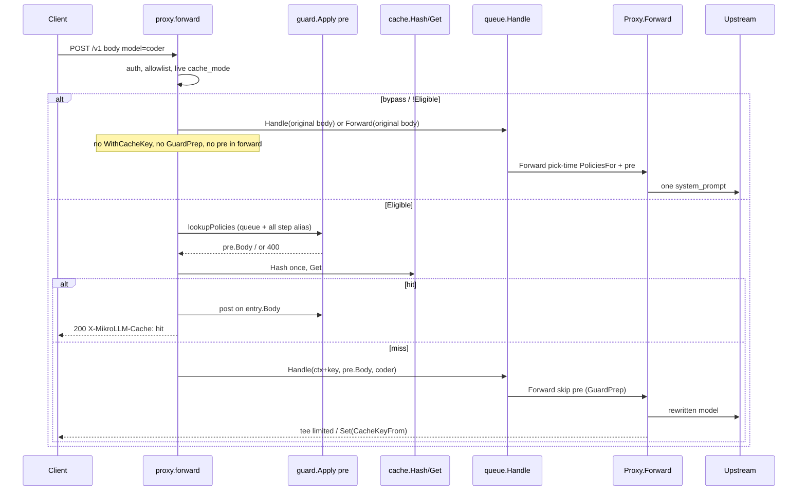

# LLM Request Caching in MikroLLM (MikroTik-first)

**English** · [Русский](ru/design-request-cache.md)

| Field | Value |
|---|---|
| **Author** | TBD |
| **Date** | 2026-09-19 |
| **Status** | Draft (rev. 4) |
| **Module** | `github.com/javded-itres/mikrollm` (Go 1.23, `CGO=0`) |
| **Target setup** | RouterOS 7.22, hAP ax³, container `mikrollm`, veth LLM `192.168.254.5`, `memory-high=64M`, USB `/data` |

---

## Overview

Today MikroLLM is a single-process gateway: `proxy.forward` reads the body (32 MiB limit); if a queue alias matches, it takes a slot via `queue.Engine.Handle`, otherwise it calls `Proxy.Forward` (model/path rewrite, LB, guardrails, fallback). There is no response in cache: repeating the same `temperature=0` chat takes the queue again, goes to Ollama / Ollama Cloud / OpenRouter again, and pays prefill and/or cloud tokens again.

The proposal is an **exact-match response cache in the same process**, without a second container. The hot layer is a byte-capped LRU in RAM (not an unbounded `map`). The cold layer is a separate SQLite file `<data>/cache.db` (not `mikrollm.db`), WAL, `synchronous=NORMAL`, its own `MaxOpenConns=1`. Redis is only an optional adapter behind `//go:build redis` for Docker/systemd; **not** in `go.mod` until PR 7 and **not** in `make tar-ros`. The feature is **off by default**, with hard caps on **response** size and volume, so existing ax³ installs do not fill the USB and do not hit `memory-high=64M`.

The cache key is computed **once** in `forward` — and only on the Eligible path after auth/pre-guard — and is never recomputed. On a cacheable miss, `Forward` writes using the key from `context`. On this path, `pre.Body` goes into the queue and to the upstream. Bypass / `!Eligible` goes into today's `Handle`/`Forward` with the **original** body, without `GuardPrep`. A hit on a queue alias is the main win: no `InsertQueueJob`, no `inflight`. Global `enabled` is **only** the default for `cache_mode=inherit`, not a kill switch inside `Layered`.

---

## Background & Motivation

### Current state

The chat chain is fixed in `internal/proxy/proxy.go` and `internal/queue/engine.go`:

```
POST /v1/chat/completions | POST /api/chat
        │
        ▼
proxy.forward          // auth, ReadAll 32MiB, model, TouchKey
        │
        ├─ queues.Lookup(model) ──► queue.Engine.Handle  // InsertQueueJob, slot, wait
        │                                    │
        │                                    ▼
        │                          Engine.run:
        │                          Forward(..., wt.body, wt.job.AssignedModel)
        │                          // AssignedModel = step (ornith-1.5:35b), not coder
        └──────────────────────────► Proxy.Forward
                                     requested := model  (step, if from the queue)
                                     pick / rewriteModel / rewriteUpstreamPath
                                     PoliciesFor(stepAlias, QueueAliasFrom, upstream)
                                     guard.Apply pre → HTTP upstream
                                     (memWriter + guard post, if not stream)
                                     X-MikroLLM-Fallback when hop>0
```

The composition root is `internal/app.New`: one `store.Open(<data>/mikrollm.db)`, `MaxOpenConns=1`, WAL. Queues write bodies to `queue_jobs`. Guardrails are `internal/guard`, policies from `store.PoliciesFor`. Admin is `internal/admin` + embed `internal/web`. MCP is `internal/mcp/tools.go`. Dependencies (`go.mod`): only `golang.org/x/crypto` and `modernc.org/sqlite` (+ the CGO-free sqlite tree).

Field numbers are from the **current** `docs/load-test.md` (matrix c∈{1,2,4,8}, 2026-09-18), not an earlier parallel run:

| Observation | Figure from `docs/load-test.md` | Implication for the cache |
|---|---|---|
| Idle container RSS | **~26 MB** | L1 budget is a few megabytes |
| Peak | **73–77 MB** (256k `glm-5.3-flash` **c=8**, 1M **c=1**) | Cannot keep a second full 4–5 MB buffer “just in case” |
| Local 35B 32k / 64k / 128k body | 156 KB / 312 KB / 623 KB | A request larger than 256 KiB is normal; hash it, do not drop it |
| Cloud 128k / 256k / 512k / 1M body | **0.59 / 1.19 / 2.37 / 4.0–5.0 MB** | A hit on 128k (6 s) pays off; hashing a 1M JSON (465–798 s) in full on ax³ is dangerous |
| 128k cloud c=1 | p50 **6.0 s**, RPS 0.17 | The main win is a hit on the LAN |
| 256k c=8 / 512k c=4 | RAM **73–76 MB**, some timeouts | `MaxHashBytes` cuts these bodies off from a second `Marshal` |
| Queue | disk + slot + sticky HTTP | A hit **before** `Handle` is the main win on MikroTik |

Ollama/vLLM prefix-cache lives **upstream**; it is not in the current `docs/load-test.md` (the file is a 32k–1M matrix, not the old §2 about p50 ~0.5 s). The gateway does not duplicate it.

Other containers on the same router: `wstunnel-ams`, `mihomo`. The router simultaneously runs Wi‑Fi, NAT, VPN. There is no free RAM “for another Redis”.

### Pain points

1. Repeating an identical deterministic request (an agent with one system prompt, eval, a `temperature=0` client) takes a queue slot again and goes to the cloud again. **The playground is not a v1 beneficiary** (always `stream: true` and default `temperature: 0.7` in `internal/web/static/app.js`).
2. `queue_jobs` on USB stores **incoming** bodies of waiting jobs, but not responses.
3. A LiteLLM-style “Redis + semantic cache” pulls in a second process, a client, and embeddings — that is a different class of hardware.
4. Any **unconditional** Redis-client import in `cache.New`/`app.New` will land in the scratch binary of `make tar-ros`, even with an empty URL. That breaks the “RouterOS image without Redis” invariant, regardless of CGO (`go-redis` is pure Go and `CGO_ENABLED=0` does not break it, but it inflates the ~12 MB binary and the audit surface).

---

## Goals & Non-Goals

### Goals

- Exact-match cache of `POST /v1/chat/completions` and `POST /api/chat` in the gateway process.
- Work on hAP ax³ at `memory-high=64M` and USB `/data` without a second container.
- Lookup **before** `queue.Engine.Handle`: a hit does not create `queue_jobs` and does not take `inflight`.
- The key is computed **once** in `forward`; `Forward` does **not** rehash.
- Isolation by API key by default; opt-in shared cache on an alias **and** on a queue.
- Admin, MCP, flags/env so that `cmd="-data /data -listen :4000"` continues to work.
- Feature off by default; conservative caps; negative responses are not cached.
- A `ports.Cache` interface so Redis can be added in PR 7 behind a build tag, without rewriting the proxy.

### Non-Goals

- Semantic / embedding cache (local embedding model, cloud embeddings, cosine). On ax³ that is a separate GPU/RAM budget and extra latency.
- Duplicating Ollama and vLLM KV / prefix cache. The gateway caches a **finished HTTP response**, not attention.
- HTTP CDN / `Cache-Control` on POST with `Authorization`.
- Caching `GET /v1/models`, health, MCP, admin (admin already has `Cache-Control: no-store`).
- Caching streaming in v1 (no v2 in this design until a separate RAM measurement exists).
- Caching 4xx/5xx and `content_filter` (including 200 with `finish_reason: content_filter`, if it can be detected cheaply).
- Moving the cache into a separate binary / sidecar on the recommended path.
- CGO, `go-redis` until PR 7, `-tags redis` in `make tar-ros`, changing the 32 MiB body limit.
- Playground as a v1 hit-path (remains stream + temp 0.7). A non-stream playground toggle is **out of scope**.

---

## Key Decisions

1. **No Redis on MikroTik.** A sidecar is an extra image (`arm64v8/redis:alpine` ~35.6 MB compressed, layers on USB are noticeably larger), extra RSS, veth, extract, failure domain. On a Docker host with RAM — an optional adapter **behind `//go:build redis`**. On ax³ — no.
2. **In-process exact-match, two layers:** L1 LRU with a **byte** cap and `sync.Mutex`; L2 a separate `cache.db`. Not a table in `mikrollm.db` (`MaxOpenConns=1` already shares login/queues/keys).
3. **Off by default.** Global `enabled` is **only the default for `inherit`**, not a kill switch in `Layered.Get`/`Set`. Per-alias/per-queue `cache_mode`:
   - `off` — always bypass, even if global on;
   - `on` — cache this alias/queue, **even if global off** (this is how you enable only `coder`; an existing `cache.db` will open on the first Get/Set);
   - `inherit` (default) — follow global `enabled`.
   Names without an alias/queue row (bare catalog name) = `inherit`. Extra queue aliases inherit `cache_mode`/`cache_share` from the parent via `GetQueueByAlias`. `forward` reads live `cache.Settings()` and live `cache_mode` from Lookup/`GetModelByAlias` on every request (not a snapshot from `app.New`).
4. **The key is computed once in `forward` on the Eligible path** after auth/allowlist/pre-guard: SHA-256 of canonical JSON (requested model/alias, tenant, path, lookup-time policy fingerprint, canonical `pre.Body`). Placed in `context` (`WithCacheKey`). `Forward` is **forbidden** to recompute the key; `Set` only `CacheKeyFrom(ctx)`. The key has **no** backend, fallback, overflow step, `AssignedModel`, `rewriteModel`. Bypass / `!Eligible`: **do not** put the key.
5. **Sufficiently deterministic, path-aware stream:**
   - `temperature` 0 or absent (for OpenAI clients without the field, **not** for playground);
   - `n` absent or 1 (1 / 1.0 / int — the same);
   - no tools/functions;
   - **stream v1 = always bypass** (we do not buffer SSE/NDJSON);
   - **no `stream` field on `POST /api/chat` → bypass** (Ollama default `stream: true`);
   - **no `stream` field on `POST /v1/chat/completions` → cacheable** (OpenAI default false).
   `RequireExplicitTemp0` default false. Playground (`app.js`: `stream: true`, `temperature` default 0.7) **never** enters the cache in v1 — this is accepted.
6. **Lookup after auth and allowlist, before the queue.** On the Eligible path, **`pre.Body`** is passed into `Handle`/`Forward` on a miss. On bypass / `!Eligible` — the **original** body, without `WithCacheKey` / `WithGuardPrep` / pre in `forward` (otherwise `injectSystem` would run twice). Pre on a hit is mandatory; post on the stored body. Fingerprint is **stable for queues**: lookup includes the union of queue policies + **all step aliases** of the queue (variant (b), without `pick()`).
7. **Two different size limits.** `MaxEntryBytes` (default **256 KiB**, code max **1 MiB**) — only the **response body** at `Set`. `MaxHashBytes` (default **1 MiB**, code max **4 MiB**) — the threshold above which Eligible=`req_too_large` **without** a second full `Marshal`. 256 KiB does **not** cut off 64k/128k requests.
8. **Isolation by `APIKey.ID`.** Shared cache is an explicit `cache_share` on an **alias and on a queue**.
9. **Redis only PR 7, `//go:build redis`.** Default `make tar-ros` / `build-arm64` does **not** pass `-tags redis`. `go-redis` (and any Redis module) does **not** appear in `go.mod` until PR 7. CGO Redis clients are forbidden. `cache.New` in the default build does not import `redisx`. CI: `go list` of the default-build graph does not contain `redisx`.
10. **One process, CGO=0, sqlite via `modernc.org/sqlite`.** No new heavy modules on the default path.
11. **Hot settings.** `ports.Cache` is always `Layered` (not `NopCache` in `app.New`, except tests). `Get`/`Set` do **not** look at `Settings().Enabled` — Eligible is decided by the proxy. Do **not** open `cache.db` in `app.New`. Lazy-open on first **L2 access**: `Get`, `Set`, `Flush`, `PurgeTenant`, `Stats` (disk). If the file exists — `Get` must open it (otherwise a restart produces a false miss). If the file does not exist — `Get`/Flush/Purge/Stats do **not** create it; only `Set` creates it. `UpdateSettings(enabled=false)` changes only the inherit-default: **no** Flush of L1 and **no** no-op Get/Set. `migrate` does **not INSERT** a `cache_settings` row.
12. **Limited tee, not `memWriter`.** A cacheable miss without post-guard writes to the client immediately (Flush); capture holds no more than `MaxEntryBytes`; overflow → keep streaming, do not Set. `memWriter` remains only for the existing post-guard.

---

## Proposed Design

### 1. Why not a Redis sidecar on MikroTik

An honest estimate for hAP ax³ (RouterOS 7.22, already has `mikrollm` 64M, `wstunnel-ams`, `mihomo`, Wi‑Fi, NAT, WG):

| Item | Redis sidecar | In-process sqlite+LRU |
|---|---|---|
| Image | `arm64v8/redis:alpine` **~35.6 MB** compressed; debian ~52 MB; layers on USB **~80–120 MB** | 0. Already scratch + CA, MikroLLM tar ~13–14 MB |
| Extract on USB | Another `/container add`, minutes | None |
| Empty-process RSS | typically **4–10 MB**; with a 32 MB dataset RSS is often 40–60 MB | L1 cap **4 MB**; sqlite WAL — hundreds of KB to a couple of MB |
| Network | Second veth on `Bridge-Docker` | 0 hop |
| Persistence | `dump.rdb` / AOF on USB | WAL `synchronous=NORMAL`, like `store.Open` |
| Failure | Redis OOM → the gateway must degrade to miss | No extra process |
| Go client | import in default build = in tar-ros | 0 until PR 7 |
| Operations | Second `memory-high`, mountlist, envlist | The `/data` volume already exists |

Redis is excellent on a Docker host with gigabytes. On ax³ it is **usually the wrong default**.

Recommendation: **do not run Redis next to MikroLLM on RouterOS.** If someone insists on a large Docker host — see “Optional Redis”. When Redis is unavailable, the gateway always continues the chat (miss). On the Docker path the layers are: **L1 + Redis instead of sqlite**, not both at once. Do not run sqlite+Redis together on ax³.

### 2. What kinds of cache exist (and what we do)

| Kind | Where it lives | On MikroTik | Decision |
|---|---|---|---|
| Exact-match HTTP response | Gateway, hash of the canonical request | Yes, cheap | **This design** |
| Semantic / embedding | Vector + embedding model | No: RAM, latency, cloud call | Non-goal |
| Model KV / prefix | Ollama, vLLM | Upstream; not measured in the current load-test | Do not duplicate |
| HTTP CDN | GET, URL key | Meaningless for POST with `sk-` | No |

### 3. Default architecture (MikroTik-first)

```
                    ┌─────────────────────────────────────────┐
                    │              mikrollm process             │
                    │  memory-high=64M, scratch, CGO=0         │
                    │                                         │
  sk- / admin ────► │  proxy.forward                          │
                    │     │  key ONCE + GuardPrep             │
                    │     ▼                                   │
                    │  ports.Cache  (Layered, always)         │
                    │     ├─ L1 LRU  (cap 4 MiB, Mutex)       │
                    │     └─ L2 sqlite cache.db (cap 32 MiB)  │
                    │         ▲  lazy open on first L2 access │
                    │     hit │  miss                         │
                    │     │   ▼                               │
                    │     │  Handle(pre.Body) / Forward(pre.Body, requested)
                    │     │  Forward: Set(CacheKeyFrom(ctx))  │
                    └─────┼───────────────────────────────────┘
                          │
                     USB /data
                     ├── mikrollm.db     (auth, queues, policies, cache_settings)
                     └── cache.db        (entries only; tenant index)
```

Layers:

- **L1 `internal/cache/memory.go`:** `map` + `container/list`, accounting of **body bytes**, LRU, **`sync.Mutex`**. Cap `MaxMemoryBytes`.
- **L2 `internal/cache/sqlite.go`:** a separate `sql.Open("sqlite", ...)` following `store.Open` (`busy_timeout(5000)`, WAL, `synchronous=NORMAL`). `SetMaxOpenConns(1)`. File `<data>/cache.db`. Index `tenant`.
- **L3 Redis:** package `internal/cache/redisx` with `//go:build redis`, PR 7 only. The default build does **not** see it. On Docker with `-tags redis`: L1+Redis **instead of** L2 sqlite.

`Layered.Get`: L1 → L2 (promote to L1) → miss. Both layers check `ExpiresAt`; expired — delete and miss. `Set`: write-through L1+L2 if `len(body) <= MaxEntryBytes`. L2 error on Get — miss, chat stays alive. L2 error on Set — log, L1 still holds.

`NopCache` — **tests only**. In `app.New` always `cache.New` → `Layered`. `Layered.Get`/`Set` do **not** check global `enabled` (that is the inherit-default in proxy Eligible). **Do not open `cache.db` in `app.New`.**

Lazy-open L2 (`ensureOpen`):

| Call | No file | File exists |
|---|---|---|
| `Get` | miss, **do not** create | open, read |
| `Set` | create + migrate + write | open, write |
| `Flush` / `PurgeTenant` / `Stats` (disk) | no-op / zeros, **do not** create | open |

After a container restart L1 is empty, the file on USB is alive: the first Eligible `Get` opens L2 and hits **without** a preceding `Set`. If nobody is Eligible and the file does not exist — `cache.db` does not appear.

### 4. Key contract and sequence (frozen)

This is a mandatory contract before PR 4. Without it a queue hit is impossible: today `Engine.run` calls `Forward(..., AssignedModel)`, and any Set inside `Forward` that recomputes the key from the step/`rewriteModel`/post-pick policies **will not match** a lookup by the client `coder`.

#### 4.1 What is computed once in `forward`

After `requireKey` / synthetic admin key, `ReadAll`, `modelBody`, `TouchKey`, queue or model allowlist. **Live** `cache.Settings()` and live `cache_mode` of the alias/queue row — on every request.

```
mode := cache_mode from GetQueueByAlias / GetModelByAlias / inherit for a bare name
if header/body bypass || mode==off || (mode==inherit && !Settings().Enabled) || !Eligible(path, body, settings):
    // today's path: Forward itself will do pick-time PoliciesFor + pre
    do NOT WithCacheKey / WithGuardPrep / guard.Apply pre in forward
    Handle(ctx, original body) or Forward(ctx, original body, requested)
    header X-MikroLLM-Cache: bypass, if the reason is not "just disabled inherit"
else:
    lookupPolicies → pre := guard.Apply(..., GuardPre)
    block → 400 + X-MikroLLM-Guardrail, not the queue
    key := Hash(... Canonical: pre.Body)   // once
    ctx = WithCacheKey + WithGuardPrep + WithRequestedModel
    // WithQueueAlias is not replaced (separate ctxKey in guardctx.go)
    Get(key)
      hit  → post-guard on entry.Body; block → 400, Delete;
             mask → serve post.Body, do not Delete, do not touch L2;
             otherwise serve + X-MikroLLM-Cache: hit
             neither Handle nor Forward
      miss → Handle(ctx, pre.Body) or Forward(ctx, pre.Body, requested)
```

An empty `CacheKeyFrom` in `Forward` is a “do not Set” safety, **not** a substitute for skipping pre. If there is no `GuardPrep` in `forward`, `Forward` must run today's pre after `pick()`.

#### 4.2 What `Forward` is forbidden to do

- Recompute the hash.
- Put `AssignedModel`, backend, fallback, or the body after `rewriteModel` into the key.
- Call `guard.Apply` pre if `GuardPrepFrom(ctx)` is true (the body is already `pre.Body`).
- `Set` without `CacheKeyFrom(ctx)` (empty key → do not write). An empty key happens on the bypass path; that is normal, not a bug.

`Engine.run` still calls `Forward(..., wt.job.AssignedModel)` — `pick()` needs this on a miss. The Set key is taken **only** from ctx, which `Handle` forwards: `context.WithTimeout(ctx, wait)` preserves values. On the Eligible path, **`pre.Body`** goes into `queue_jobs` / upstream. On the bypass path — the original body, and `Forward` injects `system_prompt` exactly once.



Mandatory contract tests:

- queue `coder` → step `local` → second request: `X-MikroLLM-Cache: hit`, `InsertQueueJob` count unchanged, `Forward`/upstream were not called;
- on Eligible miss the upstream gets a body with injected `system_prompt`;
- `stream: true` + `system_prompt` policy → **one** system message upstream, not two; `GuardPrep` is not set;
- `/api/chat` without a `stream` field → no `GuardPrep`, original body;
- global `enabled=false`, queue `coder` `cache_mode=on`, `/v1` `temperature=0` → miss then hit, `cache.db` created; inherit-alias remains bypass.

#### 4.3 Policy fingerprint for a queue (variant b)

`GetModelByAlias("coder")` does not work on a queue alias (`AliasTaken` forbids overlap). `PoliciesFor` is ternary (alias / queue / upstream). If lookup takes only the queue, and Forward after `pick` takes the step alias + upstream, the fingerprint will diverge.

**Decision (b):** on lookup (and on the hit-path pre/post) collect the **union**, without `pick()`:

```
ps = PoliciesFor(requested, queue.Alias, requested)
for each step in queue.Steps:
    m := GetModelByAlias(step.ModelAlias) // if present
    ps += PoliciesFor(m.Alias or step.ModelAlias, "", m.UpstreamName or step.ModelAlias)
ps = guard.Dedup(ps)
fingerprint = sorted "id:kind:mode:action:sha256(config)"
```

Stable between lookup and Set. Slightly over-filters: a policy attached only to step 2 will also fire on a hit, even if a live miss would have gone to step 1. This is conservative and matches “pre on hit is mandatory”. Not caching queues with step policies (variant c) was rejected: too easy to lose the main win.

For a **non**-queue: `PoliciesFor(alias, "", upstream)` from `GetModelByAlias`, or `PoliciesFor(name, "", name)` for a bare catalog name.

### 5. Cache key

Schema version `v1` is a field inside the canonical object.

```go
// internal/cache/key.go
func Hash(in KeyInput) string // hex SHA-256
```

**Decode is ordinary, without `Decoder.UseNumber()`.** Both `0` and `0.0` become `float64(0)`; `json.Marshal` writes `0`. Integer floats in allowlist fields are canonicalized as `int` (so `n: 1` and `n: 1.0` match). Golden test: `{"temperature":0}` and `{"temperature":0.0}` → one `Hash`. Remaining exact-match gaps: spaces **inside strings**, order of array elements (preserved), non-map keys are already sorted by `encoding/json` when marshaling `map[string]any`.

**Tenant:**

- Ordinary key: `"k:" + strconv.FormatInt(k.ID, 10)` — not a prefix and not a secret.
- Admin playground (`ServeChat`, `k.ID==0`, `Prefix=="admin"`): `"admin"`.
- Shared (`cache_share` on a model **or** a queue): `"s:" + requestedAlias`.

**In the key:**

| Field | In the key | Why |
|---|---|---|
| `v` | yes, `1` | schema version |
| `path` | `/v1/chat/completions` or `/api/chat` | different wire format |
| `tenant` | yes | isolation of secrets in the prompt |
| `model` | **requested** alias/name/queue | not upstream, not `AssignedModel` |
| `policy` | fingerprint §4.3 | change of system_prompt / filter / step policies |
| `messages` / `prompt` / `input` | yes | |
| `tools`, `functions`, `tool_choice`, `function_call`, `parallel_tool_calls` | yes (Eligible will still cut off tools) | |
| `response_format`, `format` | yes | |
| `seed` | yes | |
| `temperature`, `top_p`, `top_k`, `min_p`, `typical_p` | yes | |
| `presence_penalty`, `frequency_penalty`, `repetition_penalty` | yes | |
| `max_tokens`, `max_completion_tokens`, `num_predict`, `num_ctx` | yes | |
| `stop`, `stop_sequences` | yes | |
| `logit_bias`, `logprobs`, `top_logprobs` | yes | |
| `n` | yes | |
| `reasoning`, `reasoning_effort`, `thinking`, `think` | yes | |
| `options` (Ollama nested) | yes | |
| `stream` | no (stream = bypass before Hash) | |
| `user` | **no** | tracking |
| `keep_alive` | **no** | |
| `stream_options` | no | |
| Other body fields | **yes**, canonically | unknown vendor knob |

`rewriteModel` is not in the key.

If `len(pre.Body) > MaxHashBytes`: **do not** canonicalize and do not hash (no second full `Marshal` and no mandatory SHA pass over 5 MB). Eligible=`req_too_large`, miss. The `pre.Body` body already sits in memory after `ReadAll` + `guard.Apply`; we do not make an extra copy.

### 6. When a request is cacheable

`cache.Eligible(path string, raw map, bodyLen int, cfg Settings) (ok bool, reason string)`.

`forward` reads `cache.Settings()` and the current row's `cache_mode` every time (not a settings cache from `app.New`). `cache_mode` is resolved **before** Eligible:

```
mode off                 → bypass disabled
mode on                  → continue to Eligible (global may be false)
mode inherit / no row    → global enabled? otherwise bypass disabled
```

Then we do **not** cache:

| Condition | reason |
|---|---|
| `"cache": false` or `X-MikroLLM-Cache: bypass`/`no`/`0` | `bypass` |
| JSON `stream` true / `"true"` / `"1"` | `stream` |
| path `/api/chat` and no `stream` field | `stream` (Ollama default true) |
| path `/v1/chat/completions` and no `stream` field | **not** a reason — cacheable |
| `n` is set and is not equal to 1 (int/float) | `n` |
| non-empty `tools`/`functions`, or `tool_choice` is not `none`/`null`/absent | `tools` |
| `temperature` is set and `|t| > 1e-9` | `temperature` |
| `top_p` is set and `< 1` | `top_p` |
| `len(body) > MaxHashBytes` | `req_too_large` |
| not JSON | `json` |

`MaxEntryBytes` does **not** participate in Eligible. That is a `Set` limit on the **response**.

Consequence on load-test numbers (default `MaxHashBytes=1 MiB`):

| Workload | Request body | Hash? | Store a 1 KiB response? |
|---|---|---|---|
| local 32k | 156 KB | yes | yes |
| local 64k | 312 KB | yes | yes |
| local 128k | 623 KB | yes | yes |
| cloud 128k | 0.59 MB | yes | yes |
| cloud 256k | 1.19 MB | **no** | no |
| cloud 1M | 4–5 MB | **no** | no |

Eligible tests: `/api/chat` without `stream` → `bypass`; `/v1/chat/completions` without `stream` → cacheable; 300 KiB request + 1 KiB 2xx **is stored**; 1 KiB request + 300 KiB 2xx is **not** stored.

`RequireExplicitTemp0=false` — for OpenAI-compatible clients that **omit** `temperature`, not for the playground.

### 7. Streaming

**v1: skip. Closed.** `Eligible` is path-aware (§6). No SSE/NDJSON tee. Matches the fact that `guard.HasPost` already skips stream (`docs/security.md`).

Using bare `guard.IsStream` as the only criterion is **not allowed**: a missing field → `false`, and a native Ollama client without `stream` would be treated as a JSON body, while the upstream would return NDJSON. That would break both the cache and post-guard.

There is **no** v2 stream-replay on ax³ in this design. A separate request + RAM measurement if needed.

### 8. Limited tee, write, headers, `id`/`created`

We write only:

- HTTP 2xx after post-guard (if it ran);
- `len(body) <= MaxEntryBytes` (default **256 KiB**);
- non-empty body;
- not a gateway `content_filter` (400);
- not a 200 whose JSON has `choices[].finish_reason == "content_filter"` or `error.type == "content_filter"` — a cheap `json.Unmarshal` into a `map` / a pointed lookup, without a second large copy beyond the already captured buffer. If parse fails — **do not** write (fail closed on a dubious body).

We do not write 4xx/5xx, guard 400, billing, 502.

#### 8.1 `limitedTee` — not `memWriter`

The current `memWriter` (`internal/proxy/proxy.go`) is **capture-then-write**: no `Flush`, no cap, the client sees bytes only after the full body and post-guard. It remains **only** for `HasPost` (an existing RAM risk; the cache does not worsen it with a second buffer: `Set` takes `post.Body`).

For a cacheable miss **without** post-guard — a new type:

```go
// writes to the client immediately; capture holds ≤ MaxEntryBytes
type limitedTee struct {
    http.ResponseWriter
    max     int
    buf     bytes.Buffer
    overflow bool
}

func (t *limitedTee) Write(p []byte) (int, error) { /* write-through; if !overflow && buf.Len()+len(p) > max { overflow=true; buf.Reset() }; else if !overflow { buf.Write } */ }
func (t *limitedTee) Flush() {
    if f, ok := t.ResponseWriter.(http.Flusher); ok { f.Flush() }
}
```

- Overflow: drop capture (`buf.Reset()`), keep streaming to the client, do not call `Set`. Never hold 5 MB “in case it fits”.
- Do not reuse `memWriter` “with a limit after the fact”: by then the overflow is already in RAM, TTFB is already delayed.
- If `HasPost` — one `memWriter` as today; after post: if `len(post.Body)≤MaxEntryBytes` and not block — `Set(post.Body)`. No second copy “for the cache”.
- Test: 300 KiB 2xx, MaxEntry=256 KiB: the client receives all bytes **incrementally** (`Flush` after chunks as today 32 KiB); `Stores==0`; after return there are not two full copies.

On hit:

```
X-MikroLLM-Cache: hit
X-MikroLLM-Cache-Age: <seconds>
Content-Type: from the entry
```

On miss after a store attempt: `X-MikroLLM-Cache: miss`. Bypass: `bypass`. Disabled: **do not** set the header.

`id` / `created` on hit: new `chatcmpl-` + 8 hex (`queue.newID` pattern), `created` = `time.Now().Unix()`. Remarshal may reorder JSON keys — acceptable, document in `docs/api.md`. `usage`/`choices` as stored. For `/api/chat`: update `created_at`, do not touch `done`.

Hit log: `store.Log(k.Prefix, requestedAlias, "cache", 200, latency, bytesOut)` — **model = the client alias**, backend=`"cache"` (not `"cache"` twice).

### 9. Queues and singleflight

Hit before `Handle`: no `InsertQueueJob`, no `inflight++`, no `MaxWait`, no overflow.

Do not create a fake “cache hit” job.

#### 9.1 Flight state machine

Package `internal/cache/flight.go`, `sync.Mutex` on the flight map. **Not** `golang.org/x/sync`.

```
type flight struct {
    mu   sync.Mutex
    inflight map[string]*call // key → leader
}
type call struct {
    done chan struct{} // closed when the leader has fully left Handle/Forward
}
```

Rules:

1. The **leader** uses **only its own** `context` (`r.Context()` / `wt.ctx`). A waiter **must not** cancel the leader. Waiter disconnect ≠ cancel of the leader's Handle.
2. A waiter subscribes to `call.done` with **its own** ctx. Its own cancel/timeout → the waiter responds 504/`context canceled` and does **not** start a second `Handle` (otherwise two slots for one key). The client retries; by then the leader may have `Set` — it will be a hit.
3. After `done` each surviving waiter does `Get(key)` and serves a hit. If there is no entry (5xx, overflow `MaxEntryBytes`, post-block, disabled mid-flight) — the waiter goes as an **independent miss without re-entering flight for this key** (tombstone until the leader exits + a short inhibit, to avoid a loop). This may produce N−1 extra upstreams **after** the leader, not N parallel in flight.
4. The leader's body is **not** fanned out from RAM if it is > `MaxEntryBytes` (otherwise 5 MB × waiters). Coalesce only via `Set`/`Get`.
5. Oversized 2xx: one Forward for the leader; waiters after `done` get a miss and go themselves **sequentially relative to the leader**, without nested flight. We do not keep an overflow buffer so as “not to launch 10 queue jobs at once”. There are not 10 simultaneous; late N−1 — yes, and that is explicitly accepted for huge completions. For load-test `max_tokens:8` responses are tiny and go into Set.
6. Waiter timeout ≠ `MIKROLLM_QUEUE_MAX_WAIT` as “then Handle anyway”. A waiter lives on its own HTTP ctx.
7. L1 LRU and the flight map — under mutex (different or one; L1 **must** have its own `sync.Mutex`).

Flight tests:

- two identical misses → one `Forward`;
- leader disconnect: if Set succeeded — waiter `Get` hit; if the leader was canceled before 2xx — waiter miss without nested flight, may go itself (its ctx still alive) **once**;
- 300 KiB 2xx at MaxEntry 256 KiB: `Stores==0`, parallel `Handle` on the key during the leader = 1.

### 10. Guardrails

- Lookup after auth.
- Pre on the current union of policies §4.3 even on a hit. Block → 400, `Delete`.
- **Mask (`action=mask`) is not a block:** serve `post.Body` to the client, **do not** Delete, **do not** rewrite L2 (the fingerprint already bound the policy; a mask is a view, not a new entry).
- Post on the stored body. Block → 400, Delete.
- Step-only filters on a hit **are applied** (variant b). Document in `docs/security.md`: a queue cache uses the union of policies of all steps, without choosing the live step.
- Never serve a cache that would **currently** fail pre on this union.

Policies are read from `mikrollm.db` (`PoliciesFor`). A rare SELECT, not PUT of entries.

### 11. Fallback, overflow and LB

Key by **requested** model/alias. Backend, LB, host, step `AssignedModel` — outside the key.

**Fallback (402/credits):** the first miss may have answered with a backup model; a hit no longer pays. Do not set `X-MikroLLM-Fallback` on a hit.

**Queue overflow (variant a, like fallback):** `Engine.handle` on overflow calls `Forward`/`handle` with `OverflowAlias`, the same `ctx` (key preserved). A successful 2xx **is written under the requested queue key** (`coder`), not under the overflow-alias. While TTL is alive, repeats of `coder` get this response even if step 1 slots are already free. This is intentional: do not pay twice, as with fallback. A weaker model for 15 min is an accepted trade-off; flush / shorter TTL if it gets in the way. Do not drop the key on an overflow call (variant b rejected).

### 12. Limits, eviction, USB

| Parameter | Default | Cap in code | Meaning |
|---|---|---|---|
| enabled | **false** | | **inherit-default only**; `cache_mode=on` caches even when false |
| TTL | **15m** | max 24h | |
| MaxMemoryBytes (L1) | **4 MiB** | **8 MiB** | 16 MiB is too much next to `ReadAll` 32 MiB and idle 26 MB at `memory-high=64M` |
| MaxDiskBytes (L2) | **32 MiB** | 256 MiB | USB |
| MaxEntryBytes | **256 KiB** | 1 MiB | **response** only |
| MaxHashBytes | **1 MiB** | 4 MiB | above — do not canonicalize; 256k/1M miss |
| MaxEntries | soft, from byte caps | not a separate counter in the UI | 32 MiB/256 KiB ≤ 128 large or thousands of small; L1 additionally evicts by bytes |

Admin: a warning if `MaxMemoryBytes > 4 MiB` (text about `memory-high=64M`).

L1 eviction: LRU by bytes on `Set`. L2 eviction: on `Set`, if `SUM(bytes) > MaxDiskBytes` — `DELETE` old ones by `last_access` in batches of 32. 60 s ticker: `DELETE WHERE expires_at < ?`.

**No hit counter on disk.** There is **no** `hits` column in `cache_entries`. Hits/misses are only in-process atomics in `CacheStats` (reset on restart).

`last_access` debounce 60 s: a dirty flag **on the LRU node** (not a separate unbounded `map[string]time.Time`). Debounce set is limited to the current L1 keys.

**Writing dirty to L2** (otherwise disk LRU = `Set` order, a hot key will be evicted by cold ones):

- on L1 `Get`, if `now - node.lastFlush >= 60s` → `UPDATE cache_entries SET last_access=? WHERE k=?` on the same `MaxOpenConns=1` connection, clear dirty, remember `lastFlush`;
- on L1 evict of a dirty node — the same `UPDATE` **before** dropping from RAM (not on every hit).

Test: touch key A for 2 minutes; fill the disk with keys B…Z up to the cap; A remains (fresh `last_access`), untouched ones are evicted.

`Get` on both layers: if `expires_at < now` → delete, miss. Do not wait for the ticker.

USB: `synchronous=NORMAL`, `busy_timeout(5000)`, WAL, `wal_autocheckpoint=1000`, `MaxOpenConns=1` — **a copy of the `store.Open` DSN**. Not `synchronous=FULL`.

Restart: L1 empty; L2 alive (mountlist). `DELETE` of the `cache.db` file = full flush. `UpdateSettings(enabled=false)` does **not** Flush L1, does **not** no-op Get/Set, and does **not** close `cache.db` (inherit-default only).

### 13. Packages and interfaces

New package `internal/cache`. Port:

```go
type CacheEntry struct {
    Status      int
    ContentType string
    Body        []byte
    Stream      bool
    CreatedAt   time.Time
    ExpiresAt   time.Time
}

type CacheStats struct {
    Enabled     bool
    Hits        int64
    Misses      int64
    Bypasses    int64
    Stores      int64
    Errors      int64
    MemoryBytes int64
    DiskBytes   int64
    Entries     int
}

type Cache interface {
    Get(ctx context.Context, key string) (CacheEntry, bool, error)
    Set(ctx context.Context, key string, e CacheEntry) error
    Delete(ctx context.Context, key string) error
    Flush(ctx context.Context) error
    PurgeTenant(ctx context.Context, tenant string) error
    Stats() CacheStats
    Settings() domain.CacheSettings
    UpdateSettings(domain.CacheSettings) error
    Close() error
}
```

One type `domain.CacheSettings` (do not duplicate in `cache` and `store`).

`UpdateSettings`:

- `enabled` (either direction): **only inherit-default** for proxy Eligible. Layered Get/Set are not no-op. L1 is **not** Flushed. Do not close the L2 conn because of this flag.
- `cache.db` is not opened in `UpdateSettings`. Opening is `ensureOpen` on Get/Set/Flush/PurgeTenant/Stats; file creation is only `Set`.
- decreasing `MaxMemoryBytes`: immediately LRU-evict (and flush dirty `last_access` of evicted nodes);
- TTL/MaxEntry/MaxHash/MaxDisk: for new Set and for Get expiry as-is (already written entries live by their `expires_at`).

`app.New` always `cache.New(...)`. `App.Close` = `Store.Close` + `Cache.Close`.

Settings are a table in **`mikrollm.db`**:

```sql
CREATE TABLE IF NOT EXISTS cache_settings (
  id INTEGER PRIMARY KEY CHECK (id = 1),
  enabled INTEGER NOT NULL DEFAULT 0,
  ttl_ms INTEGER NOT NULL DEFAULT 900000,
  max_memory_bytes INTEGER NOT NULL DEFAULT 4194304,
  max_disk_bytes INTEGER NOT NULL DEFAULT 33554432,
  max_entry_bytes INTEGER NOT NULL DEFAULT 262144,
  max_hash_bytes INTEGER NOT NULL DEFAULT 1048576,
  require_temp0 INTEGER NOT NULL DEFAULT 0,
  cache_stream INTEGER NOT NULL DEFAULT 0,
  updated_at TEXT NOT NULL
);
```

**`migrate` does not `INSERT` into `cache_settings`.** An empty table = “there is no row”.

```sql
ALTER TABLE models ADD COLUMN cache_mode TEXT NOT NULL DEFAULT 'inherit';
ALTER TABLE models ADD COLUMN cache_share INTEGER NOT NULL DEFAULT 0;
ALTER TABLE queues ADD COLUMN cache_mode TEXT NOT NULL DEFAULT 'inherit';
ALTER TABLE queues ADD COLUMN cache_share INTEGER NOT NULL DEFAULT 0;
```

`domain.Model` / `domain.Queue` — fields. `SaveModel` / `SaveQueue` / SELECT — following `fallback`.

Context (`internal/domain/guardctx.go`, next to `queueAliasCtxKey`):

```go
func WithCacheKey(ctx context.Context, key string) context.Context
func CacheKeyFrom(ctx context.Context) string
func WithGuardPrep(ctx context.Context, ps []Policy) context.Context
func GuardPrepFrom(ctx context.Context) ([]Policy, bool)
func WithRequestedModel(ctx context.Context, alias string) context.Context
func RequestedModelFrom(ctx context.Context) string
```

### 14. Config: flags, env, precedence

`cmd="-data /data -listen :4000"` unchanged = cache off (no settings row, env empty → zero-value `enabled=false`).

| Flag | Env | Default (zero-value) |
|---|---|---|
| `-cache` | `MIKROLLM_CACHE=1` | off |
| | `MIKROLLM_CACHE_TTL=15m` | 15m |
| | `MIKROLLM_CACHE_MAX_MEMORY=4MiB` | 4MiB |
| | `MIKROLLM_CACHE_MAX_DISK=32MiB` | 32MiB |
| | `MIKROLLM_CACHE_MAX_ENTRY=256KiB` | 256KiB |
| | `MIKROLLM_CACHE_MAX_HASH=1MiB` | 1MiB |
| | `MIKROLLM_CACHE_REQUIRE_TEMP0=1` | off |
| | `MIKROLLM_CACHE_FORCE_ENV=1` | off (recovery) |
| | `MIKROLLM_CACHE_URL=` | empty; read **only** in a `-tags redis` build |

**Precedence:**

1. If `MIKROLLM_CACHE_FORCE_ENV=1` — always env overlay on the **inherit-default** (`enabled`). This does **not** turn off aliases with `cache_mode=on`. Full stop: mode=`off` on aliases/queues or Flush + modes off.
2. Else if a `cache_settings` row **exists** — SQLite, env is **ignored**.
3. Else (no row) — env overlay on zero-value. `GetCacheSettings` returns this overlay, **without** inserting a row.
4. `SaveCacheSettings` (admin/MCP) — `INSERT` or `UPDATE`. After that the source of truth is SQLite.

Rollback inherit: toggle off **or** `UPDATE cache_settings SET enabled=0`. Aliases with `cache_mode=on` will keep caching. **Not** “remove env and recreate”: the `/data` volume survives recreate (`docs/install-mikrotik.md`), the row will remain. Removing env when a row exists does nothing.

Enabling on RouterOS before the first Save: `MIKROLLM_CACHE=1` in envlist — inherit on, because `migrate` did not insert default-0. Or without env — one alias `cache_mode=on` (the file appears on the first **Set**; after restart Get will open the existing one). After Save in admin, env no longer drives inherit.

Size parser: `4096`, `4KiB`, `4MiB`. Caps in code will not let you set 2 GiB from the UI.

### 15. Admin

**Cache** tab `/admin/cache` — like `/admin/queues` / `/admin/security`:

- `internal/web/templates/cache.html`
- nav in `layout.html`; **`wrap-wide` or-list includes `"cache"`**
- `UI.pages["cache"]`; `GET /admin/cache`, `POST /admin/cache`, `POST /admin/cache/flush`
- CSRF: existing `protect()` in `internal/admin/security.go`; the new file `internal/admin/cache.go` does **not** fork protect
- bump `app.css`/`app.js` `?v=`

Form: **“Default for inherit”** (`enabled`, not “turn off the entire cache”), TTL, max memory/disk/entry/hash, require_temp0. Caption: aliases with `cache_mode=on` are cached even with the checkbox cleared. Do not show `cache_stream` in v1. “Flush cache” button. Cards: hits/misses/bypass, hit ratio, MemoryBytes, DiskBytes, Entries. Warning when MaxMemory > 4 MiB.

`POST /admin/cache`: `SaveCacheSettings` then **`Cache.UpdateSettings`** — the toggle is hot, no restart.

On `/admin/models`: select `cache_mode`, checkbox `cache_share` (help: “responses are shared across all keys; revoking `sk-` only clears `k:<id>`, the shared cache — the Flush button or TTL”). On a queue — the same in the `saveQueue` form.

`.gitignore` already contains `*.db*` and `/data/` — `cache.db` is covered.

### 16. MCP

| Tool | Purpose |
|---|---|
| `get_cache_stats` | Hits/Misses/bytes/settings |
| `flush_cache` | `Cache.Flush`; v1 full |
| `update_cache_settings` | persist + `UpdateSettings` |

`get_status` add `"cache": {enabled, hits, misses, memory_bytes, disk_bytes}`.

`save_model` / `save_queue` in `internal/mcp/tools.go`: fields `cache_mode`, `cache_share` in schema (`additionalProperties: false` — otherwise an agent cannot pass them). `mcpInstructions` — one line about the cache.

Key invalidation: `store.DeleteKey` remains a SQL one-liner and does **not** import `cache`. In `app` / admin `delKey` / MCP `toolDeleteKey` after a successful delete: `Cache.PurgeTenant(ctx, "k:"+id)` — only this key's tenant, not `s:` shared. The `tenant` index is created in PR 2.

### 17. MikroTik ops

One container, volume `mikrollm-data`. Files `/data/cache.db`, `-wal`, `-shm`. Do not raise `memory-high=64M` for the cache.

Enable before the first Save:

```routeros
/container envs add name=mikrollm key=MIKROLLM_CACHE value=1
# cmd is still: -data /data -listen :4000
```

After Save in admin — the inherit toggle is on the volume. Turn off **inherit**: admin or `FORCE_ENV` + `MIKROLLM_CACHE=0` (this does **not** mute `cache_mode=on`). Full stop: `cache_mode=off` on aliases/queues, or Flush + modes off. Do not enable `cache_share` on keys with secrets in prompts. Staging: one alias `on` (for example queue `coder`), not global on all catalog names.

`GET /ready` is still 503 if `HealthyCount() < 1`, **even if** the cache could answer a chat. This is not a cache bug: ready = “there is a live backend”. A hit with a dead cloud is an intentional chat win; do not treat `/ready` monitoring as a regression.

#### Optional Redis (advanced, not default, not ax³)

Only a `-tags redis` build on Linux Docker/systemd:

- Layers: **L1 + Redis instead of sqlite**. Not a write-through triple L1+sqlite+Redis. Do not combine on ax³.
- Redis container: `memory-high=32M`, veth on `Bridge-Docker`, **not** in AMS mark-routing, no WAN 6379, `maxmemory 24mb allkeys-lru`, **no AOF**.
- `MIKROLLM_CACHE_URL=redis://…`. Redis down → miss, chat alive, reconnect does not block `forward` > ~50 ms.
- Redis image is **not** in `dist/mikrollm-ros-legacy.tar`. Default `make tar-ros` without `-tags redis`.

### 18. Risks

| Risk | Severity | Mitigation |
|---|---|---|
| RSS growth and `memory-high` | **High** | L1 4/cap 8 MiB, entry 256 KiB, limited tee, MaxHashBytes 1 MiB, do not buffer stream |
| USB wear / full flash | Medium | 32 MiB cap, TTL, NORMAL, debounce on LRU node, hits only in RAM |
| Prompt leak between keys | **High** | tenant = key id; share opt-in; PurgeTenant `k:<id>` on DeleteKey (shared `s:` — only Flush/TTL) |
| Serving a stale response after a policy change | Medium | fingerprint union of steps + pre/post on hit + TTL |
| False hit with OpenAI default temp 1.0 | Medium | document + `cache_require_temp0` |
| Blocking `mikrollm.db` | Medium | entries are not there |
| Stampede of identical misses | Low | flight; waiter timeout without a second Handle |
| Stampede after oversized Set-skip | Low | one leader in flight; N−1 after done accepted; load-test responses are small |
| Non-deterministic tool-call | Medium | do not cache tools |
| Step-policy over-filter on hit | Low | variant b, document |
| Cache poisoning | Low | only our 2xx without content_filter |
| Redis accidentally in tar-ros | Medium | `//go:build redis` + `go list` CI |

Expected hit-path: <5 ms CPU + dst-nat as for `/health`. Miss + hash ≤1 MiB — single-digit to tens of ms vs 6 s of 128k cloud.

---

## API / Interface Changes

The client chat contract does not change. Headers:

```
X-MikroLLM-Cache: hit | miss | bypass
X-MikroLLM-Cache-Age: 42          # hit only
```

Bypass: `X-MikroLLM-Cache: bypass` or `"cache": false` (the field is stripped from the canonical key and Eligible).

Admin HTTP (cookie + CSRF): `GET/POST /admin/cache`, `POST /admin/cache/flush`.

```go
type CacheSettingsRepo interface {
    GetCacheSettings() (domain.CacheSettings, error)
    SaveCacheSettings(domain.CacheSettings) error
}
```

in `ports.Store`. `Get` without a row = zero + env overlay, no INSERT.

---

## Data Model Changes

`mikrollm.db`: `cache_settings` (no seed-INSERT); `models.cache_mode`, `models.cache_share`; `queues.cache_mode`, `queues.cache_share`.

`cache.db`:

```sql
CREATE TABLE IF NOT EXISTS cache_entries (
  k            TEXT PRIMARY KEY,
  tenant       TEXT NOT NULL,
  model        TEXT NOT NULL,
  status       INTEGER NOT NULL,
  content_type TEXT NOT NULL DEFAULT 'application/json',
  body         BLOB NOT NULL,
  stream       INTEGER NOT NULL DEFAULT 0,
  bytes        INTEGER NOT NULL,
  created_at   TEXT NOT NULL,
  expires_at   TEXT NOT NULL,
  last_access  TEXT NOT NULL
);
CREATE INDEX IF NOT EXISTS cache_entries_exp ON cache_entries(expires_at);
CREATE INDEX IF NOT EXISTS cache_entries_lru ON cache_entries(last_access);
CREATE INDEX IF NOT EXISTS cache_entries_tenant ON cache_entries(tenant);
```

No `hits` column. We do not store headers JSON.

No down migrations. Deleting `cache.db` is safe. Binary rollback: old code ignores the file.

---

## Alternatives Considered

### A. Redis sidecar on RouterOS

Pros: TTL/LRU, sharing between replicas (there are no replicas on ax³).

Cons: +35.6 MB image, extract, veth, 4–60 MB RSS, second `memory-high`, import into the binary, failure domain. **Rejected as default.** Optional adapter, Docker L1+Redis **instead of** sqlite.

### B. In-memory LRU only

Pros: zero USB.

Cons: recreating a RouterOS container zeros the cache. L1 is needed as a hot layer. **Not enough on its own.**

### C. A table in the same `mikrollm.db`

Cons: `MaxOpenConns=1`, nested Query deadlock (there is a test in `store_test.go`, `docs/architecture.md`). **Rejected** for entries. Settings — yes.

### D. Semantic cache

Non-goal (RAM, embeddings, false hits).

### E. Files on USB `cache/<sha>`

Inode storm on flash. **Rejected.**

### F. LiteLLM-style Redis + semantic

A different product. **Rejected** on MikroTik.

| | RAM | Flash | Failure domains | CGO | Binary | Ops |
|---|---|---|---|---|---|---|
| **L1+L2 sqlite (chosen)** | cap 4 MB | cap 32 MB | 1 process | no | ~+0 | volume already exists |
| Redis sidecar | 10–60 MB+ | image+rdb | 2 containers | no (pure Go client) | +client if import | veth, extract |
| RAM only | cap | 0 | lost on recreate | no | 0 | simple |
| Table in mikrollm.db | like L2 | mixed with queues | lock login | no | 0 | dangerous |
| Semantic | tens–hundreds of MB | models | cloud | risk | large | no |
| Hash files | little | inode storm | partial | no | 0 | USB is bad |

---

## Security & Privacy Considerations

- Default partition `k:<id>`. Shared — a checkbox on an alias **and** a queue: “responses are shared across all keys”.
- Admin playground (`ID=0`) is not mixed with `sk-`.
- `cache.db` on USB; git does not take it (`*.db*`, `/data/`).
- `DeleteKey` → `PurgeTenant(ctx, "k:"+id)` in the app layer. **Does not touch shared entries `"s:"+alias`** — revoking a key does not invalidate the shared alias/queue cache (opt-in share allows this). Need Flush / TTL / later `PurgeModel`. Store still does not import cache.
- Flush on compromise: v1 full + tenant purge (`k:` only).
- `dropResponseHeader` remains.
- MCP flush — MCP token / admin password, not `sk-`.
- Step policies on a hit are applied as a union (slightly stricter than a live miss) — see `docs/security.md`.
- The 32 MiB cap + key RPM limits disk fill (like `MIKROLLM_QUEUE_MAX_BYTES`).

---

## Observability

- Atomics: hits, misses, bypasses, stores, errors, evicts. Not sqlite `hits`.
- `store.Log(..., requestedAlias, "cache", 200, ...)`.
- `get_status` / `get_cache_stats`.
- L2 error — `log.Printf("cache sqlite: ...")` without the body.
- `/ready` 503 at zero healthy backends does **not** account for the cache.
- Criterion: repeat of the same `temperature=0` JSON on `/v1` → `hit`, `queue_jobs` waiting does not grow.

No Prometheus — we do not add it.

---

## Rollout Plan

1. Code: inherit default off, no settings row; `cache.db` is not opened in `app.New` and is not created until the first `Set`. If the file already exists — the first `Get` will open it.
2. Staging **without** global on: queue `coder` `cache_mode=on`, `temperature=0`, `stream:false` on `/v1` → miss then hit, file created; the rest inherit — bypass. Alternative: env `MIKROLLM_CACHE=1` (all inherit).
3. Do not enable bare 1M catalog names; for `glm-5.3-flash` create an alias with `cache_mode=off` if inherit is on.
4. Rollback inherit: admin off or `UPDATE cache_settings SET enabled=0`. This does not mute `cache_mode=on`. Do not rely on removing env with a live volume. `FORCE_ENV` + `MIKROLLM_CACHE=0` — inherit only.
5. Feature flag = `cache_settings.enabled` (inherit) + `cache_mode`, not a Go build tag (tag only for Redis).

RouterOS image: the same `make tar-ros`, without `-tags redis`.

---

## Tests

`internal/cache`:

- hash is stable under JSON key reordering;
- `{"temperature":0}` and `{"temperature":0.0}` one Hash;
- tenant isolation; share=on → hit;
- TTL: Get of expired on L1 and L2 = miss + delete;
- L1 evict by bytes under mutex;
- L2 disk cap; tenant index;
- MaxEntry: Set of a too-large response → no-op;
- MaxHash: 1.2 MB request Eligible false without requiring store;
- Eligible: temp=0, temp=0.7, tools, n=2, `/api/chat` without stream, `/v1` without stream;
- `UpdateSettings(enabled=false)` does not make Get/Set no-op; first Set with mode=on creates `cache.db`;
- fill L2 → Close → new Layered → `Get` of an existing key = hit **without** a preceding Set; no file and no Set → no file;
- L2 LRU: hot A is not evicted by cold B…Z after debounce flush of `last_access`;
- flight: two misses → one producer; waiter timeout without a second producer.

Proxy/queue integration (httptest, not `fakeRouter` alone):

- miss → upstream 1 time, second hit;
- **queue alias vs AssignedModel:** `coder`→`local`, second hit, `InsertQueueJob` without growth, Forward was not called;
- miss: upstream sees `system_prompt` in the body;
- hit/miss/bypass headers;
- stream / `/api/chat` without stream is not written;
- 500 is not written; `finish_reason=content_filter` is not written;
- 300 KiB request + 1 KiB 2xx is stored; 1 KiB request + 300 KiB 2xx is not; the client saw chunks;
- pre-guard block on hit; post mask serves masked, no Delete;
- fallback: key = requested;
- queue overflow: 2xx is written under the queue alias, second `coder` — hit;
- global off + `coder` `cache_mode=on` → miss then hit; inherit-model — bypass;
- `stream: true` + `system_prompt` → one injection, no GuardPrep;
- `ServeChat` admin does not see `sk-` cache;
- `DeleteKey` → PurgeTenant `k:<id>` (via app/admin, not store→cache import); `s:alias` entry remains.

`internal/app`: `GET /admin/cache` 302 without a session; CSRF on flush.

Default build: `go list` without `redisx`.

`go test ./...`.

---

## Open Questions

1. ~~Stream v1?~~ **Closed: skip.** No v2 in this design.
2. ~~DeleteKey tenant purge?~~ **Closed:** `tenant` index in PR 2; `PurgeTenant` from app/admin/MCP, store does not import cache.
3. ~~`/api/chat` default stream?~~ **Closed:** no field on `/api/chat` → bypass; on `/v1` → cacheable.
4. ~~Redis in the repository?~~ **Closed:** PR 7 only, `//go:build redis`, not in `tar-ros`.

There are no open product questions blocking PR 1–4.

---

## References

- Code: `internal/proxy/proxy.go` (`forward`, `Forward`, `memWriter`, `rewriteModel`), `internal/queue/engine.go` (`Handle`, `run`, `AssignedModel`, `InsertQueueJob`), `internal/guard/guard.go` (`Apply`, `IsStream`, `HasPost`, `Dedup`), `internal/store/store.go` (`Open` DSN, `MaxOpenConns=1`, `Log`, `SaveModel`, `DeleteKey`), `internal/store/security.go` (`PoliciesFor`), `internal/domain/guardctx.go`, `internal/app/app.go`, `internal/ports/ports.go`, `internal/mcp/tools.go`, `internal/web/static/app.js` (playground `stream: true`, temp 0.7), `cmd/mikrollm/main.go`, `Makefile` (`tar-ros` without tags), `Dockerfile` (scratch + binary).
- Documents: `docs/architecture.md`, `docs/load-test.md` (idle ~26 MB, peak 73–77 MB, 256k c=8 / 1M c=1), `docs/install-mikrotik.md`, `docs/api.md`, `docs/security.md`.
- Docker Hub: `arm64v8/redis:alpine` linux/arm64 compressed **35.57 MB**.
- LiteLLM caching — prior art, the stack is not portable.

---

## PR Plan

Each PR: `go test ./...` green, feature off until enabled. **Do not start PR 4** until the §4 contract (sequence + `pre.Body` + no re-hash + union step policies) is accepted — it is accepted by this rev. 2.

Do not duplicate `domain.CacheSettings` in the store package.

### PR 1 — `ports.Cache`, in-memory LRU, key, Eligible, flight

- **Title:** `cache: in-process exact-match engine (memory, key, eligibility, flight)`
- **Files:** `internal/ports/ports.go`, `internal/domain` (`CacheSettings`; context can go here or in PR 4 — preferably immediately in `guardctx.go`), `internal/cache/cache.go`, `memory.go`, `key.go`, `eligible.go`, `flight.go`, `*_test.go`.
- **Dependencies:** none.
- **Scope:** interface including `UpdateSettings`/`Settings`/`PurgeTenant`, LRU with a byte cap and **Mutex**, Hash without `UseNumber`, Eligible path-aware + `MaxHashBytes`, flight state machine. `NopCache` for tests. No proxy, no sqlite.

### PR 2 — SQLite L2 `cache.db`

- **Title:** `cache: durable sqlite layer on cache.db (not mikrollm.db)`
- **Files:** `internal/cache/sqlite.go`, `layered.go`, tests `t.TempDir()`.
- **Dependencies:** PR 1.
- **Scope:** DSN like `store.Open`. Schema **without** `hits`, **with** `INDEX cache_entries_tenant`. Lazy-open on first L2 access (Get/Set/Flush/Purge/Stats), **not** in `app.New` and not on enabled=true. Get opens an existing file; without a file Get does not create it. Creation is Set only. Get checks `expires_at`. Dirty `last_access` → `UPDATE` after ≥60 s or on L1 evict. `PurgeTenant`. `UpdateSettings(enabled=false)` does not no-op Get/Set. Test: Close/reopen Get hit without Set.

### PR 3 — Settings in `mikrollm.db`, alias/queue migrations

- **Title:** `store: cache_settings (no seed INSERT) and per-alias/queue cache_mode`
- **Files:** `internal/store/store.go` (`migrate` CREATE TABLE without INSERT, ALTER), `internal/store/cache_settings.go`, `internal/domain/types.go`, `queue.go`, `SaveModel`/`GetModel`/`ListModels`/`SaveQueue`, `store_test.go`.
- **Dependencies:** types from PR 1; in parallel with PR 2.
- **Scope:** `GetCacheSettings` without a row = zero + env overlay, **no INSERT**. `SaveCacheSettings` inserts. `cache_mode`/`cache_share` on models **and** queues. Store does **not** import `cache`, does **not** hook `DeleteKey`.

### PR 4 — Wiring into proxy and queue (gated on §4)

- **Title:** `proxy: freeze cache key in forward; tee; queue hit skips Handle`
- **Files:** `internal/proxy/proxy.go`, `limited_tee.go` (or in the same file), `proxy_test.go`, `internal/domain/guardctx.go` (if not in PR 1), `internal/app/app.go` (`cache.New` always Layered, `Close`, delete-key wrapper if admin is not there yet — otherwise the hook in PR 5), `internal/queue/engine.go` only if the body needs to be forwarded explicitly (the `Handle` signature already accepts `body`).
- **Dependencies:** PR 1–3. **The §4 contract is mandatory.**
- **Scope (two stacked commits in one PR, one merge):**
  - **4a** direct path: `forward` Hash/Get/Set-via-ctx, `limitedTee`, GuardPrep, Eligible, headers, rewrite `id`/`created`, log `backend=cache`. Non-queue tests.
  - **4b** queue: `Handle(pre.Body)`, key not from `AssignedModel`, hit without `InsertQueueJob`, test `coder`→`local`.
- Flight around miss **only** on the Eligible path in `forward`. Tests: queue key, filtered body to upstream, `/api/chat` missing stream (no GuardPrep), `stream:true` one system_prompt, 0 vs 0.0, size split, tee incremental, flight, global off + `coder` on, overflow Set under queue alias, isolation, temp bypass, guard on hit, mask.

### PR 5 — Admin

- **Title:** `admin: cache tab, CSRF flush, per-alias/queue mode, hot UpdateSettings`
- **Files:** `internal/admin/cache.go`, `admin.go` (`Deps`, `Mount`, `pages`), `delKey` → `PurgeTenant`, `internal/web/templates/layout.html` (nav + `wrap-wide` cache), `cache.html`, `models.html`, `queues.html`, `app.css`/`app.js` `?v=`.
- **Dependencies:** PR 3–4.
- **Scope:** tab, persist+`UpdateSettings`, warning L1>4MiB. Do not copy `protect()` from `security.go`.

### PR 6 — MCP, flags/env, docs

- **Title:** `mcp: cache stats/flush/settings; save_model/save_queue cache fields; flags; docs`
- **Files:** `internal/mcp/tools.go` (`get_cache_stats`, `flush_cache`, `update_cache_settings`, **`save_model`/`save_queue` + `cache_mode`/`cache_share`**, `get_status`, `mcpInstructions`), `server.go` (`Deps`), `toolDeleteKey` → `PurgeTenant`, `cmd/mikrollm/main.go`, `internal/app` Config, `docs/api.md`, `admin.md`, `architecture.md`, `install-mikrotik.md` (env vs SQLite, rollback is not “remove env”), `install-local.md`, `mcp.md`, `security.md` (union of steps on cache hit), `README.md`, `CHANGELOG.md`.
- **Dependencies:** PR 4–5.
- **Scope:** an agent can enable the cache on a single alias. RouterOS `cmd` without required flags.

### PR 7 (optional, not RouterOS) — Redis adapter

- **Title:** `cache: optional Redis adapter behind //go:build redis`
- **Files:** `internal/cache/redisx/` (`//go:build redis`), wiring file with the same tag, `go.mod` (**here** the client appears, pure Go, not CGO), `Makefile` (`build-redis`, **`tar-ros`/`build-arm64` without `-tags redis`**), optionally a note in `Dockerfile`/compose, `docs/install-docker.md` (L1+Redis **instead of** sqlite), a test/`go list` that the default graph has no `redisx`.
- **Dependencies:** PR 1, 4, 6.
- **Scope:** `make build-redis` for systemd/Docker. Default binary and `dist/mikrollm-ros-legacy.tar` **without** Redis. Graceful miss. On ax³ — “do not do this”.
