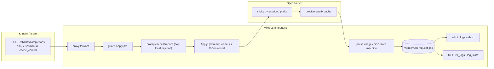

# Prompt cache облаков в MikroLLM (только prefix cache провайдера)

[English](../design-prompt-cache.md) · **Русский**

| Поле | Значение |
|---|---|
| **Автор** | TBD |
| **Дата** | 2026-09-19 |
| **Статус** | Draft (rev. 3) |
| **Модуль** | `github.com/javded-itres/mikrollm` (Go 1.23, `CGO=0`) |
| **Целевой стенд** | RouterOS 7.22, hAP ax³, контейнер `mikrollm`, veth LLM `192.168.254.5`, `memory-high=64M`, USB `/data` |
| **Связанный (не этот план)** | [`docs/design-request-cache.md`](docs/design-request-cache.md) — exact-match кэш ответов (`cache.db` / LRU / Redis). **Non-goal.** |

---

## Overview

Облачные провайдеры через **OpenRouter** уже скидывают **повтор префикса** промпта: тот же system + тот же длинный контекст, новый вопрос в хвосте. Это не exact-match всего JSON-запроса. MikroLLM сегодня это **не включает, не прокидывает и не показывает**: `guard.injectSystem` сплющивает multipart и выкидывает `cache_control` / `prompt_cache_breakpoint`; клиентский `x-session-id` не доходит до апстрима (новый `http.Request` собирается с нуля); `request_log` не хранит токены; playground ходит `stream: true`, а шлюз не разбирает `usage` из последнего SSE-события.

Предлагается **тонкий in-process слой поверх облачного prefix cache**. Никакого локального кэша ответов, никакого Redis, никакого `cache.db`, никаких эмбеддингов, никакого токенизатора на роутере. Три инкремента: (A) не ломать и прокидывать поля/заголовок сессии; (B) если клиент ничего не прислал — **только Anthropic** top-level `cache_control`; (C) разобрать `usage` и показать `cached_tokens` / грубую экономию $. Бюджет RAM — парсинг маленького объекта `usage` плюс хвост SSE ≤ 64 КиБ на in-flight запрос. `cmd="-data /data -listen :4000"` не меняется.

Продуктовый кейс, которого **нет** у exact-match кэша: агент со стабильным длинным префиксом и новым вопросом каждый раз — **на OpenRouter**:

| Путь | Что делает шлюз v1 | Ожидаемая экономия |
|---|---|---|
| `anthropic/claude-*` | Layer B: top-level `"cache_control":{"type":"ephemeral"}` если клиент не прислал | чтение ~0.10× после записи 1.25× на первом ходе |
| `z-ai/glm-*` и прочий **automatic** (OpenAI, DeepSeek, Gemini 2.5+ implicit, Grok, Moonshot) | Layer A: не ломать префикс + `session_id`; Layer B **не** инжектит | провайдер кэширует сам, если токенизированный префикс стабилен |
| Qwen-explicit / `deepseek/deepseek-v3.2` / Gemini-explicit | Layer A pass-through; клиент шлёт per-block `cache_control` (пример в `docs/providers.md` **в PR 2**) | без клиентских блоков кэш **не** включается; шлюз в v1 **не** угадывает breakpoint |

**Не** продаём $ prefix cache на строке [`docs/load-test.md`](docs/load-test.md) §2 (`glm-5.3-flash` на **Ollama Cloud**, ISP). Там billed prompt cache — **no-op** (K10, Non-Goals). Из того отчёта берём **только RAM**: тела ~0.59 МБ (~128k) / ~4–5 МБ (~1M), idle ~26 МБ, пик 256k×8 и 1M×1 ≈ 73–77 МБ (nemotron 1M до 84 МБ) — нельзя буферизовать промпт второй раз и нельзя поднять Redis.

Default `prompt_cache=auto` — **изменение биллинга** на живом Claude (первый ход 1.25× write), не no-op деплой. PR 1 (preserve) катится отдельно; PR 2, который включает inject, **в том же PR** даёт admin/MCP выключатель `off`.

---

## Background & Motivation

### Что делают облака (OpenRouter, доки от 2026-09-19)

Источники: [Prompt Caching](https://openrouter.ai/docs/features/prompt-caching), [Usage Accounting](https://openrouter.ai/docs/cookbook/administration/usage-accounting).

**Автоматический** prefix cache (доп. JSON не нужен, если **токенизированный** префикс стабилен):

| Провайдер | Порог / TTL | Чтение | Запись |
|---|---|---|---|
| OpenAI | ≥ ~1024 tok | 0.25× или 0.50× | до GPT-5.6 бесплатно; GPT-5.6+ 1.25× даже на automatic |
| Grok (xAI) | automatic | 0.25× | 0 |
| Moonshot | automatic | 0.25× | 0 |
| Groq (Kimi K2) | automatic | 0.50× | 0 |
| DeepSeek | automatic | 0.10× | 1.0× (как вход) |
| Z.AI | automatic | ~0.20× | 0 (limited-time free storage) |
| Gemini 2.5+ | implicit; Flash ≥1024, Pro ≥4096; TTL ~3–5 мин | 0.25× | 0 на implicit |

**Явный** `cache_control` (без него кэш **не** включается):

- **Anthropic Claude**: до 4 breakpoint'ов; min 1024–4096 tok по модели; TTL 5 мин или `"ttl":"1h"` (запись 1.25× / **2×**). Два режима: per-block и **top-level** `"cache_control": {"type":"ephemeral"}` — breakpoint сам едет в конец кэшируемого хвоста (multi-turn). **Это единственный auto-inject v1.**
- **Alibaba Qwen** (явный список: `qwen/qwen3-max`, `qwen/qwen-plus`, `qwen/qwen3.6-plus`, `qwen/qwen3-coder-plus`, `qwen/qwen3-coder-flash`, **`deepseek/deepseek-v3.2`**; snapshot-id вроде `qwen/qwen3.5-plus-02-15` — **нет**): **только per-block**, TTL 5 мин, запись 1.25×, чтение 0.10×. Top-level поле Claude **не** включает их кэш. v1: pass-through + пример клиенту; **не** stamp last-part.
- **Gemini через OpenRouter (explicit)**: per-block, берётся **последний** breakpoint; `systemInstruction` иммутабелен. Gemini 2.5+ implicit работает **без** поля — auto-inject не нужен. Старший/explicit путь: pass-through.

OpenAI GPT-5.6+: `prompt_cache_breakpoint` на text-частях + опционально `prompt_cache_options`. OpenRouter транслирует `cache_control` ↔ `prompt_cache_breakpoint` (TTL **не** переносится).

**Sticky routing** OpenRouter (account + model + conversation, idle **10 мин**): ключ беседы = hash(первое **system или developer** + первое non-system), либо `session_id` (body или `x-session-id`, ≤256 символов), либо `prompt_cache_key`. С `session_id` sticky включается **до** первого cache hit. Ручной `provider.order` sticky выключает.

Usage chat completions:

```json
"usage": {
  "prompt_tokens": 10339,
  "completion_tokens": 60,
  "cost": 0.042,
  "prompt_tokens_details": { "cached_tokens": 10318, "cache_write_tokens": 0 }
}
```

Anthropic-native дополнительно: `cache_read_input_tokens` / `cache_creation_input_tokens`. Парсить оба семейства.

Два разных денежных поля OpenRouter (не путать):

- **`cache_discount`** (корень ответа **или** `usage.cache_discount`) — экономия на кэше; бывает **отрицательной** на cache write. Это кандидат в `saved_usd`.
- **`usage.cost`** — **полный billed charge hop**, не экономия. Всегда класть в `usage_cost`, если ключ есть. **Никогда** не писать в `saved_usd` и не подменять им мультипликатор.

Оба persist на hop (не резолвить alias→цену post-factum).

**Стрим OpenRouter (Usage Accounting, 2026-09-19):** `usage: { include: true }` и `stream_options: { include_usage: true }` **deprecated, no effect**. Полный `usage` уже **всегда** в последнем SSE-сообщении (отдельный event после `finish_reason`, затем `data: [DONE]`). Keepalive: `: OPENROUTER PROCESSING`. Слой C **обязан** разбирать этот chunk даже если `Prepare` никогда не ставит `include_usage`. Опциональный inject `include_usage` — defense-in-depth **только** на `KindOpenRouter` (чужой OpenAI-compat прокси), не условие парсера.

**Ollama Cloud** (`https://ollama.com`, kind `ollama-cloud`): документированного billed prompt cache уровня Claude **нет**. Локальный Ollama уже держит KV prefix у себя — это **не** эта фича. **vLLM / LM Studio / local Ollama**: billed prompt cache нет → слой **no-op**.

### Текущее поведение MikroLLM (проверено в репозитории)

Цепочка чата: `internal/proxy/proxy.go` `forward` → опционально `queue.Engine.Handle` → `Proxy.Forward`.

```
POST /v1/chat/completions | POST /api/chat
        │
        ▼
proxy.forward                 // auth, ReadAll 32MiB, model, TouchKey
        │
        ├─ queues.Lookup ──► queue.Engine.Handle / run
        │                         Forward(wt.ctx, w, k, path, body, AssignedModel)
        └──────────────────► Proxy.Forward
                               guard.Apply(body, policies, GuardPre)   // всегда Unmarshal+Marshal
                               rewriteModel(filtered, upstream)        // hop-local сегодня
                               http.NewRequest + domain.ApplyUpstreamHeaders
                               copySafeHeaders + WriteHeader, затем copy 32 КиБ + Flush
                               (memWriter + guard post, если !stream && HasPost)
                               st.Log(prefix, model, backend, status, latency, bytesOut)
```

Каждый `Forward`:

1. **`guard.Apply`** (`internal/guard/guard.go` 67–96) всегда `json.Unmarshal` → `map[string]any` → **`json.Marshal`** в конце, даже если политики пустые. Плюс **внутренний** `json.Marshal` в цикле `applyPolicy` при каждом `changed`. Ключи **объекта** сортируются `encoding/json`. **Массивы не переставляются:** порядок `messages` и `content[]` сохраняется. Extra top-level ключи (`session_id`, `cache_control`, `provider`, `prompt_cache_key`, …) в `map[string]any` **выживают**. Числа становятся `float64` (`8` → `8`). Cache-killer — **не** сорт ключей, а `contentText` flatten в `injectSystem`.
2. **`injectSystem`**: если **первое** сообщение `role=system`, **заменяет `content` строкой** `prompt + "\n\n" + contentText(...)`. Это **сплющивает multipart** и **дропает `cache_control` / `prompt_cache_breakpoint` на частях**. Если первого system нет — prepend `{role, content: prompt}` (строка), даже если клиент начал с `developer` (OpenRouter sticky смотрит system **или** developer). Существующее поведение prepend при отсутствии system сохраняем; не патчим `developer` как system в v1.
3. **`rewriteModel`**: remarshal только если строка `model` отличается от `upstream`; прочие top-level ключи сохраняет; если совпало — **те же байты**. Результат hop-local: `filtered` не перезаписывается.
4. **`domain.ApplyUpstreamHeaders`** (`internal/domain/token.go`): Bearer + `User-Agent: MikroLLM/0.0.1`; для OpenRouter ещё `HTTP-Referer`, `X-Title`, `X-OpenRouter-Title`. **`x-session-id` нет.**
5. Клиентские заголовки **не** копируются, потому что `http.NewRequestWithContext` собирается **с нуля** — это и есть защита от утечки Cookie/Authorization клиента, **не** `copySafeHeaders` (`copySafeHeaders` — **response**-сторона: режет `Set-Cookie`/`Location`/CORS с апстрима). `X-Session-Id` клиента **теряется**. `Forward` / `queue.Engine.Handle` не принимают исходный `http.Request`, только `context.Context` + body. Сейчас в ctx кладётся лишь `domain.WithQueueAlias` (`internal/domain/guardctx.go`). `Engine.run` уже передаёт `wt.ctx` в `Forward` (`engine.go:300`); достаточно обернуть ctx в `forward` **до** `Handle`.
6. **`store.Log`** (`internal/store/store.go`): `INSERT INTO request_log (ts, key_prefix, model, backend, status, latency_ms, bytes_out)`. Trim last-500. **Колонок токенов, upstream и $ нет.** `Forward` пишет в `model` **alias hop** (`proxy.go:520`), не `upstream_name` каталога. Админка `/admin/logs` и MCP `list_logs` / `log_stats` кэш не показывают.
7. Каталог OpenRouter (`health.decodeOpenAICatalog`): `pricing.prompt` / `pricing.completion` → `CatalogEntry.PromptUSD` / `CompletionUSD` за 1M. **Цены cache-read нет.** Провайдер: `domain.ProviderOf(id, KindOpenRouter)` по префиксу до `/` (`anthropic` → `Anthropic`, …). `catalogMeta` — **точное** совпадение имени. Alias без `/` (`claude-sonnet-4`) при холодном health даёт `ProviderOf` → `"OpenRouter"` — auto **не** инжектит (безопасно).
8. Стрим: шлюз копирует байты 32 КиБ + `Flush` **сразу после** `WriteHeader`. `stream_options.include_usage` не выставляет. На OpenRouter это **не** причина слепоты (usage уже в последнем SSE); слепота — мы **не парсим** хвост и не отличаем `: comment` / `[DONE]` от usage-chunk.
9. Fallback (`X-MikroLLM-Fallback`, hop>0) и overflow очереди **меняют model**. Prefix cache предыдущей модели **не** переносится. `filtered` (post-guard) общий на все hop — поэтому inject `cache_control` **нельзя** писать обратно в `filtered`.
10. `least_conn` среди нескольких OpenRouter-бэкендов редок; sticky на стороне OpenRouter — per API key. Шлюз всё равно должен форвардить `session_id`.

`walk` / `rewriteContent` при mask копируют ключи part-map, так что `cache_control` на блоке **переживает** маскирование текста. Изменённый текст = miss у провайдера — корректно.

Idle RSS контейнера ~**26 МБ** ([`docs/load-test.md`](docs/load-test.md)). Пик 256k×8 / 1M×1 ≈ **73–77 МБ** (1M nemotron ~84 МБ) уже выше `memory-high=64M`. Второй буфер **промпта** или Redis недопустимы. Буфер **completion** ≤ 1 МиБ на non-stream без post-guard — отдельный потолок, не путать с телом запроса.

### Боли

1. «Тот же длинный префикс, новый вопрос» на **OpenRouter Claude** не включает explicit cache, пока клиент (и playground) не шлёт `cache_control`. На **Qwen-explicit / `deepseek-v3.2`** то же самое — и v1 это **не** чинит инжектом, только не ломает клиентские блоки.
2. Политика `system_prompt` ломает уже расставленные breakpoint'ы (`contentText`).
3. Агенты не видят `cached_tokens` ни в логах, ни в MCP, ни в заголовке non-stream ответа.
4. Playground (`internal/web/static/app.js`, `stream: true` → `/admin/chat` → `ServeChat` → `forward`) не отдаёт заголовок cache-токенов (K13); без парсера последнего SSE `usage` слой C слепой. `include_usage` на OpenRouter больше не требуется.

---

## Goals & Non-Goals

### Goals

1. Не портить облачный prefix cache: сохранить и прокинуть поля тела и `x-session-id` на OpenRouter.
2. Починить `injectSystem`: не flatten multipart, не дропать `cache_control` / `prompt_cache_breakpoint`.
3. Если клиент не прислал cache-hints — **только Anthropic top-level** `"cache_control":{"type":"ephemeral"}` (режим `prompt_cache=auto`). Qwen / Alibaba / `deepseek/deepseek-v3.2` / Gemini-explicit — **pass-through + документированный per-block пример в PR 2**, не auto-inject и не last-part stamp в v1.
4. Наблюдать экономию: разобрать `usage` (non-stream JSON и **последний SSE/NDJSON объект, в котором есть `usage`**), записать в `request_log` токены + `saved_usd` (discount или оценка) + `usage_cost` (billed fact, не savings), показать в админке/MCP, отдать `X-MikroLLM-Cache-Tokens` на non-stream.
5. Опционально на `KindOpenRouter` выставить `stream_options.include_usage=true`, если ключа нет (не перетирать явный `false`). **Не** считать это условием парсера: OpenRouter usage в стриме уже есть.
6. No-op на `ollama` / `vllm` / `lmstudio` / `ollama-cloud`.
7. CGO=0, без новых модулей в `go.mod` (сейчас только `golang.org/x/crypto` + `modernc.org/sqlite`). Нулевой прирост RAM сверх парсинга usage + хвост 64 КиБ/запрос + 1 МиБ non-stream buffer (не HasPost).
8. Очередь и fallback: тот же `Forward`; `Prepare` **hop-local**; usage пишется у **успешного** hop.

### Non-Goals

- Exact-match кэш ответов, L1 LRU, `<data>/cache.db`, Redis, `//go:build redis`, semantic cache — это [`docs/design-request-cache.md`](docs/design-request-cache.md). Этот документ **не** меняет и **не** реализует тот план.
- KV prefix cache локального Ollama / vLLM (живёт апстримом; шлюз его не дублирует и не «включает»).
- Billed prompt cache Ollama Cloud — нет публичной семантики; не эмулировать; **не** ссылаться на glm-5.3-flash load-test как на $ экономию этой фичи.
- Менять account-level sticky OpenRouter (недоступно с нашей стороны).
- Токенизатор на устройстве / оценка числа токенов промпта.
- Сверка с инвойсами OpenRouter (`usage.cost` = billed fact; `saved_usd` = `cache_discount` или оценка, не инвойс).
- Кэш embeddings / image / audio / Batch API.
- Синтез `session_id` в v1 (см. Key Decisions).
- Переписывание string-content в multipart и **stamp last text part** для Qwen/Gemini в v1 (optional PR 5).
- Default `"ttl":"1h"` (запись 2×).
- Новые флаги CLI, обязательные для старта. `cmd="-data /data -listen :4000"` остаётся достаточным.
- Вызов OpenRouter `GET /api/v1/generation` с роутера (лишний HTTPS, таймауты health ~8 с).

---

## Key Decisions

| # | Решение | Почему |
|---|---|---|
| K1 | **Отдельная фича** от exact-match кэша. Ни `cache.db`, ни Redis, ни ключ хеша тела. | Другая семантика (префикс vs полный replay). На ax³ нет RAM/USB на второй слой. Пользователь явно просил только облачный prompt cache. |
| K2 | **Pass-through тела всегда**, независимо от `prompt_cache`. Список полей: `cache_control` (top-level и per-block), `session_id`, `prompt_cache_key`, `prompt_cache_options`, `prompt_cache_breakpoint`, объект `provider`. | Клиент/агент, который уже умеет Claude/Qwen cache, не должен терять breakpoint из-за шлюза. `provider.order` выключает sticky — это выбор клиента, поле не вырезать. Extra keys уже выживают `map[string]any`; работа — **не уничтожать** их в `injectSystem`. |
| K3 | **`injectSystem` никогда не flatten `[]any`.** Prepend отдельной text-части **перед** кэшированными блоками **или** нового system-сообщения. String остаётся string (не конвертить в multipart — токенизация). Default ветка (редкий object-content): stringify через `contentText`, не дропать сообщение. Первое `role=system` патчим; `developer` не считаем system. Message-level `cache_control` ключи сохраняем. | Текущий `contentText` на массиве — доказанный cache killer. Маскирование, которое **меняет** кэшируемый текст, остаётся miss — так и надо. |
| K4 | **`guard.Apply`:** (1) `len(Dedup(policies))==0` или ни одна политика не `Applies` к фазе → **не decode**, вернуть `body`; (2) только `system_prompt` → decode + inject + **один** Marshal; (3) остальные политики → decode, apply, **один** Marshal в конце; **убрать** внутренний `json.Marshal` в цикле `applyPolicy`; (4) если после политик `!changed` → исходные байты. | Пустой путь на ax³ (нет политик) не должен строить map на 5 МБ. Сорт ключей не ломает prefix tokens, но Marshal/Unmarshal жрут CPU/RAM. `Result.Changed` уже есть и proxy его не использует. |
| K5 | **`x-session-id` через `context`**, не через расширение сигнатуры `Forward`. `domain.WithSessionID` / `SessionIDFrom` рядом с `WithQueueAlias` (ключ ctx `2`). Ставить на OpenRouter `req.Header` в `Forward` **только** если `KindOpenRouter`. | `Forward` и очередь уже принимают `ctx`; `run` уже передаёт `wt.ctx`. Исходный `http.Request` в `run` нет. Прочие клиентские заголовки не копировать: защита — **новый Request**, не `copySafeHeaders`. |
| K6 | **v1 `session_id`: только pass-through.** Не генерировать. Клиентам/агентам — слать свой стабильный id (≤256). Playground header не шлёт — дефолтный hash OpenRouter (first system/developer + first non-system) всё ещё sticky, если `app.js` держит первое user-сообщение. | Синтез дублирует дефолт OpenRouter. Случайный id на запрос **ломает** sticky. |
| K7 | **Auto-inject только Anthropic top-level** `"cache_control": {"type":"ephemeral"}` (без `ttl`). Не multipart rewrite. Qwen / Alibaba / `deepseek/deepseek-v3.2` / Gemini-explicit — **не** auto. | Один ключ, multi-turn, 5 мин, запись 1.25×. `"ttl":"1h"` = 2× write. Per-block stamp на 128k теле сдвигает префикс и упирается в 4 breakpoint Claude. Документ + клиентский пример в **PR 2**. Optional last-part stamp — **PR 5**, не v1. |
| K8 | **`NeedsAnthropicTopLevel(provider, sendAs, origModel)`:** true если `Provider` (после `ProviderLabel`) == `"Anthropic"` **или** prefix `anthropic/` у `sendAs` **или** у исходного `raw["model"]`. Если все три промах (alias без `/`, холодный catalog) — **не** инжектить. | `catalogMeta` — exact match. Холодный health + `upstream_name=claude-sonnet-4` → `"OpenRouter"`; безопасный skip лучше ложного inject. |
| K9 | **Настройка `prompt_cache`.** Глобально `admin_meta.prompt_cache` DEFAULT `'auto'`. На alias: `models.prompt_cache` DEFAULT `'inherit'`. **`Resolve(global, alias)`:** `""` и `"inherit"` у alias → global; пустой global → `auto`. **`SaveModel`:** пустой или невалидный `PromptCache` **persist `'inherit'`** (как `LBPolicy==""` → `least_conn`). | Иначе `setModelFallback` / `ConnectOllamaModel` / MCP без поля затрут режим в `""`, а старый Resolve(`""`→`auto`) обошёл бы global и форсировал inject. |
| K10 | Режимы (только hop `KindOpenRouter`; иначе no-op): **`off`** — не инжектить, pass-through; **`auto`** — top-level `cache_control` только если K8 и нет hints; **`on`** — top-level на любой OpenRouter-запрос без hints. Никогда не инжектить, если hints уже есть. Default `auto` = **behavior change / 1.25× write** на Claude, не «безопасный выкл». | `on` — ручной рычаг. Не переписывать messages. Не ставить на Ollama Cloud. |
| K11 | **Cache-hints** (запрет инжекта): top-level `cache_control` или `prompt_cache_options`; любой nested `cache_control` / `prompt_cache_breakpoint` в decoded map, **включая `tools`**. `session_id` / `prompt_cache_key` — **не** hint. | Не затирать клиентский Claude/Qwen. Не добавить 5-й Anthropic breakpoint поверх четырёх блочных. Sticky можно сочетать с нашим top-level полем. |
| K12 | **`include_usage` опционален**, только `KindOpenRouter`, если `stream` и ключа нет. Явный `false` не перетирать. Слой C **не** зависит от этого поля: парсить last usage chunk всё равно. | OpenRouter: deprecated no-effect; usage уже в последнем SSE. Inject — на случай чужого OpenAI-compat за тем же kind. |
| K13 | **Не изобретать `usage`.** Прокинуть апстримный объект как есть (`walk` его не трогает). Свои поля в JSON ответа не добавлять. Заголовок `X-MikroLLM-Cache-Tokens` — **только non-stream** (до `WriteHeader`). Стрим: usage в last-chunk + `request_log`. Trailers нет. `X-MikroLLM-Cache-Write-Tokens` — только если write > 0. | HTTP нельзя дописать заголовок после flush. Буфер стрима запрещён. |
| K14 | **`Prepare` hop-local.** `filtered` навсегда = post-guard body. Каждый hop: `payload, _ := promptcache.Prepare(PrepInput{Body: filtered, SendAs: upstream, Kind: b.KindNorm(), ...})`. `payload` живёт до `Do` этого hop и **не** пишется в `filtered`. Внутри Prepare: один Unmarshal → model + optional inject + optional include_usage → один Marshal если changed. Non-OR: дешёвый путь как нынешний `rewriteModel` (Unmarshal только если `model` ≠ `SendAs`). | Иначе Claude `auto` на hop 0 оставит `cache_control` в теле hop 1 (OpenAI/Ollama/Qwen) — это поведение `on` в `auto` и риск 400. Сегодня `rewriteModel(filtered, upstream)` уже hop-local. |
| K15 | **Лог: ALTER `request_log`**, не новая таблица. Токены + hop identity + $ в момент записи (см. Data Model). Trim 500. Usage парсить только с **успешного** тела (2xx); 4xx/5xx/guard/502 → нули. Fallback: каждая hop-строка как сейчас; ненулевые токены только у 2xx hop. | `catalogMeta(alias)` post-factum не находит `anthropic/claude-…`. Цена должна сесть, пока hop знает `upstream` и `requested`. |
| K16 | **Пакет `internal/promptcache`** (std only): mode, hints, inject, parse usage, SSE state machine, multipliers. `proxy` вызывает; `store` не импортирует. | Держать `proxy.go` коротким. Тесты без HTTP. |
| K17 | **`usage.cost` — total billed, никогда `saved_usd`.** (1) Если `cache_discount` есть (корень **или** `usage.cache_discount`) → `saved_usd = cache_discount` (отрицательный write ок). (2) Иначе если `cached_tokens` **или** `cache_write_tokens` > 0 **и** известен catalog `prompt_usd` hop → оценка мультипликатором (OpenAI **0.50×**, занижает vs 0.25×). (3) `usage.cost` всегда persist как `usage_cost`, если ключ есть; **не** участвует в `EstimateSaved`. Нет discount, нет cached/write, неизвестный провайдер или нет `prompt_usd` → `saved_usd=0`, токены всё равно пишем. Не звать `/api/v1/generation`. Dash: сумма `saved_usd` = экономия; `usage_cost` отдельно как факт. | Иначе наличие `cost` на каждом OR-chunk обнуляло бы «оценку $», а подмена cost→saved врала бы в другую сторону. |
| K18 | **Не форвардить `x-session-id` на non-OpenRouter.** | У Ollama/vLLM заголовок бессмысленен. Body `session_id` всё равно уйдёт extra JSON key. |
| K19 | **SQL моделей целиком в PR 2** (ALTER + все SELECT/INSERT/UPDATE `ListModels`/`GetModel`/`GetModelByAlias`/`SaveModel`/`ConnectOllamaModel`). MCP: свойство `prompt_cache` в schema (`additionalProperties: false`); `hasArg("prompt_cache")` иначе старое. Admin POST через `u.protect` (CSRF), паттерн `setModelFallback`. Методы `PromptCacheMode`/`SetPromptCacheMode` **на `ports.Store`**. | Иначе round-trip затрёт колонку; MCP не сможет ни прочитать global, ни послать поле. |

---

## Proposed Design

### Компоненты



Новых процессов нет. SQLite тот же `mikrollm.db`, `MaxOpenConns=1`.

### Поток Forward (после изменений)

```mermaid
sequenceDiagram
  participant Cl as Клиент
  participant Fw as proxy.forward
  participant Q as queue.Engine
  participant F as Proxy.Forward
  participant G as guard.Apply
  participant PC as promptcache.Prepare
  participant Up as OpenRouter
  participant Log as store.Log

  Cl->>Fw: body + X-Session-Id
  Fw->>Fw: ctx = WithSessionID(r.Context(), header)
  alt alias очереди
    Fw->>Q: Handle(ctx, …, original body)
    Q->>F: Forward(wt.ctx, …, AssignedModel)
  else
    Fw->>F: Forward(ctx, …)
  end
  F->>G: Apply(body, policies, GuardPre)
  Note over G: нет политик → без decode<br/>injectSystem не flatten
  G-->>F: filtered = pre.Body (навсегда)
  loop hop 0..3
    F->>F: pick backend / upstream
    F->>PC: Prepare(Body: filtered, SendAs, Kind, Provider, Mode)
    Note over PC: payload hop-local;<br/>filtered не меняется
    F->>Up: POST payload + headers
    alt 2xx
      F->>F: 3-way: stream / HasPost / 1MiB
      F->>Log: usage этого hop
    else error + fallback
      F->>Log: zeros
      Note over F: следующий hop снова Prepare(filtered)
    end
  end
```

Точки вставки:

- `proxy.forward` (~строка 350): `ctx := domain.WithSessionID(r.Context(), r.Header.Get("X-Session-Id"))`; в `queues.Handle` и прямой `Forward` — этот `ctx` (сейчас в очередь идёт голый `r.Context()`). `Engine.run` уже делает `Forward(wt.ctx, …)`.
- `Proxy.Forward`: `filtered = pre.Body` **один раз**; на каждом hop `payload, _ := promptcache.Prepare(PrepInput{Body: filtered, SendAs: upstream, Kind: b.KindNorm(), Provider: p.providerOf(...), OrigModel: requested, Mode: mode})`. **Не** `filtered = payload`.
- Перед `p.client.Do`: если `b.KindNorm()==KindOpenRouter` и `SessionIDFrom(ctx)!=""` → `req.Header.Set("X-Session-Id", sid)`.
- Ответ: 3-way branch (ниже). Никогда `WriteHeader`/`Flush` в клиентский `w` до EOF на non-stream без HasPost.

### Слой A — не ломать / прокидывать

#### `injectSystem`

Сейчас (`internal/guard/guard.go` 217–230): flatten через `contentText`.

Новое:

```go
func injectSystem(raw map[string]any, prompt string) {
    msgs, _ := raw["messages"].([]any)
    if len(msgs) > 0 {
        if m, ok := msgs[0].(map[string]any); ok {
            if role, _ := m["role"].(string); strings.EqualFold(role, "system") {
                switch c := m["content"].(type) {
                case string:
                    m["content"] = prompt + "\n\n" + c // string остаётся string
                case []any:
                    part := map[string]any{"type": "text", "text": prompt}
                    m["content"] = append([]any{part}, c...) // maps блоков шарим, не мутируем
                default:
                    // редкий object-content: stringify, не дропать сообщение
                    m["content"] = prompt + "\n\n" + contentText(c)
                }
                msgs[0] = m
                raw["messages"] = msgs
                return
            }
        }
    }
    // нет первого system (в т.ч. только developer) — prepend system, как сейчас
    sys := map[string]any{"role": "system", "content": prompt}
    raw["messages"] = append([]any{sys}, msgs...)
}
```

Правила:

- Не вызывать `contentText` на `[]any`.
- Не удалять ключи сообщения (`name`, message-level `cache_control`).
- Не конвертировать string → multipart в v1.
- Prepend **перед** кэшированными блоками: политика попадает в префикс. Стабильная политика → общий кэш; смена → miss (верно).
- `rewriteContent` при mask копирует part-map — `cache_control` живёт. Mask кэшируемого текста = miss.
- `developer` как первое сообщение: **не** патчим его content; prepend нового `system` (как сегодня при отсутствии system). OpenRouter sticky хеширует first system/developer — появление нашего system **меняет** sticky key, если клиент не шлёт `session_id`. Документировать; не чинить синтезом id в v1.

#### `guard.Apply`

```go
func Apply(body []byte, policies []domain.Policy, phase string) Result {
    policies = Dedup(policies)
    any := false
    for _, p := range policies {
        if Applies(p, phase) {
            any = true
            break
        }
    }
    if !any {
        return Result{Body: body} // нет decode
    }
    raw, ok := decode(body)
    if !ok {
        return Result{Body: body}
    }
    changed := false
    if phase == domain.GuardPre {
        if prompt := joinSystem(policies); prompt != "" {
            injectSystem(raw, prompt)
            changed = true
        }
    }
    for _, p := range policies {
        if !Applies(p, phase) || p.Kind == domain.GuardSystemPrompt {
            continue
        }
        blocked, ch := applyPolicy(raw, p) // больше не Marshal внутри
        if blocked != nil {
            return Result{Body: body, Block: blocked}
        }
        changed = changed || ch
    }
    if !changed {
        return Result{Body: body}
    }
    out, err := json.Marshal(raw)
    if err != nil {
        return Result{Body: body}
    }
    return Result{Body: out, Changed: true}
}
```

Документировать: провайдеры хешируют **токены** `messages`, не байты JSON. `encoding/json` **не** переставляет массивы (`messages`, `content[]`); переставляет только ключи объектов. Запрещено пересобирать `messages` не в том порядке, кроме prepend system.

#### Заголовок сессии

`internal/domain/guardctx.go`:

```go
const sessionIDCtxKey guardCtxKey = 2

func WithSessionID(ctx context.Context, id string) context.Context { /* trim; cut at \r/\n; cap 256 */ }
func SessionIDFrom(ctx context.Context) string
```

`http.Header.Get("X-Session-Id")` case-insensitive. Пустая строка → ctx не трогать. Длина >256: молча trim справа (коллизии допустимы). CRLF вырезать как `SanitizeToken`.

Body `session_id` OpenRouter берёт **раньше** заголовка; body не переписываем (K6). Только header → форвардим header. Только body → JSON pass-through. Оба → OpenRouter предпочтёт body.

Форвард заголовка **только** `KindOpenRouter` (K18).

#### Тесты слоя A (PR 1, без `Prepare`)

1. Multipart system + `cache_control` на втором блоке, **без** `system_prompt` → структура блоков и `cache_control` на месте; top-level `session_id`, `prompt_cache_key`, `provider` живы.
2. То же **с** `system_prompt` → structural equality `content` = `[policyPart, ...original]`; второй блок с `cache_control` не сплющен.
3. String system + `system_prompt` → конкатенация строк, не массив.
4. Message-level `cache_control` + string content + `system_prompt` → ключ на сообщении жив, content остаётся string.
5. `x-session-id` на апстриме **только** kind `openrouter`. На Ollama/vLLM нет.
6. Очередь overflow: hop на OpenRouter overflow-alias всё ещё видит `X-Session-Id` (`forward` кладёт ctx до `Handle`; overflow зовёт `Forward` с тем же ctx).
7. `Apply` без политик: `bytes.Equal` исходному body (и **без** Unmarshal — можно шпион на decoder в тесте через невалидный JSON? достаточно: валидный JSON с несортированными ключами остаётся byte-equal).
8. `rewriteModel` при смене `model` сохраняет extra keys (уже почти есть `TestRewriteModelReplacesQueueAlias` — добавить extra field). `Prepare` здесь **не** упоминать.

### Слой B — включить, если клиент не прислал

Пакет `internal/promptcache` (появляется в PR 2):

```go
const (
    ModeOff     = "off"
    ModeAuto    = "auto"
    ModeOn      = "on"
    ModeInherit = "inherit"
)

type PrepInput struct {
    Body      []byte
    SendAs    string // upstream model этой hop
    OrigModel string // raw/client/alias; для K8
    Kind      string
    Provider  string // CatalogEntry.Provider hop
    Mode      string // уже Resolve()'d off|auto|on
}

func Prepare(in PrepInput) (out []byte, changed bool)
func HasCacheHints(raw map[string]any) bool
func NeedsAnthropicTopLevel(provider, sendAs, origModel string) bool
func Resolve(global, alias string) string
```

`Resolve`:

```go
func Resolve(global, alias string) string {
    a := strings.ToLower(strings.TrimSpace(alias))
    if a == "" || a == ModeInherit {
        g := strings.ToLower(strings.TrimSpace(global))
        if g == "" {
            return ModeAuto
        }
        return g
    }
    return a
}
```

`SaveModel` (store):

```go
if m.PromptCache == "" || !validPromptCache(m.PromptCache) {
    m.PromptCache = ModeInherit
}
```

`validPromptCache` для колонки alias: `inherit|off|auto|on`. Для global: `off|auto|on`. Мусор при **чтении** alias → трактовать как inherit; при **записи из admin/MCP** — HTTP/MCP ошибка. `SaveModel` из внутренних round-trip (`setModelContext`) всегда имеет валидное поле после GetModel.

`Prepare`:

1. Если `Kind != KindOpenRouter` и (`SendAs==""` || model уже равен) — вернуть body (как `rewriteModel` early-return). Если model надо сменить — Unmarshal только ради `model`.
2. Иначе Unmarshal → map; ошибка → body.
3. Подставить `SendAs` в `model` при необходимости.
4. Optional `include_usage` (K12) — можно в PR 3; в PR 2 не обязательно.
5. Inject `cache_control`, если OpenRouter и не `HasCacheHints`:
   - `Mode==auto` && `NeedsAnthropicTopLevel(provider, sendAs, origModel)` → `{"type":"ephemeral"}`;
   - `Mode==on` → то же без `ttl`;
   - иначе skip.
6. Marshal, если changed; иначе исходные байты **этого** входа (`filtered`, не предыдущий payload).

`NeedsAnthropicTopLevel`: OR по трём строкам, case-insensitive prefix `anthropic/` и provider `"Anthropic"`. Все промах → false.

`HasCacheHints`: рекурсия по decoded map (messages, tools, …). Не `bytes.Contains`.

Резолв mode **один раз** на запрос (по alias hop 0 / requested), не на каждый fallback alias? **Нет:** fallback — другая модель, другой `GetModelByAlias(model)` на текущем hop. Mode резолвить **на hop** по текущему `model` после `pick`. Claude→OpenAI: hop 1 alias OpenAI с `inherit` → global `auto` → `NeedsAnthropicTopLevel` false → **нет** inject на hop 1, даже если hop 0 инжектил в свой payload. Это работает **только** если payload hop-local (K14).

Тест PR 2 (обязательный): Anthropic hop 402 → fallback OpenAI alias; захваченное тело OpenAI **без** top-level `cache_control` при `auto`.

Qwen/Gemini-explicit: в PR 2 — абзац + JSON-пример per-block в [`docs/providers.md`](docs/providers.md) (не ждать PR 4). Шлюз блоки не расставляет.

### Слой C — наблюдать экономию

#### Парсинг usage

```go
type Usage struct {
    PromptTokens     int
    CompletionTokens int
    CachedTokens     int
    CacheWriteTokens int
    CacheDiscount    float64
    HasDiscount      bool // ключ cache_discount присутствовал (даже если 0 или <0)
    Cost             float64
    HasCost          bool // ключ usage.cost присутствовал; это billed total, не savings
}

func ParseJSON(event []byte) Usage // полный chat JSON или полный SSE data-payload
func ParseUsageMap(u map[string]any) Usage // только внутренний объект usage (токены + cost + usage.cache_discount)
```

`ParseJSON` смотрит **весь event** (completion body / SSE payload, который state machine сохранил, потому что в нём был ключ `"usage"`):

| Поле | JSON path (полный event) |
|---|---|
| Prompt | `usage.prompt_tokens`, иначе `usage.input_tokens` |
| Completion | `usage.completion_tokens`, иначе `usage.output_tokens` |
| Cached | `usage.prompt_tokens_details.cached_tokens`, иначе `usage.cache_read_input_tokens` |
| Write | `usage.prompt_tokens_details.cache_write_tokens`, иначе `usage.cache_creation_input_tokens` |
| `HasDiscount` / `CacheDiscount` | ключ **`cache_discount` на корне**; если нет — **`usage.cache_discount`**. Значение может быть <0. Нет ключа → `HasDiscount=false`, не путать с 0. |
| `HasCost` / `Cost` | **`usage.cost` только**. Корень `cost` не читать (чужие поля). Это **total billed**, не savings. |

Ollama NDJSON `done`: `prompt_eval_count` / `eval_count`; cached/write/discount/cost = нет.

`ParseUsageMap` **не** видит корневой `cache_discount`. Поэтому SSE/`ParseJSON` всегда кормят **полный payload события**, не вырезанный `usage`. Если вызвать `ParseUsageMap` на inner map — discount только из `usage.cache_discount`.

Если оба семейства токенов — **max** по полю (не сумма). Отрицательные токены → 0. `cache_discount` **не** клипать. `usage.cost` не клипать. Не-int numbers через `float64` trunc для токенов.

Ошибка Unmarshal / не-object → нули. Тело не логировать.

#### Stream: state machine (copy loop + ignore list)

Playground и агенты: `stream: true`. OpenRouter шлёт keepalive `: OPENROUTER PROCESSING`, дельты, **отдельный** usage event после `finish_reason`, затем `data: [DONE]`. LiteLLM-баг «остановиться до usage chunk» не копировать.

```
lastUsage = nil
frag = empty  // ≤ 64 KiB
for {
    n, err = resp.Body.Read(buf32k)
    if n > 0 {
        Write+Flush to client   // ВСЕГДА, даже если tail overflow
        feed(tailScanner, buf[:n])
    }
    if err != nil { break }
}
Log(ParseJSON(lastUsage))  // nil → нули
```

`feed` (SSE, OpenRouter / OpenAI-compat):

1. Копить строки в `frag`. Если `len(frag) > 64KiB` → **сбросить frag**, `lastUsage` не трогать (если уже был usage-chunk — оставить; если нет — останется 0). **Copy к клиенту не останавливать.**
2. Пустая строка → разделитель event, игнор.
3. Строка с префиксом `:` → comment/keepalive, игнор.
4. `data: [DONE]` или payload `[DONE]` → игнор для usage.
5. Строка `data:` + JSON: Unmarshal в `map[string]any`. Если есть ключ `"usage"`:
   - если `len(payload) ≤ 64KiB` → `lastUsage = payload` (**весь event**, не inner `usage` — иначе корневой `cache_discount` потеряется);
   - иначе → **не** сохранять этот кадр (`usage=0` если другого не было), copy продолжается.
6. Прочие `data:` (дельты без `usage`) → игнор для usage.
7. Не-JSON payload → игнор.

NDJSON (`/api/chat` native Ollama): те же лимиты; кандидат — объект с `done==true` и/или `prompt_eval_count`; `cached_tokens=0`. Не поднимать cap «до целого огромного NDJSON». Если usage окажется на гигантском content-кадре — принять 0, не буферить.

RAM: 64 КиБ × inflight; c=8 → 512 КиБ. Не буферизовать весь SSE.

`X-MikroLLM-Cache-Tokens` на стриме **нет**.

Тесты PR 3: comment frames; `[DONE]`; usage-only extra chunk после `finish_reason`; 64 КиБ overflow → HTTP 200 + полное тело клиенту + `cached_tokens=0`; клиентский `stream_options.include_usage=false` не переписывается; парсер находит usage **без** inject `include_usage`.

#### Non-stream / stream: 3-way branch (один место в Forward)

Сегодня `copySafeHeaders(outW.Header(), resp.Header)` вызывается **один раз** на writer, который реально эмитит (`w` или `memWriter`), затем `WriteHeader`, затем copy+Flush. `copySafeHeaders` (`proxy.go` 708–716) делает **`Add`**, не `Set`: второй вызов на те же ключи **дублирует** `Content-Type` / `Cache-Control`. Общего `outHeader` на все ветки нет. Инвариант: апстримные заголовки копируются **ровно один раз** на тот writer, с которого клиент их увидит.

Очередь оборачивает `w` в `headTracker`: первый `Write` без `WriteHeader` форсирует 200 — поэтому буфер **не** в `w`, а в `bytes.Buffer` / существующий `memWriter`, пока не решили заголовки.

Псевдокод **одного** места после успешного `Do` (2xx). **Нет** строки `copySafeHeaders(outHeader, …)` до `switch`.

```
switch {
case guard.IsStream(filtered):
    copySafeHeaders(w.Header(), resp.Header)   // один раз, на клиентский w
    w.WriteHeader(code)                        // без X-MikroLLM-Cache-*
    copy 32KiB + Flush + tailScanner           // в w / headTracker
    usage = ParseJSON(lastUsage)               // полный SSE event

case guard.HasPost(policies):
    // unbounded memWriter — НЕ резать 1 МиБ; как сегодня
    cap := memWriter{h: http.Header{}}
    copySafeHeaders(cap.Header(), resp.Header) // один раз, ТОЛЬКО на cap
    cap.WriteHeader(code)
    copy всего апстрима в cap (без Flush клиенту)
    post := guard.Apply(cap.buf.Bytes(), policies, GuardPost)
    if post.Block != nil { ...; return }
    usage = ParseJSON(post.Body)               // walk не режет usage
    // на w апстрим ещё не копировали — нельзя copy resp.Header на w И cap.h на w
    copySafeHeaders(w.Header(), cap.h)         // один раз: апстрим с cap
    setCacheHeaders(w.Header(), usage)         // Header.Set, не Add — не дублирует
    w.WriteHeader(cap.code or 200)
    w.Write(post.Body)
    // headTracker.wrote == true только после этого Write

default:
    // !stream && !HasPost: буфер ≤ 1 MiB; НЕ Write/Flush в w до EOF/overflow
    var buf bytes.Buffer
    overflow := false
    for {
        n, err := resp.Body.Read(tmp)
        if n > 0 {
            if !overflow && buf.Len()+n <= MaxUsageBuffer { // 1<<20
                buf.Write(tmp[:n])
            } else {
                if !overflow {
                    overflow = true
                    copySafeHeaders(w.Header(), resp.Header) // один раз
                    w.WriteHeader(code)                      // БЕЗ cache-заголовков
                    w.Write(buf.Bytes())
                    buf.Reset()
                }
                w.Write(tmp[:n]); Flush
            }
        }
        if err != nil { break }
    }
    if overflow {
        usage = zero   // usage в конце JSON — префикс не парсить
    } else {
        usage = ParseJSON(buf.Bytes())
        copySafeHeaders(w.Header(), resp.Header) // один раз
        setCacheHeaders(w.Header(), usage)       // Set после copy
        w.WriteHeader(code)
        w.Write(buf.Bytes())
    }
}

p.st.Log(..., usageWithPrice(usage, upstream, catalog, provider))
```

`setCacheHeaders`: только `Header.Set("X-MikroLLM-Cache-Tokens", …)` и при write>0 `Set("X-MikroLLM-Cache-Write-Tokens", …)`. После `copySafeHeaders` (`Add`) это безопасно: наших ключей в `resp` нет.

Жёсткие правила:

- **Никогда** не вызывать `copySafeHeaders(w.Header(), resp.Header)` и затем `copySafeHeaders(w.Header(), cap.h)` — `Add` удвоит `Content-Type`.
- HasPost: апстримные заголовки живут на `cap.h`; на `w` они попадают **только** с `cap.h`.
- Overflow 1 МиБ: **не** парсить усечённый JSON; `usage` в конце. Copy заголовков один раз в момент overflow, без cache-токенов.
- HasPost **без** потолка 1 МиБ.
- На stream никогда не откладывать первый байт ради usage.
- `headTracker.wrote` истинен только когда клиент реально получил байты.

Тесты PR 3: overflow 1MiB+1 → 200, полное тело, без cache-заголовка, tokens 0; HasPost + usage headers; `headTracker.wrote` после реального write; **ровно один `Content-Type`** у клиента на stream, HasPost и buffered JSON.

#### `include_usage` (PR 3, optional)

В `Prepare`, только `KindOpenRouter` + stream: если нет ключа `include_usage` — поставить `true`. Клиентский `false` оставить. Парсер не требует этого поля.

#### `store.Log` / ports

```go
// ports.LogRepo — 5 call sites в proxy.go, 2 в mcp/server_test.go, других нет
Log(prefix, model, backend string, status int, latency time.Duration, bytesOut int64, u domain.TokenUsage)
```

`domain.TokenUsage` несёт токены + hop-time $ (нули на guard/502/4xx).

#### Оценка $ (считается в proxy в момент Log, не post-factum)

`usage.cost` сюда **не** передаётся и **не** читается.

```go
func EstimateSaved(u Usage, promptUSDPer1M float64, provider string) (saved float64, ok bool) {
    if u.HasDiscount {
        return u.CacheDiscount, true // 0 и отрицательные валидны
    }
    if u.CachedTokens == 0 && u.CacheWriteTokens == 0 {
        return 0, false
    }
    if promptUSDPer1M <= 0 {
        return 0, false
    }
    readMult, known := ReadMultiplier(provider)
    if !known {
        return 0, false
    }
    saved = promptUSDPer1M/1e6*float64(u.CachedTokens)*(1-readMult)
    // write extra: Anthropic/Qwen 1.25× если CacheWriteTokens>0
    // u.Cost / u.HasCost НЕ ИСПОЛЬЗОВАТЬ
    return saved, true
}

// persist на hop:
//   usage_cost = u.Cost если u.HasCost, иначе 0
//   saved_usd  = EstimateSaved(...) если ok, иначе 0
```

Таблица **read** (fallback, если нет `cache_discount`):

| Provider label / slug | read × |
|---|---|
| Anthropic / `anthropic` | 0.10 |
| DeepSeek / `deepseek` | 0.10 |
| Qwen / `qwen` | 0.10 |
| Google / `google` | 0.25 |
| xAI / `x-ai` / Grok | 0.25 |
| Moonshot / `moonshotai` | 0.25 |
| Groq / `groq` | 0.50 |
| OpenAI / `openai` | **0.50** (консервативно занижает vs 0.25× модели) |
| Z.ai / `z-ai` | 0.20 |
| иначе | unknown → только токены |

`promptUSDPer1M` = `catalogMeta(upstream, requested).PromptUSD` **на hop**, пока известны оба имени. Пишем в строку лога.

Dash last-500:

- экономия: **сумма `saved_usd`** (discount или оценка);
- факт OpenRouter: **сумма `usage_cost`** отдельной подписью, если хоть одна строка `HasCost` (в SQLite ненулевой `usage_cost` **или** колонка заполнена — 0 валиден, поэтому лучше считать «есть cost», если hop записал его; для простоты UI: показать сумму `usage_cost` как «billed (OR)», сумму `saved_usd` как «оценка экономии»). **Не** вычитать одно из другого.

UI: «оценка», не биллинг. `usage.cost` никогда не подпись под «сэкономлено».

### Данные и настройки

**`admin_meta.prompt_cache TEXT NOT NULL DEFAULT 'auto'`** — `Store.PromptCacheMode() / SetPromptCacheMode` на **`ports.Store`**.

**`models.prompt_cache TEXT NOT NULL DEFAULT 'inherit'`** — все SQL модели в PR 2, одним коммитом.

Валидация как K9. Нет таблицы `settings`. Нет второго SQLite.

### RAM / нагрузка

| Статья | Оценка | Комментарий |
|---|---|---|
| `Usage` struct | десятки байт | стек |
| SSE tail | ≤ 64 КиБ × inflight | c=8 → 512 КиБ; overflow не копится |
| Non-stream buffer | ≤ 1 МиБ, только `!stream && !HasPost` | playground стримит |
| HasPost memWriter | unbounded, **как сейчас** | не ужесточаем этим планом |
| Inject top-level | ~40 байт JSON | нет копий 128k префикса |
| Колонки лога × 500 | десятки КиБ | INTEGER+REAL |
| Idle RSS | ~26 МБ без изменения | нет Redis, нет L1 |
| Тела 0.59 / 5 МБ | RAM-доказательство из load-test | не $ Ollama Cloud |

Нет политик → guard без decode. `Prepare` на local Ollama с совпавшим `model` — без Unmarshal.

### Очередь и fallback

- `forward` кладёт session в ctx **до** `Handle`. Overflow (`engine.go` ~148: `Forward(..., q.OverflowAlias)`) и `run` используют тот же ctx → `X-Session-Id` на OpenRouter overflow hop. Prefix cache другой модели не шарить.
- Fallback в `Forward`: каждый hop `Prepare(filtered, …)` заново. Claude `cache_control` **не** протекает на OpenAI hop. Неудачный hop: tokens=0. Успешный: свои `cached_tokens` / `saved_usd`.
- `X-MikroLLM-Fallback` как сейчас при `hop>0`.

### Admin / MCP

**PR 2 (выключатель, обязателен вместе с inject):**

- `/admin/models`: select `prompt_cache` как `fallback`; `POST /admin/models/{id}/prompt-cache` через `u.protect` (CSRF, копия `setModelFallback`: GetModel → поле → SaveModel).
- Глобальный select на `/admin/models` над таблицей alias: `POST /admin/prompt-cache` тоже `u.protect`.
- MCP `save_model` / `list_models`: поле в **schema**. `hasArg("prompt_cache")` иначе старое. `get_status` additive `prompt_cache.global`.

**PR 4 (наблюдение, после колонок лога):**

- `/admin/logs`: колонки prompt / cached / write / оценка $.
- `/admin` dash: stat «кэш промпта» = сумма `cached_tokens` + сумма `saved_usd` (экономия). Рядом опционально сумма `usage_cost` как «billed», не как savings.
- MCP `list_logs` / `log_stats`: additive token + `$` поля; `cached_ratio`.

Заголовки non-stream:

```
X-MikroLLM-Cache-Tokens: 10318
X-MikroLLM-Cache-Write-Tokens: 1234    # только если > 0
```

Не путать с будущим exact-match `X-MikroLLM-Cache: hit|miss`.

---

## API / Interface Changes

### HTTP клиент → шлюз (без ломки)

```http
POST /v1/chat/completions
X-Session-Id: agent-thread-42
```

```json
{
  "model": "claude",
  "session_id": "agent-thread-42",
  "prompt_cache_key": "…",
  "cache_control": { "type": "ephemeral" },
  "messages": [
    {
      "role": "system",
      "content": [
        { "type": "text", "text": "stable prefix…", "cache_control": { "type": "ephemeral" } }
      ]
    }
  ]
}
```

Новых обязательных полей нет. Ответ: апстримный `usage` as-is + cache-заголовки на non-stream.

### `ports.LogRepo`

Было: `Log(..., bytesOut int64)`  
Стало: `Log(..., bytesOut int64, u domain.TokenUsage)`

### `ports.Store` / `domain.Model`

Добавить в интерфейс `ports.Store` (MCP `Server.st` — это `ports.Store`, без type assert):

```go
PromptCacheMode() string
SetPromptCacheMode(string) error
```

```go
type Model struct {
    // ...
    Fallback     string
    PromptCache  string // inherit|off|auto|on; SaveModel: "" → inherit
}

type TokenUsage struct {
    PromptTokens, CompletionTokens, CachedTokens, CacheWriteTokens int
    Upstream       string
    PromptUSD      float64 // catalog $/1M на hop; 0 если нет
    CacheDiscount  float64
    HasDiscount    bool
    Cost           float64
    HasCost        bool
    SavedUSD       float64
    HasSaved       bool
}

type RequestLog struct {
    // существующие поля ...
    PromptTokens, CompletionTokens, CachedTokens, CacheWriteTokens int
    Upstream      string
    PromptUSD     float64
    CacheDiscount float64
    UsageCost     float64
    SavedUSD      float64
}
```

Has* в SQLite не храним отдельным BOOL: для `cache_discount` / `usage_cost` / `saved_usd` пишем REAL и считаем «есть» если hop заполнил (0 валиден для discount). Проще: три REAL + `flags` не вводить; dash суммирует `saved_usd` как есть (0 не вредит сумме). Если discount был 0 — сумма не меняется, это ок.

### MCP

`objSchema(..., additionalProperties: false)`:

- `save_model`: свойство `prompt_cache` (string).
- `list_models`: поле в результате.
- `list_logs` / `log_stats`: additive, schema фильтров можно не расширять.
- `get_status`: additive `prompt_cache`.

---

## Data Model Changes

```sql
-- store.migrate, игнор duplicate
-- PR 2:
ALTER TABLE models ADD COLUMN prompt_cache TEXT NOT NULL DEFAULT 'inherit';
ALTER TABLE admin_meta ADD COLUMN prompt_cache TEXT NOT NULL DEFAULT 'auto';

-- PR 3:
ALTER TABLE request_log ADD COLUMN prompt_tokens INTEGER NOT NULL DEFAULT 0;
ALTER TABLE request_log ADD COLUMN completion_tokens INTEGER NOT NULL DEFAULT 0;
ALTER TABLE request_log ADD COLUMN cached_tokens INTEGER NOT NULL DEFAULT 0;
ALTER TABLE request_log ADD COLUMN cache_write_tokens INTEGER NOT NULL DEFAULT 0;
ALTER TABLE request_log ADD COLUMN upstream TEXT NOT NULL DEFAULT '';
ALTER TABLE request_log ADD COLUMN prompt_usd REAL NOT NULL DEFAULT 0;
ALTER TABLE request_log ADD COLUMN cache_discount REAL NOT NULL DEFAULT 0;
ALTER TABLE request_log ADD COLUMN usage_cost REAL NOT NULL DEFAULT 0;
ALTER TABLE request_log ADD COLUMN saved_usd REAL NOT NULL DEFAULT 0;
```

Миграция совместима с USB `/data/mikrollm.db`. Старые 500 строк — нули. Старый бинарь с явным `SELECT id, ts, … bytes_out` на новой схеме работает. Новый бинарь гоняет ALTER в `Open`. Rollback: вернуть бинарь; колонки не мешают. Выключатель без даунгрейда: `prompt_cache=off` (UI в PR 2).

Индексов на token/$ columns не нужно.

---

## Alternatives Considered

### 1. Exact-match response cache (L1 LRU + `cache.db` / Redis)

[`docs/design-request-cache.md`](docs/design-request-cache.md). Экономит полный replay, **не** «тот же префикс, новый вопрос». **Не делаем.** Сосуществование позже: разные заголовки (`X-MikroLLM-Cache` vs `X-MikroLLM-Cache-Tokens`).

### 2. Redis sidecar / второй контейнер

Нет свободной RAM на hAP ax³. Redis не увеличивает `cached_tokens` провайдера. Отклонён.

### 3. Синтез `session_id`

Дублирует дефолт OpenRouter; random-per-request ломает sticky. v1 pass-through (K6). Не PR 5 этого плана (PR 5 = last-part stamp).

### 4. Per-block auto breakpoint / stamp last text part

Нужно Qwen, `deepseek/deepseek-v3.2`, Gemini-explicit. Риск: сдвиг breakpoint, string→multipart меняет токенизацию, Anthropic лимит 4. **Не v1.** Optional **PR 5** после документации в PR 2. Goal 3 сужен до Anthropic top-level.

### 5. Буфер всего стрима ради заголовка

1M completion × c упрётся в 64M. Trailers клиенты игнорируют. Отвергнуто: state machine + лог.

### 6. Цены cache-read из OpenRouter `/models` или `GET /generation`

`decodeOpenAICatalog` знает только prompt/completion. `input_cache_read` плавал. `/api/v1/generation` — лишний HTTPS с роутера. **Предпочтение:** `cache_discount` (корень или `usage`) как `saved_usd`; иначе мультипликатор. `usage.cost` persist отдельно как факт, **не** как savings.

### 7. Default `prompt_cache=off`

Нулевая биллинг-неожиданность, но Claude без поля так и не включит кэш, пока оператор не узнает. Оставляем `auto` как продукт, **но** называем behavior change и даём `off` в том же PR, что inject.

---

## Security & Privacy Considerations

| Угроза | Митигация |
|---|---|
| Утечка клиентских Cookie/Authorization на OpenRouter | Новый `http.Request` с нуля; на апстрим уходит **только** `X-Session-Id` (и наши Referer/Title/Bearer бэкенда). `copySafeHeaders` тут ни при чём (response). |
| `session_id` как коррелятор в логах | **Не** писать в `request_log`. |
| CRLF в заголовке | Trim; вырезать `\r\n` (как `SanitizeToken`). |
| CSRF на новых POST | `u.protect` — как `POST /admin/models/{id}/fallback`. |
| Политика mask vs кэш провайдера | Кэш **провайдера**. Следующий запрос с другим текстом = miss. |
| `prompt_cache=on` → 400 | Opt-in. Не ретраить, снимая поле. |
| Default `auto` = 1.25× write Claude | Rollout: PR 1 сначала; PR 2 = inject **и** UI/MCP `off`. Короткий playground над min tokens: поле уйдёт, кэша может не быть. |
| Оценка $ vs инвойс | «оценка»; `cache_discount` → `saved_usd`; иначе мультипликатор 0.50× OpenAI; `usage.cost` только как billed fact. |
| Guard post не вырезать `usage` | `walk` не ходит в `usage`. Тест. |
| Prepare leak на fallback | K14 hop-local; тест Claude→OpenAI без `cache_control`. |

Auth не меняется: Bearer `sk-`, MCP-токен.

---

## Observability

| Сигнал | Где |
|---|---|
| `cached_tokens` / write / prompt / completion | `request_log`, `/admin/logs`, MCP `list_logs` |
| `saved_usd`, `cache_discount`, `usage_cost`, `upstream` | та же строка, hop-time |
| Суммы и `cached_ratio` | MCP `log_stats`, dash stat |
| `X-MikroLLM-Cache-Tokens` | non-stream |
| Апстримный `usage` | тело 1:1 |
| Ошибки парсинга / SSE overflow | молча 0; тело клиенту полное |
| `log.Printf` | не спамить на hit |

Алертов нет. Оператору: dash 0 при живом Claude → сломан pass-through / `off` / короткий промпт / SSE parser сожрал usage comment'ом (регрессия).

RAM — RouterOS `memory-current`, как в load-test.

---

## Rollout Plan

Это **не** no-op деплой на Claude.

1. **PR 1 в прод первым** (preserve + session). Инжекта нет. Claude/Qwen клиентские блоки начинают выживать `system_prompt`. Биллинг не меняется.
2. **PR 2** — inject default `auto` **и в том же PR** admin/MCP `off` (global + per-alias), все SQL моделей, `ports.Store` методы, CSRF `protect`, Qwen-пример в `docs/providers.md`. Операторы с живым Claude-трафиком могут выставить `off` без SQL и без даунгрейда. **Behavior change:** первый Claude-ход после апгрейда платит **1.25× write** (5 мин TTL), если нет hints и промпт ≥ min tokens (1024–4096). Короче минимума — поле всё равно уйдёт, кэша не будет (OpenRouter: «will not be cached», обычно не 400).
3. PR 3 — usage/log/stream parser. PR 4 — таблицы логов/dash/$ (мультипликаторы).
4. Деплой ax³: `make tar-ros`, `cmd` без новых флагов. ALTER в `Open()`.
5. Проверка: curl OpenRouter Claude с длинным system дважды → второй `cached_tokens>0`; golden multipart+`system_prompt`; fallback Claude→OpenAI без `cache_control` в теле; SSE comments не обнуляют usage.
6. Rollback: старый бинарь. Колонки SQLite не мешают явному SELECT. На новом бинаре: global `off`.
7. CLI-флаг не нужен.

Слои A→B→C→D — отдельные PR. PR 2 не стартовать, пока SaveModel/Resolve/UI `off` не специфицированы (этот rev. 2). PR 3 не стартовать без SSE state machine (этот rev. 2).

---

## Risks

| Риск | Severity | Митигация |
|---|---|---|
| Default `auto`: Claude платит 1.25× write на первом ходе после апгрейда | **High** | Rollout: PR 1 отдельно; PR 2 = inject + UI `off`; назвать behavior change |
| Top-level `cache_control` на не-Claude при `on` → 400 | Medium | Default `auto`; `on` opt-in; не ретраить |
| SSE comment / `[DONE]` затирает usage → silent 0 | Medium | State machine: last JSON **с ключом `usage`**; игнор-лист; тесты |
| `Prepare` записать в `filtered` → leak на fallback | High | K14; тест Anthropic 402 → OpenAI без поля |
| `SaveModel` `""` затирает mode / Resolve `""`→auto минуя global | High | Persist inherit; Resolve inherit/"" → global |
| `$` 0.25× OpenAI завышает экономию | Medium | 0.50×; `cache_discount` first; `usage.cost` ≠ saved |
| `copySafeHeaders` `Add` удвоит `Content-Type` | High | 3-way: ровно один copy на эмитящий writer; Set MikroLLM после copy; тест одного Content-Type |
| `include_usage` отвергнут | Low | Optional; парсер не зависит; только OR |
| Второй Unmarshal 5 МБ | Medium | K4 skip decode без политик; Prepare early-return non-OR |
| Non-stream 1 МиБ × c=8 | Low | playground стримит; HasPost не режем |
| HasPost unbounded | Info | pre-existing; не часть этого плана |
| Fallback / overflow меняет model | Low | Документ + `X-MikroLLM-Fallback`; hop-local Prepare |
| `least_conn` два OR-ключа | Low | `session_id` едет; sticky per key у них |
| Alias без `/` + холодный catalog | Low | K8 не инжектит |
| Mask/PII в префиксе | Info | Ожидаемый miss |
| Короткий Claude < min tokens | Low | Поле уходит, кэша нет, обычно не 400 |

---

## Open Questions

1. Stamp last text part для Qwen / `deepseek-v3.2` / Gemini-explicit? **v1: нет.** Документация + клиентский пример в PR 2. Optional **PR 5** (риски Alt 4). Goal 3 сужен до Anthropic.
2. Синтез `session_id` для playground? **v1: нет.** `app.js` может позже слать стабильный id вкладки (отдельный JS, не этот план). Дефолтный hash OpenRouter работает, пока первое user-сообщение стабильно.
3. Тянуть `input_cache_read` из каталога, когда стабилизируется? **Не блокирует.** Предпочитаем `cache_discount` на chunk.
4. `X-MikroLLM-Cache-Write-Tokens` всегда или только >0? **Только >0.**
5. Глобальный `prompt_cache` на дашборде vs модели? **Модели (PR 2, выключатель)** + dash stat токенов/$ в PR 4.

---

## PR Plan

Каждый PR независимо reviewable. Линейные зависимости. Не делать ничего из `docs/design-request-cache.md`.

### PR 1 — Preserve fields + fix `injectSystem` + session header

**Заголовок:** `fix(guard): preserve cache_control; forward x-session-id to OpenRouter`

**Зависит от:** ничего. **Можно начинать сразу.** Биллинг не меняется.

**Файлы:**

- `internal/guard/guard.go` — `injectSystem`; skip decode если нет политик; один Marshal; убрать Marshal из цикла `applyPolicy`
- `internal/guard/guard_test.go` — golden multipart ± `system_prompt`; message-level `cache_control` + string; extra top-level keys; `bytes.Equal` без политик; порядок `content[]` = `[policy, ...original]`
- `internal/domain/guardctx.go` — `WithSessionID` / `SessionIDFrom` (trim, cap 256, strip CR/LF)
- `internal/proxy/proxy.go` — `WithSessionID` в `forward` **до** `Handle`/`Forward`; `X-Session-Id` на OpenRouter после `ApplyUpstreamHeaders`
- `internal/proxy/proxy_test.go` — `TestOpenRouterChatPathAndHeaders` + session; негатив Ollama/vLLM; multipart system_prompt через ChatCompletions; **queue overflow всё ещё шлёт `X-Session-Id`** на OpenRouter
- тесты `WithSessionID`

**Не в PR 1:** пакет `promptcache`, `Prepare`, settings UI, ALTER.

**Проверка:** `go test ./internal/guard ./internal/proxy ./internal/domain ./internal/queue`.

### PR 2 — Auto `cache_control` + settings (выключатель в этом же PR)

**Заголовок:** `feat: OpenRouter prompt_cache auto/on/off (Anthropic top-level)`

**Зависит от:** PR 1. **Не стартовать inject без UI/MCP `off` и SaveModel round-trip.**

**Файлы (весь SQL моделей здесь, не дробь):**

- `internal/promptcache/prepare.go` + `prepare_test.go` — `Prepare`, `HasCacheHints`, `NeedsAnthropicTopLevel` (provider + sendAs + origModel), `Resolve` (`""`/`inherit` → global)
- `internal/proxy/proxy.go` — hop-local `Prepare(filtered)` вместо `rewriteModel`; **не** писать в `filtered`
- `internal/domain/types.go` — `Model.PromptCache`
- `internal/store/store.go` — ALTER `models.prompt_cache`, `admin_meta.prompt_cache`; **все** SELECT/INSERT/UPDATE моделей; `SaveModel`: `""`/invalid → `inherit`; `PromptCacheMode`/`SetPromptCacheMode`
- `internal/ports/ports.go` — оба метода на `Store`
- `internal/store/store_test.go` — default inherit/auto; round-trip `setModelFallback`-style SaveModel не затирает; ConnectOllamaModel → inherit
- `internal/admin/admin.go` + `internal/web/templates/models.html` — select на alias; `POST /admin/models/{id}/prompt-cache` и `POST /admin/prompt-cache` через **`u.protect`**
- `internal/mcp/tools.go` — schema `save_model` + поле `list_models`; `hasArg("prompt_cache")`; `get_status.prompt_cache.global`
- `internal/proxy/proxy_test.go` — Anthropic получает top-level; OpenAI в `auto` — нет; клиентский `cache_control` не затирается; Ollama Cloud — нет; **Anthropic 402 → fallback OpenAI без `cache_control` в теле**
- `docs/providers.md` — секция prompt cache: auto = Anthropic only; **Qwen/`deepseek-v3.2`/Gemini-explicit per-block пример**; Ollama Cloud no-op

**Не в PR 2:** `include_usage`, usage parse, logs UI, `models.html` повторно в PR 4.

**Описание:** Default `auto` = behavior change на Claude (1.25× write). Выключатель в UI/MCP обязателен.

### PR 3 — Usage parse + `request_log` + stream state machine

**Заголовок:** `feat: log cached_tokens from upstream usage`

**Зависит от:** PR 2. **Не стартовать, пока SSE algorithm, K17 (`cost` ≠ saved) и 3-way headers (один `copySafeHeaders`) не в этом документе (rev. 3 — да).**

**Файлы:**

- `internal/promptcache/usage.go` + tests — paths: корневой `cache_discount` **или** `usage.cache_discount`; токены и `cost` под `usage`; `ParseJSON` на полном event; `HasCost` не влияет на `saved_usd`
- `internal/promptcache/tail.go` + tests — state machine: comments, `[DONE]`, last JSON with `usage` (полный payload), 64KiB overflow keep-copy
- `internal/promptcache/prepare.go` — optional `include_usage` (KindOpenRouter only)
- `internal/promptcache/price.go` + test — OpenAI **0.50×**; `EstimateSaved` = discount иначе multiplier; **не** читает `Cost`
- `internal/domain/types.go` — `TokenUsage`, поля `RequestLog`
- `internal/ports/ports.go` — `Log(..., u)`
- `internal/store/store.go` — ALTER token + upstream + $ колонок; INSERT/SELECT
- `internal/proxy/proxy.go` — 3-way branch; hop-time `catalogMeta(upstream, requested)` → `TokenUsage`; Log
- `internal/proxy/proxy_test.go` — JSON usage → header + log; SSE comments/[DONE]/usage-only chunk; overflow 1MiB+1; HasPost + headers; **один `Content-Type`** на stream / HasPost / buffered JSON; `include_usage=false` intact; usage без inject include_usage; fallback hop zeros; hop с `usage.cost` и без `cache_discount` всё равно получает multiplier `saved_usd` при cached>0
- `internal/mcp/server_test.go` — сигнатура `Log`
- `internal/queue` test: `headTracker.wrote` после реального write non-stream buffer path

**Описание:** Парсер не зависит от `include_usage`. HasPost без 1MiB cap.

### PR 4 — Admin logs/dash + MCP stats + remaining docs

**Заголовок:** `docs+ui: prompt cache tokens in logs, stats`

**Зависит от:** PR 3.

**Файлы:**

- `internal/web/templates/logs.html`, `dash.html` — **не** `models.html` (уже PR 2)
- `internal/web/static/app.css` / `app.js` — колонка/фильтр
- `internal/admin/admin.go` — агрегаты last-500 (`cached_tokens_sum`, `saved_usd_sum` = экономия, `usage_cost_sum` = billed fact)
- `internal/mcp/tools.go` — поля `list_logs`, суммы `log_stats`
- `docs/api.md` — `x-session-id`, pass-through, заголовки, fallback ≠ shared cache, стрим без response header, SSE usage
- `docs/security.md` — injectSystem не flatten; mask → miss; CSRF на новых POST
- `docs/mcp.md` / `docs/admin.md` / `docs/architecture.md`
- `CHANGELOG.md` Unreleased — behavior change Claude 1.25× write

**Не делать:** Redis, `cache.db`, last-part stamp, синтез session, CLI-флаг.

### Optional PR 5 (не v1)

Stamp last text part для Qwen / `deepseek-v3.2` / Gemini-explicit. Риски Alt 4. Только если документация PR 2 окажется мало.

---

## References

- OpenRouter Prompt Caching (fetched 2026-09-19): https://openrouter.ai/docs/features/prompt-caching
- OpenRouter Usage Accounting (fetched 2026-09-19): `usage` always in last SSE; `stream_options.include_usage` deprecated no-effect
- [`docs/design-request-cache.md`](docs/design-request-cache.md) — related work, **не** этот план
- [`docs/architecture.md`](docs/architecture.md), [`docs/api.md`](docs/api.md), [`docs/providers.md`](docs/providers.md), [`docs/security.md`](docs/security.md), [`docs/load-test.md`](docs/load-test.md) (RAM only)
- Код: `internal/proxy/proxy.go` (`forward`, `Forward`, `rewriteModel` hop-local), `internal/guard/guard.go` (`Apply`, `injectSystem`, `rewriteContent`, inner Marshal), `internal/domain/token.go` (`ApplyUpstreamHeaders`), `internal/domain/kind.go`, `internal/domain/provider.go` (`ProviderOf`), `internal/domain/guardctx.go`, `internal/store/store.go` (`migrate`, `Log`, `SaveModel` full-row), `internal/health/health.go` (`decodeOpenAICatalog`, `Catalog`), `internal/queue/engine.go` (`Handle`, `run` `wt.ctx`, overflow `Forward`, `headTracker`), `internal/mcp/tools.go` (`objSchema` additionalProperties false, `hasArg` fallback), `internal/admin/admin.go` (`protect`, `setModelFallback`), `internal/ports/ports.go` (`LogRepo`, `Store`)
