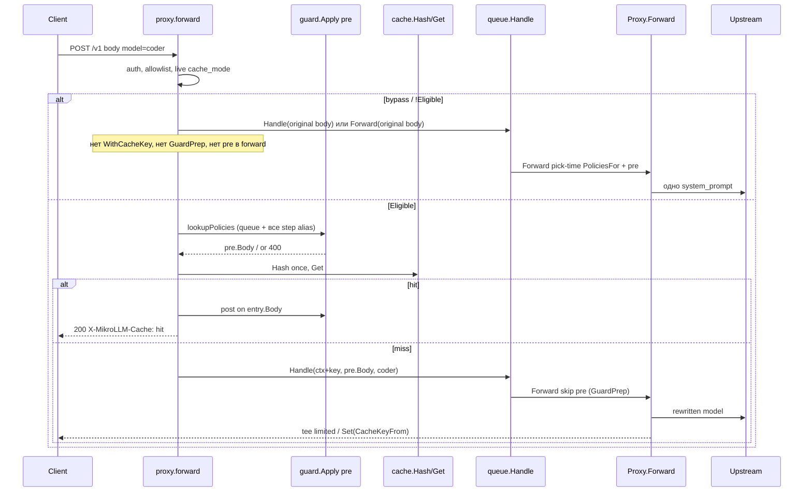

# Кэширование LLM-запросов в MikroLLM (MikroTik-first)

[English](../design-request-cache.md) · **Русский**

| Поле | Значение |
|---|---|
| **Автор** | TBD |
| **Дата** | 2026-09-19 |
| **Статус** | Draft (rev. 4) |
| **Модуль** | `github.com/javded-itres/mikrollm` (Go 1.23, `CGO=0`) |
| **Целевой стенд** | RouterOS 7.22, hAP ax³, контейнер `mikrollm`, veth LLM `192.168.254.5`, `memory-high=64M`, USB `/data` |

---

## Overview

Сейчас MikroLLM — однопроцессный шлюз: `proxy.forward` читает тело (лимит 32 МиБ), при совпадении alias очереди занимает слот через `queue.Engine.Handle`, иначе зовёт `Proxy.Forward` (rewrite модели/пути, LB, guardrails, fallback). Ответа в кэше нет: повтор того же `temperature=0` чата снова занимает очередь, снова идёт на Ollama / Ollama Cloud / OpenRouter и снова платит префилл и/или облачные токены.

Предлагается **точный (exact-match) кэш ответов в том же процессе**, без второго контейнера. Горячий слой — ограниченный по байтам LRU в RAM (не unbounded `map`). Холодный — отдельный SQLite-файл `<data>/cache.db` (не `mikrollm.db`), WAL, `synchronous=NORMAL`, свой `MaxOpenConns=1`. Redis — только опциональный адаптер за `//go:build redis` для Docker/systemd; **не** в `go.mod` до PR 7 и **не** в `make tar-ros`. Фича **выключена по умолчанию**, с жёсткими потолками размера **ответа** и тома, чтобы текущие установки ax³ не забили USB и не упёрлись в `memory-high=64M`.

Ключ кэша считается **один раз** в `forward` — и только на Eligible-пути после auth/pre-guard — и больше не пересчитывается. `Forward` на cacheable miss пишет по ключу из `context`. В очередь и в апстрим на этом пути уходит `pre.Body`. Bypass / `!Eligible` идёт в сегодняшний `Handle`/`Forward` с **оригинальным** телом, без `GuardPrep`. Hit на alias очереди — главный выигрыш: нет `InsertQueueJob`, нет `inflight`. Глобальный `enabled` — **только** default для `cache_mode=inherit`, не рубильник внутри `Layered`.

---

## Background & Motivation

### Текущее состояние

Цепочка чата зафиксирована в `internal/proxy/proxy.go` и `internal/queue/engine.go`:

```
POST /v1/chat/completions | POST /api/chat
        │
        ▼
proxy.forward          // auth, ReadAll 32MiB, model, TouchKey
        │
        ├─ queues.Lookup(model) ──► queue.Engine.Handle  // InsertQueueJob, слот, wait
        │                                    │
        │                                    ▼
        │                          Engine.run:
        │                          Forward(..., wt.body, wt.job.AssignedModel)
        │                          // AssignedModel = шаг (ornith-1.5:35b), не coder
        └──────────────────────────► Proxy.Forward
                                     requested := model  (шаг, если из очереди)
                                     pick / rewriteModel / rewriteUpstreamPath
                                     PoliciesFor(stepAlias, QueueAliasFrom, upstream)
                                     guard.Apply pre → HTTP upstream
                                     (memWriter + guard post, если не stream)
                                     X-MikroLLM-Fallback при hop>0
```

Корень композиции — `internal/app.New`: один `store.Open(<data>/mikrollm.db)`, `MaxOpenConns=1`, WAL. Очереди пишут тела в `queue_jobs`. Guardrails — `internal/guard`, политики из `store.PoliciesFor`. Админка — `internal/admin` + embed `internal/web`. MCP — `internal/mcp/tools.go`. Зависимости (`go.mod`): только `golang.org/x/crypto` и `modernc.org/sqlite` (+ CGO-free дерево sqlite).

Полевые цифры — **текущий** `docs/load-test.md` (матрица c∈{1,2,4,8}, 2026-09-18), не более ранний параллельный заезд:

| Наблюдение | Цифра из `docs/load-test.md` | Следствие для кэша |
|---|---|---|
| Idle RSS контейнера | **~26 МБ** | Бюджет L1 — единицы мегабайт |
| Пик | **73–77 МБ** (256k `glm-5.3-flash` **c=8**, 1M **c=1**) | Нельзя держать второй полный буфер 4–5 МБ «на всякий случай» |
| Локальная 35B 32k / 64k / 128k тело | 156 КБ / 312 КБ / 623 КБ | Запрос больше 256 КиБ — это норма; хешировать, не отбрасывать |
| Облако 128k / 256k / 512k / 1M тело | **0.59 / 1.19 / 2.37 / 4.0–5.0 МБ** | Hit на 128k (6 с) окупается; 1M JSON (465–798 с) хешировать целиком на ax³ опасно |
| 128k cloud c=1 | p50 **6.0 с**, RPS 0.17 | Главный выигрыш hit на LAN |
| 256k c=8 / 512k c=4 | RAM **73–76 МБ**, часть timeout | `MaxHashBytes` отсекает эти тела от второго `Marshal` |
| Очередь | диск + слот + sticky HTTP | Hit **до** `Handle` — главный выигрыш на MikroTik |

Prefix-cache Ollama/vLLM живёт **апстримом**; в текущем `docs/load-test.md` его нет (файл — матрица 32k–1M, не старый §2 про p50 ~0.5 с). Шлюз его не дублирует.

Другие контейнеры на том же роутере: `wstunnel-ams`, `mihomo`. Роутер одновременно гоняет Wi‑Fi, NAT, VPN. Свободной RAM «на ещё один Redis» нет.

### Боли

1. Повтор идентичного детерминированного запроса (агент с одним системным промптом, eval, `temperature=0` клиент) снова занимает слот очереди и снова идёт в облако. **Playground в v1 бенефициаром не является** (всегда `stream: true` и default `temperature: 0.7` в `internal/web/static/app.js`).
2. `queue_jobs` на USB хранит **входящие** тела ждущих, но не ответы.
3. LiteLLM-стиль «Redis + semantic cache» тянет второй процесс, клиент и эмбеддинги — это другой класс железа.
4. Любой **безусловный** import Redis-клиента в `cache.New`/`app.New` попадёт в scratch-бинарь `make tar-ros`, даже при пустом URL. Это ломает инвариант «RouterOS-образ без Redis», независимо от CGO (`go-redis` — pure Go и `CGO_ENABLED=0` не ломает, но раздувает ~12 МБ бинарь и audit surface).

---

## Goals & Non-Goals

### Goals

- Exact-match кэш `POST /v1/chat/completions` и `POST /api/chat` в процессе шлюза.
- Работа на hAP ax³ при `memory-high=64M` и USB `/data` без второго контейнера.
- Lookup **до** `queue.Engine.Handle`: hit не создаёт `queue_jobs` и не занимает `inflight`.
- Ключ считается **один раз** в `forward`; `Forward` **не** перехеширует.
- Изоляция по API-ключу по умолчанию; opt-in shared cache на alias **и** на очереди.
- Админка, MCP, флаги/env так, чтобы `cmd="-data /data -listen :4000"` продолжал работать.
- Фича off by default; консервативные потолки; отрицательные ответы не кэшируются.
- Интерфейс `ports.Cache` так, чтобы Redis можно было добавить в PR 7 за build tag, не переписывая proxy.

### Non-Goals

- Semantic / embedding cache (локальная модель эмбеддингов, cloud embeddings, cosine). На ax³ это отдельный GPU/RAM-бюджет и extra latency.
- Дублирование KV / prefix cache Ollama и vLLM. Шлюз кэширует **готовый HTTP-ответ**, не attention.
- HTTP CDN / `Cache-Control` на POST с `Authorization`.
- Кэш `GET /v1/models`, health, MCP, админки (админка уже `Cache-Control: no-store`).
- Кэш стриминга в v1 (нет v2 в этом дизайне, пока не будет отдельного замера RAM).
- Кэш 4xx/5xx и `content_filter` (включая 200 с `finish_reason: content_filter`, если детектируется дёшево).
- Вынос кэша в отдельный бинарь / sidecar в рекомендуемом пути.
- CGO, `go-redis` до PR 7, `-tags redis` в `make tar-ros`, изменение лимита тела 32 МиБ.
- Playground как hit-path v1 (остаётся stream + temp 0.7). Non-stream toggle playground — **out of scope**.

---

## Key Decisions

1. **Не Redis на MikroTik.** Sidecar — лишний образ (`arm64v8/redis:alpine` ~35.6 МБ compressed, слои на USB заметно больше), лишний RSS, veth, extract, failure domain. На Docker-хосте с RAM — опциональный адаптер **за `//go:build redis`**. На ax³ — нет.
2. **In-process exact-match, два слоя:** L1 LRU с **байтовым** капом и `sync.Mutex`; L2 отдельный `cache.db`. Не таблица в `mikrollm.db` (`MaxOpenConns=1` уже делит login/очереди/ключи).
3. **Выключено по умолчанию.** Глобальный `enabled` — **только default для `inherit`**, не kill switch в `Layered.Get`/`Set`. Per-alias/per-queue `cache_mode`:
   - `off` — всегда bypass, даже если global on;
   - `on` — кэшировать этот alias/очередь, **даже если global off** (так включают только `coder`; существующий `cache.db` откроется на первом Get/Set);
   - `inherit` (default) — следовать global `enabled`.
   Имена без строки alias/очереди (голый catalog name) = `inherit`. Extra alias очереди наследуют `cache_mode`/`cache_share` родителя через `GetQueueByAlias`. `forward` каждый запрос читает live `cache.Settings()` и live `cache_mode` из Lookup/`GetModelByAlias` (не снимок `app.New`).
4. **Ключ считается один раз в `forward` на Eligible-пути** после auth/allowlist/pre-guard: SHA-256 канонического JSON (requested model/alias, tenant, path, fingerprint политик lookup-time, каноническое `pre.Body`). Кладётся в `context` (`WithCacheKey`). `Forward` **запрещено** пересчитывать ключ; `Set` только `CacheKeyFrom(ctx)`. В ключе **нет** backend, fallback, overflow-шага, `AssignedModel`, `rewriteModel`. Bypass / `!Eligible`: ключ **не** класть.
5. **Достаточно детерминированное, path-aware stream:**
   - `temperature` 0 или отсутствует (для OpenAI-клиентов без поля, **не** для playground);
   - `n` отсутствует или 1 (1 / 1.0 / int — одно);
   - нет tools/functions;
   - **stream v1 = всегда bypass** (не буферизуем SSE/NDJSON);
   - **нет поля `stream` на `POST /api/chat` → bypass** (Ollama default `stream: true`);
   - **нет поля `stream` на `POST /v1/chat/completions` → cacheable** (OpenAI default false).
   `RequireExplicitTemp0` default false. Playground (`app.js`: `stream: true`, `temperature` default 0.7) в v1 **никогда не попадает** в кэш — это принято.
6. **Lookup после auth и allowlist, до очереди.** На Eligible-пути в `Handle`/`Forward` на miss передаётся **`pre.Body`**. На bypass / `!Eligible` — **оригинальный** body, без `WithCacheKey` / `WithGuardPrep` / pre в `forward` (иначе `injectSystem` сработает дважды). Pre на hit обязателен; post на сохранённом теле. Fingerprint **стабилен для очередей**: в lookup входит объединение политик очереди + **всех step alias** очереди (вариант (b), без `pick()`).
7. **Два разных лимита размера.** `MaxEntryBytes` (default **256 KiB**, код max **1 MiB**) — только **тело ответа** при `Set`. `MaxHashBytes` (default **1 MiB**, код max **4 MiB**) — порог, выше которого Eligible=`req_too_large` **без** второго полного `Marshal`. 256 КиБ **не** отсекает 64k/128k запросы.
8. **Изоляция по `APIKey.ID`.** Shared cache — явный `cache_share` на **alias и на очереди**.
9. **Redis только PR 7, `//go:build redis`.** Default `make tar-ros` / `build-arm64` **не** передаёт `-tags redis`. `go-redis` (и любой Redis-модуль) **не** появляется в `go.mod` до PR 7. CGO Redis-клиенты запрещены. `cache.New` в default build не импортирует `redisx`. CI: `go list` графа default-сборки не содержит `redisx`.
10. **Один процесс, CGO=0, sqlite через `modernc.org/sqlite`.** Никаких новых тяжёлых модулей в дефолтном пути.
11. **Hot settings.** `ports.Cache` всегда `Layered` (не `NopCache` в `app.New`, кроме тестов). `Get`/`Set` **не** смотрят на `Settings().Enabled` — Eligible решает proxy. `cache.db` **не** открывать в `app.New`. Lazy-open на первом **L2-доступе**: `Get`, `Set`, `Flush`, `PurgeTenant`, `Stats` (disk). Если файл есть — `Get` обязан его открыть (иначе рестарт даёт ложный miss). Если файла нет — `Get`/Flush/Purge/Stats **не** создают его; создаёт только `Set`. `UpdateSettings(enabled=false)` меняет только inherit-default: **не** Flush L1 и **не** no-op Get/Set. `migrate` **не INSERT** строку `cache_settings`.
12. **Limited tee, не `memWriter`.** Cacheable miss без post-guard пишет клиенту сразу (Flush), в захват кладёт не больше `MaxEntryBytes`; overflow → стрим дальше, Set не делать. `memWriter` остаётся только для существующего post-guard.

---

## Proposed Design

### 1. Почему не Redis sidecar на MikroTik

Честная смета для hAP ax³ (RouterOS 7.22, уже есть `mikrollm` 64M, `wstunnel-ams`, `mihomo`, Wi‑Fi, NAT, WG):

| Статья | Redis sidecar | In-process sqlite+LRU |
|---|---|---|
| Образ | `arm64v8/redis:alpine` **~35.6 МБ** compressed; debian ~52 МБ; слои на USB **~80–120 МБ** | 0. Уже scratch + CA, tar MikroLLM ~13–14 МБ |
| Extract на USB | Ещё один `/container add`, минуты | Нет |
| RSS пустого процесса | типично **4–10 МБ**; с датасетом 32 МБ RSS часто 40–60 МБ | L1 кап **4 МБ**; sqlite WAL — сотни КБ–пара МБ |
| Сеть | Второй veth на `Bridge-Docker` | 0 hop |
| Persistence | `dump.rdb` / AOF на USB | WAL `synchronous=NORMAL`, как `store.Open` |
| Failure | Redis OOM → шлюз обязан деградировать в miss | Нет лишнего процесса |
| Клиент в Go | import в default build = в tar-ros | 0 до PR 7 |
| Операции | Второй `memory-high`, mountlist, envlist | Том `/data` уже есть |

Redis отличен на Docker-хосте с гигабайтами. На ax³ он **обычно неправильный default**.

Рекомендация: **не ставить Redis рядом с MikroLLM на RouterOS.** Если кто-то настаивает на большом Docker-хосте — см. «Опциональный Redis». Шлюз при недоступности Redis всегда продолжает чат (miss). На Docker-пути слои: **L1 + Redis вместо sqlite**, не оба сразу. На ax³ sqlite+Redis вместе не запускать.

### 2. Какие виды кэша существуют (и что делаем)

| Вид | Где живёт | На MikroTik | Решение |
|---|---|---|---|
| Exact-match HTTP ответа | Шлюз, хеш канонического запроса | Да, дёшево | **Этот дизайн** |
| Semantic / embedding | Вектор + модель эмбеддингов | Нет: RAM, latency, cloud call | Non-goal |
| Model KV / prefix | Ollama, vLLM | Апстрим; в текущем load-test не измерялся | Не дублировать |
| HTTP CDN | GET, ключ URL | Бессмысленно для POST с `sk-` | Нет |

### 3. Архитектура по умолчанию (MikroTik-first)

```
                    ┌─────────────────────────────────────────┐
                    │              процесс mikrollm             │
                    │  memory-high=64M, scratch, CGO=0         │
                    │                                         │
  sk- / admin ────► │  proxy.forward                          │
                    │     │  ключ ОДИН раз + GuardPrep        │
                    │     ▼                                   │
                    │  ports.Cache  (Layered, всегда)         │
                    │     ├─ L1 LRU  (кап 4 MiB, Mutex)       │
                    │     └─ L2 sqlite cache.db (кап 32 MiB)  │
                    │         ▲  lazy open на первом L2 access │
                    │     hit │  miss                         │
                    │     │   ▼                               │
                    │     │  Handle(pre.Body) / Forward(pre.Body, requested)
                    │     │  Forward: Set(CacheKeyFrom(ctx))  │
                    └─────┼───────────────────────────────────┘
                          │
                     USB /data
                     ├── mikrollm.db     (auth, queues, policies, cache_settings)
                     └── cache.db        (только entries; индекс tenant)
```

Слои:

- **L1 `internal/cache/memory.go`:** `map` + `container/list`, учёт **байтов тел**, LRU, **`sync.Mutex`**. Потолок `MaxMemoryBytes`.
- **L2 `internal/cache/sqlite.go`:** отдельный `sql.Open("sqlite", ...)` по образцу `store.Open` (`busy_timeout(5000)`, WAL, `synchronous=NORMAL`). `SetMaxOpenConns(1)`. Файл `<data>/cache.db`. Индекс `tenant`.
- **L3 Redis:** пакет `internal/cache/redisx` с `//go:build redis`, только PR 7. Default build его **не видит**. На Docker с `-tags redis`: L1+Redis **вместо** L2 sqlite.

`Layered.Get`: L1 → L2 (promote в L1) → miss. Оба слоя проверяют `ExpiresAt`; просроченное — delete и miss. `Set`: write-through L1+L2, если `len(body) <= MaxEntryBytes`. Ошибка L2 на Get — miss, чат жив. Ошибка L2 на Set — лог, L1 всё равно держит.

`NopCache` — **только тесты**. В `app.New` всегда `cache.New` → `Layered`. `Layered.Get`/`Set` **не** проверяют global `enabled` (это inherit-default в proxy Eligible). **`cache.db` не открывать в `app.New`.**

Lazy-open L2 (`ensureOpen`):

| Вызов | Файла нет | Файл есть |
|---|---|---|
| `Get` | miss, **не** создавать | открыть, читать |
| `Set` | создать + migrate + писать | открыть, писать |
| `Flush` / `PurgeTenant` / `Stats` (disk) | no-op / нули, **не** создавать | открыть |

После рестарта контейнера L1 пустой, файл на USB жив: первый Eligible `Get` открывает L2 и попадает в hit **без** предшествующего `Set`. Если никто не Eligible и файла нет — `cache.db` не появляется.

### 4. Контракт ключа и последовательность (заморожено)

Это обязательный контракт до PR 4. Без него hit на очереди невозможен: сегодня `Engine.run` зовёт `Forward(..., AssignedModel)`, и любой Set внутри `Forward` с пересчётом ключа от шага/`rewriteModel`/post-pick политик **не совпадёт** с lookup по клиентскому `coder`.

#### 4.1 Что считается один раз в `forward`

После `requireKey` / synthetic admin key, `ReadAll`, `modelBody`, `TouchKey`, allowlist очереди или модели. **Live** `cache.Settings()` и live `cache_mode` строки alias/очереди — на каждый запрос.

```
mode := cache_mode из GetQueueByAlias / GetModelByAlias / inherit для голого имени
if header/body bypass || mode==off || (mode==inherit && !Settings().Enabled) || !Eligible(path, body, settings):
    // сегодняшний путь: Forward сам сделает pick-time PoliciesFor + pre
    do NOT WithCacheKey / WithGuardPrep / guard.Apply pre в forward
    Handle(ctx, original body) или Forward(ctx, original body, requested)
    заголовок X-MikroLLM-Cache: bypass, если причина не «просто disabled inherit»
else:
    lookupPolicies → pre := guard.Apply(..., GuardPre)
    block → 400 + X-MikroLLM-Guardrail, не очередь
    key := Hash(... Canonical: pre.Body)   // один раз
    ctx = WithCacheKey + WithGuardPrep + WithRequestedModel
    // WithQueueAlias не заменяется (отдельный ctxKey в guardctx.go)
    Get(key)
      hit  → post-guard на entry.Body; block → 400, Delete;
             mask → отдать post.Body, не Delete, L2 не трогать;
             иначе serve + X-MikroLLM-Cache: hit
             ни Handle, ни Forward
      miss → Handle(ctx, pre.Body) или Forward(ctx, pre.Body, requested)
```

Пустой `CacheKeyFrom` в `Forward` — предохранитель «не Set», **не** замена пропуску pre. Если в `forward` нет `GuardPrep`, `Forward` обязан прогнать сегодняшний pre после `pick()`.

#### 4.2 Что запрещено `Forward`

- Пересчитывать хеш.
- Класть в ключ `AssignedModel`, backend, fallback, тело после `rewriteModel`.
- Звать `guard.Apply` pre, если `GuardPrepFrom(ctx)` истинно (тело уже `pre.Body`).
- `Set` без `CacheKeyFrom(ctx)` (пустой ключ → не писать). Пустой ключ бывает на bypass-пути; это норма, не баг.

`Engine.run` по-прежнему вызывает `Forward(..., wt.job.AssignedModel)` — это нужно `pick()` на miss. Ключ Set берётся **только** из ctx, который `Handle` пробрасывает: `context.WithTimeout(ctx, wait)` сохраняет values. На Eligible-пути в `queue_jobs` / апстрим уходит **`pre.Body`**. На bypass-пути — оригинальный body, и `Forward` сам инжектит `system_prompt` ровно один раз.



Обязательные тесты контракта:

- очередь `coder` → шаг `local` → второй запрос: `X-MikroLLM-Cache: hit`, `InsertQueueJob` count неизменен, `Forward`/upstream не звались;
- на Eligible miss в апстрим уходит тело с инжектированным `system_prompt`;
- `stream: true` + политика `system_prompt` → в апстриме **одно** system-сообщение, не два; `GuardPrep` не установлен;
- `/api/chat` без поля `stream` → нет `GuardPrep`, оригинальный body;
- global `enabled=false`, очередь `coder` `cache_mode=on`, `/v1` `temperature=0` → miss затем hit, `cache.db` создан; inherit-alias остаётся bypass.

#### 4.3 Fingerprint политик для очереди (вариант b)

`GetModelByAlias("coder")` на alias очереди не срабатывает (`AliasTaken` запрещает пересечение). `PoliciesFor` трёхместный (alias / queue / upstream). Если в lookup взять только очередь, а в Forward после `pick` — alias шага + upstream, fingerprint разъедется.

**Решение (b):** на lookup (и на hit-path pre/post) собрать **объединение**, без `pick()`:

```
ps = PoliciesFor(requested, queue.Alias, requested)
для каждого step в queue.Steps:
    m := GetModelByAlias(step.ModelAlias) // если есть
    ps += PoliciesFor(m.Alias или step.ModelAlias, "", m.UpstreamName или step.ModelAlias)
ps = guard.Dedup(ps)
fingerprint = sorted "id:kind:mode:action:sha256(config)"
```

Стабильно между lookup и Set. Слегка over-filter: политика, повешенная только на шаг 2, сработает и на hit, даже если live miss пошёл бы в шаг 1. Это консервативно и соответствует «pre на hit обязателен». Не кэшировать очереди с step-политиками (вариант c) отброшен: слишком легко потерять главный win.

Для **не**-очереди: `PoliciesFor(alias, "", upstream)` из `GetModelByAlias` либо `PoliciesFor(name, "", name)` для голого catalog name.

### 5. Ключ кэша

Версия схемы `v1` — поле внутри канонического объекта.

```go
// internal/cache/key.go
func Hash(in KeyInput) string // hex SHA-256
```

**Декод обычный, без `Decoder.UseNumber()`.** И `0`, и `0.0` становятся `float64(0)`; `json.Marshal` пишет `0`. Целочисленные float в allowlist-полях канонизируются как `int` (чтобы `n: 1` и `n: 1.0` совпали). Golden test: `{"temperature":0}` и `{"temperature":0.0}` → один `Hash`. Остающиеся gaps exact-match: пробелы **внутри строк**, порядок элементов в массивах (сохраняется), не-map ключи уже сортируются `encoding/json` при marshal `map[string]any`.

**Tenant:**

- Обычный ключ: `"k:" + strconv.FormatInt(k.ID, 10)` — не prefix и не секрет.
- Admin playground (`ServeChat`, `k.ID==0`, `Prefix=="admin"`): `"admin"`.
- Shared (`cache_share` на модели **или** очереди): `"s:" + requestedAlias`.

**В ключе:**

| Поле | В ключе | Зачем |
|---|---|---|
| `v` | да, `1` | версия схемы |
| `path` | `/v1/chat/completions` или `/api/chat` | разный wire format |
| `tenant` | да | изоляция секретов в промпте |
| `model` | **requested** alias/имя/очередь | не upstream, не `AssignedModel` |
| `policy` | fingerprint §4.3 | смена system_prompt / фильтра / step-политик |
| `messages` / `prompt` / `input` | да | |
| `tools`, `functions`, `tool_choice`, `function_call`, `parallel_tool_calls` | да (Eligible всё равно отсечёт tools) | |
| `response_format`, `format` | да | |
| `seed` | да | |
| `temperature`, `top_p`, `top_k`, `min_p`, `typical_p` | да | |
| `presence_penalty`, `frequency_penalty`, `repetition_penalty` | да | |
| `max_tokens`, `max_completion_tokens`, `num_predict`, `num_ctx` | да | |
| `stop`, `stop_sequences` | да | |
| `logit_bias`, `logprobs`, `top_logprobs` | да | |
| `n` | да | |
| `reasoning`, `reasoning_effort`, `thinking`, `think` | да | |
| `options` (Ollama nested) | да | |
| `stream` | нет (stream = bypass до Hash) | |
| `user` | **нет** | трекинг |
| `keep_alive` | **нет** | |
| `stream_options` | нет | |
| Прочие поля тела | **да**, канонически | неизвестный vendor-knob |

`rewriteModel` в ключ не входит.

Если `len(pre.Body) > MaxHashBytes`: **не** канонизировать и не хешировать (никакого второго полного `Marshal` и никакого обязательного прохода SHA по 5 МБ). Eligible=`req_too_large`, miss. Тело `pre.Body` уже лежит в памяти после `ReadAll` + `guard.Apply`; лишнюю копию не делаем.

### 6. Когда запрос cacheable

`cache.Eligible(path string, raw map, bodyLen int, cfg Settings) (ok bool, reason string)`.

`forward` каждый раз читает `cache.Settings()` и `cache_mode` текущей строки (не кэш настроек с `app.New`). `cache_mode` резолвится **до** Eligible:

```
mode off                 → bypass disabled
mode on                  → дальше Eligible (global может быть false)
mode inherit / нет строки → global enabled? иначе bypass disabled
```

Дальше **не** кэшируем:

| Условие | reason |
|---|---|
| `"cache": false` или `X-MikroLLM-Cache: bypass`/`no`/`0` | `bypass` |
| JSON `stream` true / `"true"` / `"1"` | `stream` |
| path `/api/chat` и поля `stream` **нет** | `stream` (Ollama default true) |
| path `/v1/chat/completions` и поля `stream` нет | **не** reason — cacheable |
| `n` задан и не равен 1 (int/float) | `n` |
| непустые `tools`/`functions`, или `tool_choice` не `none`/`null`/отсутствует | `tools` |
| `temperature` задан и `|t| > 1e-9` | `temperature` |
| `top_p` задан и `< 1` | `top_p` |
| `len(body) > MaxHashBytes` | `req_too_large` |
| не JSON | `json` |

`MaxEntryBytes` в Eligible **не участвует**. Это лимит `Set` на **ответ**.

Следствие на цифрах load-test (default `MaxHashBytes=1 MiB`):

| Workload | Тело запроса | Hash? | Store ответа 1 КиБ? |
|---|---|---|---|
| local 32k | 156 КБ | да | да |
| local 64k | 312 КБ | да | да |
| local 128k | 623 КБ | да | да |
| cloud 128k | 0.59 МБ | да | да |
| cloud 256k | 1.19 МБ | **нет** | нет |
| cloud 1M | 4–5 МБ | **нет** | нет |

Тесты Eligible: `/api/chat` без `stream` → `bypass`; `/v1/chat/completions` без `stream` → cacheable; 300 КиБ request + 1 КиБ 2xx **хранится**; 1 КиБ request + 300 КиБ 2xx **не** хранится.

`RequireExplicitTemp0=false` — для OpenAI-совместимых клиентов, которые **опускают** `temperature`, не для playground.

### 7. Streaming

**v1: skip. Закрыто.** `Eligible` path-aware (§6). Никакого tee SSE/NDJSON. Совпадает с тем, что `guard.HasPost` уже пропускает stream (`docs/security.md`).

Использовать голый `guard.IsStream` как единственный критерий **нельзя**: отсутствует поле → `false`, и native Ollama-клиент без `stream` будет принят за JSON-тело, а апстрим отдаст NDJSON. Это сломает и кэш, и post-guard.

v2 stream-replay на ax³ в этом дизайне **нет**. Отдельный запрос + замер RAM, если понадобится.

### 8. Limited tee, запись, заголовки, `id`/`created`

Пишем только:

- HTTP 2xx после post-guard (если он был);
- `len(body) <= MaxEntryBytes` (default **256 КиБ**);
- не пустой body;
- не gateway `content_filter` (400);
- не 200, у которого в JSON `choices[].finish_reason == "content_filter"` или `error.type == "content_filter"` — дешёвый `json.Unmarshal` в `map` / точечный lookup, без второй большой копии сверх уже захваченного буфера. Если разбор не удался — **не** пишем (fail closed на сомнительном теле).

Не пишем 4xx/5xx, guard 400, биллинг, 502.

#### 8.1 `limitedTee` — не `memWriter`

Текущий `memWriter` (`internal/proxy/proxy.go`) — **capture-then-write**: нет `Flush`, нет капа, клиент видит байты только после полного тела и post-guard. Он остаётся **только** для `HasPost` (существующий RAM-риск, кэш его не усугубляет вторым буфером: `Set` берёт `post.Body`).

Для cacheable miss **без** post-guard — новый тип:

```go
// пишет клиенту сразу, в capture кладёт ≤ MaxEntryBytes
type limitedTee struct {
    http.ResponseWriter
    max     int
    buf     bytes.Buffer
    overflow bool
}

func (t *limitedTee) Write(p []byte) (int, error) { /* write-through; if !overflow && buf.Len()+len(p) > max { overflow=true; buf.Reset() }; else if !overflow { buf.Write } */ }
func (t *limitedTee) Flush() {
    if f, ok := t.ResponseWriter.(http.Flusher); ok { f.Flush() }
}
```

- Overflow: capture бросить (`buf.Reset()`), клиенту продолжать стримить, `Set` не вызывать. Никогда не держать 5 МБ «вдруг влезет».
- Не реиспользовать `memWriter` «с лимитом после факта»: к этому моменту переполнение уже в RAM, TTFB уже отложен.
- Если `HasPost` — один `memWriter` как сейчас; после post: если `len(post.Body)≤MaxEntryBytes` и не block — `Set(post.Body)`. Второй копии «для кэша» нет.
- Тест: 300 КиБ 2xx, MaxEntry=256 КиБ: клиент получает все байты **инкрементально** (`Flush` после чанков как сейчас 32 КиБ); `Stores==0`; после return нет двух полных копий.

На hit:

```
X-MikroLLM-Cache: hit
X-MikroLLM-Cache-Age: <seconds>
Content-Type: из записи
```

На miss после попытки store: `X-MikroLLM-Cache: miss`. Bypass: `bypass`. Disabled: заголовок **не** ставить.

`id` / `created` на hit: новый `chatcmpl-` + 8 hex (`queue.newID` pattern), `created` = `time.Now().Unix()`. Remarshal может переставить ключи JSON — приемлемо, документировать в `docs/api.md`. `usage`/`choices` как сохранено. Для `/api/chat`: обновить `created_at`, не трогать `done`.

Лог hit: `store.Log(k.Prefix, requestedAlias, "cache", 200, latency, bytesOut)` — **model = клиентский alias**, backend=`"cache"` (не `"cache"` дважды).

### 9. Очереди и singleflight

Hit до `Handle`: нет `InsertQueueJob`, нет `inflight++`, нет `MaxWait`, нет overflow.

Не создаём фейковую job «cache hit».

#### 9.1 Flight state machine

Пакет `internal/cache/flight.go`, `sync.Mutex` на карте полётов. **Не** `golang.org/x/sync`.

```
type flight struct {
    mu   sync.Mutex
    inflight map[string]*call // key → leader
}
type call struct {
    done chan struct{} // закрывается, когда лидер полностью вышел из Handle/Forward
}
```

Правила:

1. **Лидер** использует **только свой** `context` (`r.Context()` / `wt.ctx`). Waiter **не имеет права** отменять лидера. Disconnect waiter ≠ отмена Handle лидера.
2. Waiter подписывается на `call.done` со **своим** ctx. Свой cancel/timeout → waiter отвечает 504/`context canceled` и **не** стартует второй `Handle` (иначе два слота на один ключ). Клиент ретраит; к тому моменту лидер мог `Set` — будет hit.
3. После `done` каждый доживший waiter делает `Get(key)` и служит hit. Если записи нет (5xx, overflow `MaxEntryBytes`, post-block, disabled mid-flight) — waiter идёт **самостоятельным miss без повторного входа в flight по этому ключу** (tombstone до выхода лидера + короткий inhibit, чтобы не зациклить). Это может дать N−1 дополнительных upstream **после** лидера, не N параллельных в полёте.
4. Тело лидера **не** фанится из RAM, если оно > `MaxEntryBytes` (иначе 5 МБ × waiters). Coalesce только через `Set`/`Get`.
5. Oversized 2xx: один Forward у лидера; waiters после `done` получают miss и идут сами **последовательно относительно лидера**, без nested flight. Не держим overflow-буфер, чтобы «не запускать 10 queue jobs одновременно». Одновременных 10 — нет; поздние N−1 — да, и это явно принято для огромных completion. Для load-test `max_tokens:8` ответы крошечные и попадают в Set.
6. Таймаут waiter ≠ `MIKROLLM_QUEUE_MAX_WAIT` как «потом всё равно Handle». Waiter живёт своим HTTP ctx.
7. L1 LRU и flight map — под mutex (разные или один; L1 **обязан** иметь свой `sync.Mutex`).

Тесты flight:

- два одинаковых miss → один `Forward`;
- disconnect лидера: если Set успел — waiter `Get` hit; если лидер отменён до 2xx — waiter miss без nested flight, может сам пойти (свой ctx ещё жив) **один** раз;
- 300 КиБ 2xx при MaxEntry 256 КиБ: `Stores==0`, параллельных `Handle` на ключ во время лидера = 1.

### 10. Guardrails

- Lookup после auth.
- Pre на актуальном объединении политик §4.3 даже при hit. Block → 400, `Delete`.
- **Mask (`action=mask`) не block:** отдать `post.Body` клиенту, **не** Delete, **не** переписывать L2 (fingerprint уже привязал политику; маска — view, не новая запись).
- Post на сохранённом теле. Block → 400, Delete.
- Step-only фильтры на hit **применяются** (вариант b). Документировать в `docs/security.md`: кэш очереди использует union политик всех шагов, без выбора живого шага.
- Никогда не отдаём кэш, который **сейчас** не прошёл бы pre на этом union.

Политики читаются из `mikrollm.db` (`PoliciesFor`). Редкий SELECT, не PUT entries.

### 11. Fallback, overflow и LB

Ключ по **requested** model/alias. Backend, LB, хост, `AssignedModel` шага — вне ключа.

**Fallback (402/кредиты):** первый miss мог ответить запасной моделью; hit больше не платит. `X-MikroLLM-Fallback` на hit не ставим.

**Overflow очереди (вариант a, как fallback):** `Engine.handle` при переполнении зовёт `Forward`/`handle` с `OverflowAlias`, тот же `ctx` (ключ сохранён). Успешный 2xx **пишется под ключом запрошенной очереди** (`coder`), не под overflow-alias. Пока TTL жив, повторы `coder` получают этот ответ, даже если слоты шага 1 уже свободны. Это намеренно: не платить дважды, как с fallback. Слабее модель на 15 мин — принятый trade-off; flush / короче TTL, если мешает. Не drop ключа на overflow-вызове (вариант b отвергнут).

### 12. Лимиты, eviction, USB

| Параметр | Default | Потолок в коде | Смысл |
|---|---|---|---|
| enabled | **false** | | **только inherit-default**; `cache_mode=on` кэширует и при false |
| TTL | **15m** | max 24h | |
| MaxMemoryBytes (L1) | **4 MiB** | **8 MiB** | 16 MiB слишком много рядом с `ReadAll` 32 МиБ и idle 26 МБ при `memory-high=64M` |
| MaxDiskBytes (L2) | **32 MiB** | 256 MiB | USB |
| MaxEntryBytes | **256 KiB** | 1 MiB | только **ответ** |
| MaxHashBytes | **1 MiB** | 4 MiB | выше — не канонизировать; 256k/1M miss |
| MaxEntries | soft, из байтовых капов | не отдельный счётчик в UI | 32 MiB/256 KiB ≤ 128 крупных или тысячи мелких; L1 дополнительно evict по байтам |

Админка: предупреждение, если `MaxMemoryBytes > 4 MiB` (текст про `memory-high=64M`).

Eviction L1: LRU по байтам при `Set`. Eviction L2: при `Set`, если `SUM(bytes) > MaxDiskBytes` — `DELETE` старых по `last_access` пачками 32. Тикер 60 с: `DELETE WHERE expires_at < ?`.

**Hit-счётчик на диске нет.** Колонки `hits` в `cache_entries` **нет**. Hits/misses — только in-process atomics в `CacheStats` (сброс при рестарте).

`last_access` debounce 60 с: dirty-флаг **на узле LRU** (не отдельный unbounded `map[string]time.Time`). Debounce set ограничен текущими ключами L1.

**Запись dirty в L2** (иначе LRU диска = порядок `Set`, горячий ключ вытеснится холодными):

- на L1 `Get`, если `now - node.lastFlush >= 60s` → `UPDATE cache_entries SET last_access=? WHERE k=?` на том же `MaxOpenConns=1` соединении, сбросить dirty, запомнить `lastFlush`;
- на L1 evict грязного узла — тот же `UPDATE` **до** выброса из RAM (не на каждый hit).

Тест: ключ A трогать 2 минуты; заполнить диск ключами B…Z до капа; A остаётся (свежий `last_access`), вытесняются нетронутые.

`Get` на обоих слоях: если `expires_at < now` → delete, miss. Не ждать тикер.

USB: `synchronous=NORMAL`, `busy_timeout(5000)`, WAL, `wal_autocheckpoint=1000`, `MaxOpenConns=1` — **копия DSN `store.Open`**. Не `synchronous=FULL`.

Рестарт: L1 пустой; L2 жив (mountlist). `DELETE` файла `cache.db` = полный flush. `UpdateSettings(enabled=false)` **не** Flush L1, **не** no-op Get/Set и **не** закрывает `cache.db` (inherit-default только).

### 13. Пакеты и интерфейсы

Новый пакет `internal/cache`. Порт:

```go
type CacheEntry struct {
    Status      int
    ContentType string
    Body        []byte
    Stream      bool
    CreatedAt   time.Time
    ExpiresAt   time.Time
}

type CacheStats struct {
    Enabled     bool
    Hits        int64
    Misses      int64
    Bypasses    int64
    Stores      int64
    Errors      int64
    MemoryBytes int64
    DiskBytes   int64
    Entries     int
}

type Cache interface {
    Get(ctx context.Context, key string) (CacheEntry, bool, error)
    Set(ctx context.Context, key string, e CacheEntry) error
    Delete(ctx context.Context, key string) error
    Flush(ctx context.Context) error
    PurgeTenant(ctx context.Context, tenant string) error
    Stats() CacheStats
    Settings() domain.CacheSettings
    UpdateSettings(domain.CacheSettings) error
    Close() error
}
```

Один тип `domain.CacheSettings` (не дублировать в `cache` и `store`).

`UpdateSettings`:

- `enabled` (любое направление): **только inherit-default** для proxy Eligible. Get/Set Layered не no-op. L1 **не** Flush. Conn L2 не закрывать из‑за этого флага.
- `cache.db` не открывается в `UpdateSettings`. Открытие — `ensureOpen` на Get/Set/Flush/PurgeTenant/Stats; создание файла — только `Set`.
- уменьшение `MaxMemoryBytes`: немедленно LRU-evict (и flush dirty `last_access` вытесняемых узлов);
- TTL/MaxEntry/MaxHash/MaxDisk: для новых Set и для Get expiry as-is (уже записанные живут по своему `expires_at`).

`app.New` всегда `cache.New(...)`. `App.Close` = `Store.Close` + `Cache.Close`.

Настройки — таблица в **`mikrollm.db`**:

```sql
CREATE TABLE IF NOT EXISTS cache_settings (
  id INTEGER PRIMARY KEY CHECK (id = 1),
  enabled INTEGER NOT NULL DEFAULT 0,
  ttl_ms INTEGER NOT NULL DEFAULT 900000,
  max_memory_bytes INTEGER NOT NULL DEFAULT 4194304,
  max_disk_bytes INTEGER NOT NULL DEFAULT 33554432,
  max_entry_bytes INTEGER NOT NULL DEFAULT 262144,
  max_hash_bytes INTEGER NOT NULL DEFAULT 1048576,
  require_temp0 INTEGER NOT NULL DEFAULT 0,
  cache_stream INTEGER NOT NULL DEFAULT 0,
  updated_at TEXT NOT NULL
);
```

**`migrate` не делает `INSERT` в `cache_settings`.** Пустая таблица = «строки нет».

```sql
ALTER TABLE models ADD COLUMN cache_mode TEXT NOT NULL DEFAULT 'inherit';
ALTER TABLE models ADD COLUMN cache_share INTEGER NOT NULL DEFAULT 0;
ALTER TABLE queues ADD COLUMN cache_mode TEXT NOT NULL DEFAULT 'inherit';
ALTER TABLE queues ADD COLUMN cache_share INTEGER NOT NULL DEFAULT 0;
```

`domain.Model` / `domain.Queue` — поля. `SaveModel` / `SaveQueue` / SELECT — по образцу `fallback`.

Контекст (`internal/domain/guardctx.go`, рядом с `queueAliasCtxKey`):

```go
func WithCacheKey(ctx context.Context, key string) context.Context
func CacheKeyFrom(ctx context.Context) string
func WithGuardPrep(ctx context.Context, ps []Policy) context.Context
func GuardPrepFrom(ctx context.Context) ([]Policy, bool)
func WithRequestedModel(ctx context.Context, alias string) context.Context
func RequestedModelFrom(ctx context.Context) string
```

### 14. Конфиг: флаги, env, precedence

`cmd="-data /data -listen :4000"` без изменений = кэш выключен (нет строки settings, env пустой → zero-value `enabled=false`).

| Флаг | Env | Default (zero-value) |
|---|---|---|
| `-cache` | `MIKROLLM_CACHE=1` | off |
| | `MIKROLLM_CACHE_TTL=15m` | 15m |
| | `MIKROLLM_CACHE_MAX_MEMORY=4MiB` | 4MiB |
| | `MIKROLLM_CACHE_MAX_DISK=32MiB` | 32MiB |
| | `MIKROLLM_CACHE_MAX_ENTRY=256KiB` | 256KiB |
| | `MIKROLLM_CACHE_MAX_HASH=1MiB` | 1MiB |
| | `MIKROLLM_CACHE_REQUIRE_TEMP0=1` | off |
| | `MIKROLLM_CACHE_FORCE_ENV=1` | off (recovery) |
| | `MIKROLLM_CACHE_URL=` | пусто; читается **только** в сборке `-tags redis` |

**Precedence:**

1. Если `MIKROLLM_CACHE_FORCE_ENV=1` — всегда env overlay на **inherit-default** (`enabled`). Это **не** выключает alias с `cache_mode=on`. Полный стоп: mode=`off` на alias/очередях или Flush + modes off.
2. Иначе если строка `cache_settings` **есть** — SQLite, env **игнорируется**.
3. Иначе (строки нет) — env overlay на zero-value. `GetCacheSettings` возвращает этот overlay, **не** вставляя строку.
4. `SaveCacheSettings` (админка/MCP) — `INSERT` или `UPDATE`. После этого источник истины — SQLite.

Rollback inherit: тумблер off **или** `UPDATE cache_settings SET enabled=0`. Alias с `cache_mode=on` продолжат кэшировать. **Не** «убрать env и recreate»: том `/data` переживает recreate (`docs/install-mikrotik.md`), строка останется. Убрать env при существующей строке ничего не даст.

Включение на RouterOS до первого Save: `MIKROLLM_CACHE=1` в envlist — inherit on, потому что `migrate` не вставил default-0. Либо без env — один alias `cache_mode=on` (файл появится на первом **Set**; после рестарта Get откроет существующий). После Save в админке env больше не рулит inherit.

Парсер размеров: `4096`, `4KiB`, `4MiB`. Потолки в коде не дадут выставить 2 ГиБ из UI.

### 15. Админка

Вкладка **Кэш** `/admin/cache` — как `/admin/queues` / `/admin/security`:

- `internal/web/templates/cache.html`
- nav в `layout.html`; **`wrap-wide` or-list включает `"cache"`**
- `UI.pages["cache"]`; `GET /admin/cache`, `POST /admin/cache`, `POST /admin/cache/flush`
- CSRF: существующий `protect()` в `internal/admin/security.go`; новый файл `internal/admin/cache.go` **не** форкает protect
- bump `app.css`/`app.js` `?v=`

Форма: **«По умолчанию для inherit»** (`enabled`, не «выключить весь кэш»), TTL, max memory/disk/entry/hash, require_temp0. Подпись: alias с `cache_mode=on` кэшируются и при снятой галке. `cache_stream` в v1 не показывать. Кнопка «Очистить кэш». Карточки: hits/misses/bypass, hit ratio, MemoryBytes, DiskBytes, Entries. Предупреждение при MaxMemory > 4 MiB.

`POST /admin/cache`: `SaveCacheSettings` затем **`Cache.UpdateSettings`** — тумблер горячий, без рестарта.

На `/admin/models`: select `cache_mode`, checkbox `cache_share` (help: «ответы общие для всех ключей; отзыв `sk-` чистит только `k:<id>`, общий кэш — кнопка Очистить или TTL»). На очереди — то же в форме `saveQueue`.

`.gitignore` уже содержит `*.db*` и `/data/` — `cache.db` покрыт.

### 16. MCP

| Tool | Назначение |
|---|---|
| `get_cache_stats` | Hits/Misses/bytes/settings |
| `flush_cache` | `Cache.Flush`; v1 полный |
| `update_cache_settings` | persist + `UpdateSettings` |

`get_status` дополнить `"cache": {enabled, hits, misses, memory_bytes, disk_bytes}`.

`save_model` / `save_queue` в `internal/mcp/tools.go`: поля `cache_mode`, `cache_share` в schema (`additionalProperties: false` — иначе агент не сможет их передать). `mcpInstructions` — одна строка про кэш.

Инвалидация ключа: `store.DeleteKey` остаётся SQL one-liner и **не** импортирует `cache`. В `app` / admin `delKey` / MCP `toolDeleteKey` после успешного delete: `Cache.PurgeTenant(ctx, "k:"+id)` — только tenant этого ключа, не `s:` shared. Индекс `tenant` создаётся в PR 2.

### 17. MikroTik ops

Один контейнер, том `mikrollm-data`. Файлы `/data/cache.db`, `-wal`, `-shm`. `memory-high=64M` не поднимать ради кэша.

Включить до первого Save:

```routeros
/container envs add name=mikrollm key=MIKROLLM_CACHE value=1
# cmd по-прежнему: -data /data -listen :4000
```

После Save в админке — тумблер inherit на томе. Выключить **inherit**: админка или `FORCE_ENV` + `MIKROLLM_CACHE=0` (это **не** глушит `cache_mode=on`). Полный стоп: `cache_mode=off` на alias/очередях, либо Flush + modes off. Не включать `cache_share` на ключах с секретами в промптах. Staging: один alias `on` (например очередь `coder`), не global на все catalog names.

`GET /ready` по-прежнему 503, если `HealthyCount() < 1`, **даже если** кэш мог бы ответить на чат. Это не баг кэша: ready = «есть живой бэкенд». Hit при мёртвом облаке — намеренный win чата; мониторинг `/ready` не считать регрессом.

#### Опциональный Redis (advanced, не default, не ax³)

Только сборка `-tags redis` на Linux Docker/systemd:

- Слои: **L1 + Redis вместо sqlite**. Не write-through тройка L1+sqlite+Redis. На ax³ не сочетать.
- Контейнер Redis: `memory-high=32M`, veth на `Bridge-Docker`, **не** в mark-routing AMS, нет WAN 6379, `maxmemory 24mb allkeys-lru`, **без AOF**.
- `MIKROLLM_CACHE_URL=redis://…`. Redis down → miss, чат жив, reconnect не блокирует `forward` > ~50 мс.
- Образ Redis **не** в `dist/mikrollm-ros-legacy.tar`. Default `make tar-ros` без `-tags redis`.

### 18. Риски

| Риск | Severity | Митигация |
|---|---|---|
| Рост RSS и `memory-high` | **High** | L1 4/cap 8 MiB, entry 256 KiB, limited tee, MaxHashBytes 1 MiB, не буферить stream |
| USB wear / полная флешка | Medium | 32 MiB кап, TTL, NORMAL, debounce на LRU node, hits только в RAM |
| Утечка промптов между ключами | **High** | tenant = key id; share opt-in; PurgeTenant `k:<id>` при DeleteKey (shared `s:` — только Flush/TTL) |
| Отдать устаревший ответ после смены политики | Medium | fingerprint union шагов + pre/post на hit + TTL |
| Ложный hit при OpenAI default temp 1.0 | Medium | документ + `cache_require_temp0` |
| Блокировка `mikrollm.db` | Medium | entries не там |
| Stampede одинаковых miss | Low | flight; waiter timeout без второго Handle |
| Stampede после oversized Set-skip | Low | один лидер в полёте; N−1 после done приняты; load-test ответы мелкие |
| Недетерминированный tool-call | Medium | не кэшировать tools |
| Step-политики over-filter на hit | Low | вариант b, документировать |
| Отравление кэша | Low | только свой 2xx без content_filter |
| Redis случайно в tar-ros | Medium | `//go:build redis` + `go list` CI |

Ожидаемый hit-path: <5 мс CPU + dst-nat как у `/health`. Miss + hash ≤1 МиБ — единицы–десятки мс vs 6 с облака 128k.

---

## API / Interface Changes

Клиентский контракт чата не меняется. Заголовки:

```
X-MikroLLM-Cache: hit | miss | bypass
X-MikroLLM-Cache-Age: 42          # только hit
```

Bypass: `X-MikroLLM-Cache: bypass` или `"cache": false` (поле вынимается из канонического ключа и Eligible).

Админ HTTP (cookie + CSRF): `GET/POST /admin/cache`, `POST /admin/cache/flush`.

```go
type CacheSettingsRepo interface {
    GetCacheSettings() (domain.CacheSettings, error)
    SaveCacheSettings(domain.CacheSettings) error
}
```

в `ports.Store`. `Get` без строки = zero + env overlay, без INSERT.

---

## Data Model Changes

`mikrollm.db`: `cache_settings` (без seed-INSERT); `models.cache_mode`, `models.cache_share`; `queues.cache_mode`, `queues.cache_share`.

`cache.db`:

```sql
CREATE TABLE IF NOT EXISTS cache_entries (
  k            TEXT PRIMARY KEY,
  tenant       TEXT NOT NULL,
  model        TEXT NOT NULL,
  status       INTEGER NOT NULL,
  content_type TEXT NOT NULL DEFAULT 'application/json',
  body         BLOB NOT NULL,
  stream       INTEGER NOT NULL DEFAULT 0,
  bytes        INTEGER NOT NULL,
  created_at   TEXT NOT NULL,
  expires_at   TEXT NOT NULL,
  last_access  TEXT NOT NULL
);
CREATE INDEX IF NOT EXISTS cache_entries_exp ON cache_entries(expires_at);
CREATE INDEX IF NOT EXISTS cache_entries_lru ON cache_entries(last_access);
CREATE INDEX IF NOT EXISTS cache_entries_tenant ON cache_entries(tenant);
```

Нет колонки `hits`. Headers JSON не храним.

Миграции вниз нет. Удаление `cache.db` безопасно. Откат бинаря: старый код файл игнорирует.

---

## Alternatives Considered

### A. Redis sidecar на RouterOS

Плюсы: TTL/LRU, шаринг между репликами (реплик на ax³ нет).

Минусы: +35.6 МБ образ, extract, veth, 4–60 МБ RSS, второй `memory-high`, import в бинарь, failure domain. **Отклонено как default.** Optional adapter, Docker L1+Redis **вместо** sqlite.

### B. Только in-memory LRU

Плюсы: ноль USB.

Минусы: recreate контейнера RouterOS обнуляет кэш. L1 нужен как hot layer. **Недостаточно в одиночку.**

### C. Таблица в том же `mikrollm.db`

Минусы: `MaxOpenConns=1`, deadlock вложенного Query (есть тест в `store_test.go`, `docs/architecture.md`). **Отклонено** для entries. Settings — да.

### D. Semantic cache

Non-goal (RAM, embeddings, ложные hits).

### E. Файлы на USB `cache/<sha>`

Inode storm на флешке. **Отклонено.**

### F. LiteLLM-style Redis + semantic

Другой продукт. **Отклонено** на MikroTik.

| | RAM | Flash | Failure domains | CGO | Бинарь | Ops |
|---|---|---|---|---|---|---|
| **L1+L2 sqlite (выбор)** | кап 4 МБ | кап 32 МБ | 1 процесс | нет | ~+0 | том уже есть |
| Redis sidecar | 10–60 МБ+ | образ+rdb | 2 контейнера | нет (pure Go клиент) | +клиент если import | veth, extract |
| Только RAM | кап | 0 | потеря при recreate | нет | 0 | просто |
| Таблица в mikrollm.db | как L2 | смесь с очередями | lock login | нет | 0 | опасно |
| Semantic | десятки–сотни МБ | модели | cloud | риск | большой | нет |
| Файлы-хеши | мало | inode storm | частичный | нет | 0 | USB плохо |

---

## Security & Privacy Considerations

- Default partition `k:<id>`. Shared — checkbox на alias **и** очереди: «ответы общие для всех ключей».
- Admin playground (`ID=0`) не смешивается с `sk-`.
- `cache.db` на USB; git не берёт (`*.db*`, `/data/`).
- `DeleteKey` → `PurgeTenant(ctx, "k:"+id)` в app-слое. **Shared-записи `"s:"+alias` не трогает** — отзыв ключа не инвалидирует общий кэш alias/очереди (opt-in share это допускает). Нужен Flush / TTL / поздний `PurgeModel`. Store по-прежнему не импортирует cache.
- Flush при компрометации: v1 полный + tenant purge (`k:` only).
- `dropResponseHeader` остаётся.
- MCP flush — MCP-токен / пароль админки, не `sk-`.
- Step-политики на hit применяются union'ом (чуть строже live miss) — см. `docs/security.md`.
- Кап 32 МиБ + RPM ключа ограничивает заполнение диска (как `MIKROLLM_QUEUE_MAX_BYTES`).

---

## Observability

- Atomics: hits, misses, bypasses, stores, errors, evicts. Не sqlite `hits`.
- `store.Log(..., requestedAlias, "cache", 200, ...)`.
- `get_status` / `get_cache_stats`.
- Ошибка L2 — `log.Printf("cache sqlite: ...")` без тела.
- `/ready` 503 при нуле здоровых бэкендов **не** учитывает кэш.
- Критерий: повтор `temperature=0` того же JSON на `/v1` → `hit`, `queue_jobs` waiting не растёт.

Prometheus нет — не добавляем.

---

## Rollout Plan

1. Код: inherit default off, строки settings нет; `cache.db` не открыт в `app.New` и не создаётся, пока нет первого `Set`. Если файл уже есть — первый `Get` его откроет.
2. Staging **без** global on: очередь `coder` `cache_mode=on`, `temperature=0`, `stream:false` на `/v1` → miss затем hit, файл создан; остальные inherit — bypass. Альтернатива: env `MIKROLLM_CACHE=1` (все inherit).
3. Не включать голые 1M catalog names; для `glm-5.3-flash` завести alias с `cache_mode=off`, если inherit включён.
4. Rollback inherit: админка off или `UPDATE cache_settings SET enabled=0`. `cache_mode=on` это не глушит. Не полагаться на удаление env при живом томе. `FORCE_ENV` + `MIKROLLM_CACHE=0` — только inherit.
5. Feature flag = `cache_settings.enabled` (inherit) + `cache_mode`, не Go build tag (tag только для Redis).

Образ RouterOS: тот же `make tar-ros`, без `-tags redis`.

---

## Tests

`internal/cache`:

- hash стабилен при перестановке ключей JSON;
- `{"temperature":0}` и `{"temperature":0.0}` один Hash;
- tenant isolation; share=on → hit;
- TTL: Get просроченного на L1 и L2 = miss + delete;
- L1 evict по байтам под mutex;
- L2 disk cap; индекс tenant;
- MaxEntry: Set слишком большого ответа → no-op;
- MaxHash: 1.2 МБ request Eligible false без требования store;
- Eligible: temp=0, temp=0.7, tools, n=2, `/api/chat` без stream, `/v1` без stream;
- `UpdateSettings(enabled=false)` не делает Get/Set no-op; первый Set при mode=on создаёт `cache.db`;
- fill L2 → Close → новый Layered → `Get` существующего ключа = hit **без** предшествующего Set; нет файла и нет Set → файла нет;
- L2 LRU: hot A не вытесняется холодными B…Z после debounce flush `last_access`;
- flight: два miss → один producer; waiter timeout без второго producer.

Интеграция proxy/queue (httptest, не `fakeRouter` в одиночку):

- miss → upstream 1 раз, второй hit;
- **queue alias vs AssignedModel:** `coder`→`local`, второй hit, `InsertQueueJob` без прироста, Forward не звался;
- miss: апстрим видит `system_prompt` в теле;
- заголовки hit/miss/bypass;
- stream / `/api/chat` без stream не пишется;
- 500 не пишется; `finish_reason=content_filter` не пишется;
- 300 КиБ request + 1 КиБ 2xx хранится; 1 КиБ request + 300 КиБ 2xx нет; клиент видел чанки;
- pre-guard block на hit; post mask отдаёт masked, не Delete;
- fallback: ключ = requested;
- overflow очереди: 2xx пишется под alias очереди, второй `coder` — hit;
- global off + `coder` `cache_mode=on` → miss затем hit; inherit-модель — bypass;
- `stream: true` + `system_prompt` → одно injection, нет GuardPrep;
- `ServeChat` admin не видит кэш `sk-`;
- `DeleteKey` → PurgeTenant `k:<id>` (через app/admin, не store→cache import); запись `s:alias` остаётся.

`internal/app`: `GET /admin/cache` 302 без сессии; CSRF на flush.

Default build: `go list` без `redisx`.

`go test ./...`.

---

## Open Questions

1. ~~Stream v1?~~ **Закрыто: skip.** Нет v2 в этом дизайне.
2. ~~DeleteKey tenant purge?~~ **Закрыто:** индекс `tenant` в PR 2; `PurgeTenant` из app/admin/MCP, store не импортирует cache.
3. ~~`/api/chat` default stream?~~ **Закрыто:** нет поля на `/api/chat` → bypass; на `/v1` → cacheable.
4. ~~Redis в репозитории?~~ **Закрыто:** только PR 7, `//go:build redis`, не в `tar-ros`.

Открытых продуктовых вопросов, блокирующих PR 1–4, нет.

---

## References

- Код: `internal/proxy/proxy.go` (`forward`, `Forward`, `memWriter`, `rewriteModel`), `internal/queue/engine.go` (`Handle`, `run`, `AssignedModel`, `InsertQueueJob`), `internal/guard/guard.go` (`Apply`, `IsStream`, `HasPost`, `Dedup`), `internal/store/store.go` (`Open` DSN, `MaxOpenConns=1`, `Log`, `SaveModel`, `DeleteKey`), `internal/store/security.go` (`PoliciesFor`), `internal/domain/guardctx.go`, `internal/app/app.go`, `internal/ports/ports.go`, `internal/mcp/tools.go`, `internal/web/static/app.js` (playground `stream: true`, temp 0.7), `cmd/mikrollm/main.go`, `Makefile` (`tar-ros` без tags), `Dockerfile` (scratch + бинарь).
- Документы: `docs/architecture.md`, `docs/load-test.md` (idle ~26 МБ, пик 73–77 МБ, 256k c=8 / 1M c=1), `docs/install-mikrotik.md`, `docs/api.md`, `docs/security.md`.
- Docker Hub: `arm64v8/redis:alpine` linux/arm64 compressed **35.57 MB**.
- LiteLLM caching — prior art, стек не переносим.

---

## PR Plan

Каждый PR: `go test ./...` зелёный, фича off пока не включат. **PR 4 не начинать**, пока контракт §4 (sequence + `pre.Body` + no re-hash + union step policies) принят — он принят этим rev. 2.

Не дублировать `domain.CacheSettings` в store-пакете.

### PR 1 — `ports.Cache`, in-memory LRU, ключ, Eligible, flight

- **Заголовок:** `cache: in-process exact-match engine (memory, key, eligibility, flight)`
- **Файлы:** `internal/ports/ports.go`, `internal/domain` (`CacheSettings`; контекст можно здесь или в PR 4 — предпочтительно сразу `guardctx.go`), `internal/cache/cache.go`, `memory.go`, `key.go`, `eligible.go`, `flight.go`, `*_test.go`.
- **Зависимости:** нет.
- **Суть:** интерфейс включая `UpdateSettings`/`Settings`/`PurgeTenant`, LRU с байтовым капом и **Mutex**, Hash без `UseNumber`, Eligible path-aware + `MaxHashBytes`, flight state machine. `NopCache` для тестов. Без proxy, без sqlite.

### PR 2 — SQLite L2 `cache.db`

- **Заголовок:** `cache: durable sqlite layer on cache.db (not mikrollm.db)`
- **Файлы:** `internal/cache/sqlite.go`, `layered.go`, тесты `t.TempDir()`.
- **Зависимости:** PR 1.
- **Суть:** DSN как `store.Open`. Schema **без** `hits`, **с** `INDEX cache_entries_tenant`. Lazy-open на первом L2-доступе (Get/Set/Flush/Purge/Stats), **не** в `app.New` и не на enabled=true. Get при существующем файле открывает его; без файла Get не создаёт. Создание — только Set. Get проверяет `expires_at`. Dirty `last_access` → `UPDATE` через ≥60 с или на L1 evict. `PurgeTenant`. `UpdateSettings(enabled=false)` не no-op Get/Set. Тест: Close/reopen Get hit без Set.

### PR 3 — Настройки в `mikrollm.db`, миграции alias/queue

- **Заголовок:** `store: cache_settings (no seed INSERT) and per-alias/queue cache_mode`
- **Файлы:** `internal/store/store.go` (`migrate` CREATE TABLE без INSERT, ALTER), `internal/store/cache_settings.go`, `internal/domain/types.go`, `queue.go`, `SaveModel`/`GetModel`/`ListModels`/`SaveQueue`, `store_test.go`.
- **Зависимости:** типы из PR 1; параллельно с PR 2.
- **Суть:** `GetCacheSettings` без строки = zero + env overlay, **без INSERT**. `SaveCacheSettings` вставляет. `cache_mode`/`cache_share` на models **и** queues. Store **не** импортирует `cache`, **не** хукает `DeleteKey`.

### PR 4 — Врезка в proxy и очередь (gated на §4)

- **Заголовок:** `proxy: freeze cache key in forward; tee; queue hit skips Handle`
- **Файлы:** `internal/proxy/proxy.go`, `limited_tee.go` (или в том же файле), `proxy_test.go`, `internal/domain/guardctx.go` (если не в PR 1), `internal/app/app.go` (`cache.New` всегда Layered, `Close`, обёртка delete-key если admin ещё нет — иначе hook в PR 5), `internal/queue/engine.go` только если нужно явно пробросить body (сигнатура `Handle` уже принимает `body`).
- **Зависимости:** PR 1–3. **Контракт §4 обязателен.**
- **Суть (два stacked commit в одном PR, один merge):**
  - **4a** прямой путь: `forward` Hash/Get/Set-via-ctx, `limitedTee`, GuardPrep, Eligible, заголовки, rewrite `id`/`created`, log `backend=cache`. Тесты non-queue.
  - **4b** очередь: `Handle(pre.Body)`, ключ не от `AssignedModel`, hit без `InsertQueueJob`, тест `coder`→`local`.
- Flight вокруг miss **только** на Eligible-пути в `forward`. Тесты: queue key, filtered body to upstream, `/api/chat` missing stream (нет GuardPrep), `stream:true` одно system_prompt, 0 vs 0.0, size split, tee incremental, flight, global off + `coder` on, overflow Set под queue alias, isolation, temp bypass, guard on hit, mask.

### PR 5 — Админка

- **Заголовок:** `admin: cache tab, CSRF flush, per-alias/queue mode, hot UpdateSettings`
- **Файлы:** `internal/admin/cache.go`, `admin.go` (`Deps`, `Mount`, `pages`), `delKey` → `PurgeTenant`, `internal/web/templates/layout.html` (nav + `wrap-wide` cache), `cache.html`, `models.html`, `queues.html`, `app.css`/`app.js` `?v=`.
- **Зависимости:** PR 3–4.
- **Суть:** вкладка, persist+`UpdateSettings`, предупреждение L1>4MiB. `protect()` не копировать из `security.go`.

### PR 6 — MCP, флаги/env, docs

- **Заголовок:** `mcp: cache stats/flush/settings; save_model/save_queue cache fields; flags; docs`
- **Файлы:** `internal/mcp/tools.go` (`get_cache_stats`, `flush_cache`, `update_cache_settings`, **`save_model`/`save_queue` + `cache_mode`/`cache_share`**, `get_status`, `mcpInstructions`), `server.go` (`Deps`), `toolDeleteKey` → `PurgeTenant`, `cmd/mikrollm/main.go`, `internal/app` Config, `docs/api.md`, `admin.md`, `architecture.md`, `install-mikrotik.md` (env vs SQLite, rollback не «убрать env»), `install-local.md`, `mcp.md`, `security.md` (union шагов на cache hit), `README.md`, `CHANGELOG.md`.
- **Зависимости:** PR 4–5.
- **Суть:** агент может включить кэш на одном alias. `cmd` RouterOS без обязательных флагов.

### PR 7 (опционально, не RouterOS) — Redis adapter

- **Заголовок:** `cache: optional Redis adapter behind //go:build redis`
- **Файлы:** `internal/cache/redisx/` (`//go:build redis`), wiring-файл с тем же tag, `go.mod` (**здесь** появляется клиент, pure Go, не CGO), `Makefile` (`build-redis`, **`tar-ros`/`build-arm64` без `-tags redis`**), опционально заметка в `Dockerfile`/compose, `docs/install-docker.md` (L1+Redis **вместо** sqlite), тест/`go list` что default graph без `redisx`.
- **Зависимости:** PR 1, 4, 6.
- **Суть:** `make build-redis` для systemd/Docker. Default бинарь и `dist/mikrollm-ros-legacy.tar` **без** Redis. Graceful miss. На ax³ — «не делайте так».
